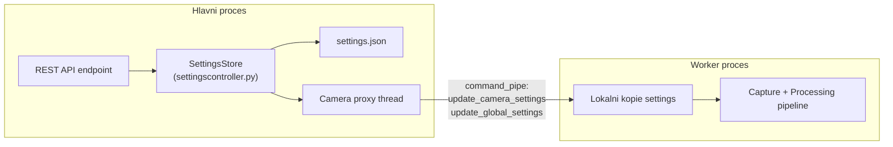
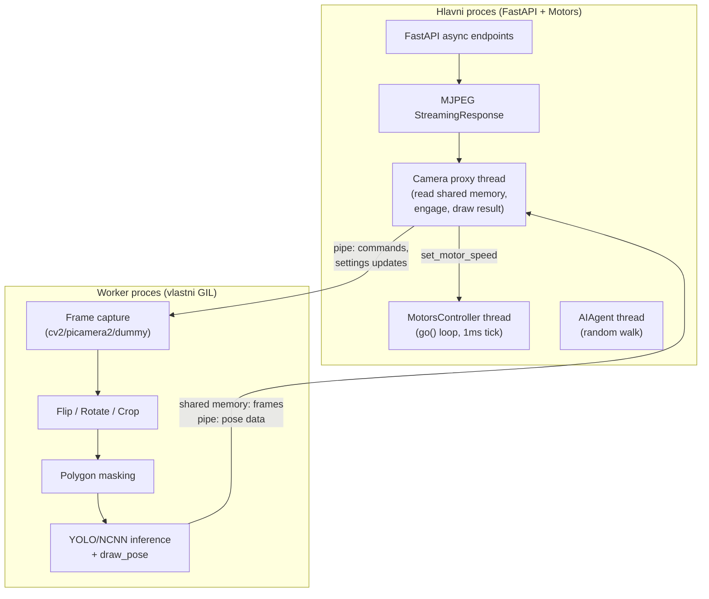
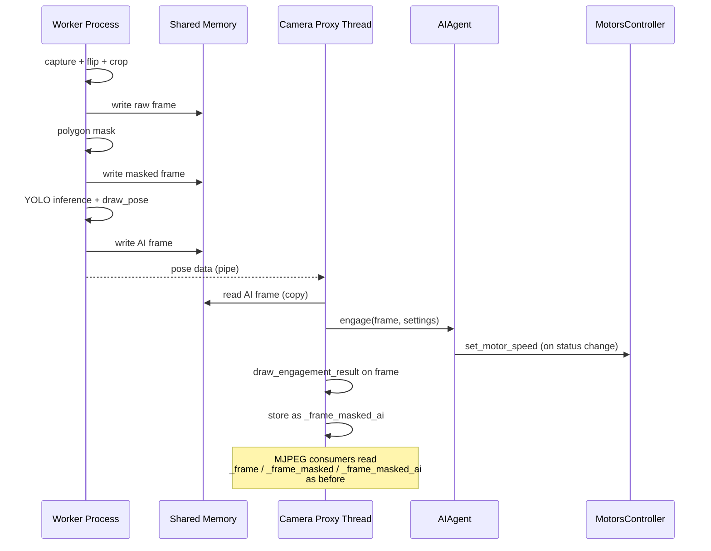

# Isolace kamerové pipeline do separátního procesu

## Problém

Motor thread (`MotorsController.run()`) sdílí GIL s camera threadem, který provádí CPU-intenzivní NCNN inferenci. Výsledkem je, že motor PWM tik (`motor.go()`) dostává CPU čas jen v mezerách mezi Python prací camera threadu, a motory se tak aktualizují pouze několikrát za sekundu.

## Cíl

Přesunout **celou** kamerovou pipeline (capture, flip/rotate/crop, polygon mask, YOLO inference, draw_pose) do **separátního OS procesu** s vlastním GIL. Hlavní proces bude obsluhovat pouze:
- Motor PWM tick loop (plynulé ~1000 Hz)
- AI engagement state machine (`engage()`)
- MJPEG streaming (čtení hotových framů ze shared memory)
- REST API (FastAPI)

## Multiplatformní kompatibilita

Řešení musí fungovat spolehlivě na **Raspberry Pi OS, Windows, Linux a macOS**.

### Pravidlo: vždy `spawn` kontext

Všechny `multiprocessing` objekty se vytvářejí přes **explicitní spawn kontext** — nikdy ne přes defaultní `multiprocessing` modul:

```python
_mp_ctx = multiprocessing.get_context("spawn")
# Vždy použít:
_mp_ctx.Process(...)
_mp_ctx.Lock()
_mp_ctx.Pipe()
# Nikdy ne:
multiprocessing.Process(...)
```

Důvod: Na Linuxu je default `fork`, který je nekompatibilní s thready (deadlocky). Na Windows a macOS je default `spawn`. Explicitní `spawn` sjednocuje chování na všech OS.

### Pickle-ovatelnost

`spawn` vyžaduje, aby vše předané do worker procesu bylo pickle-ovatelné:
- `multiprocessing.Lock`, `Pipe`, `SharedMemory` objekty vytvořené přes `_mp_ctx` **jsou** pickle-ovatelné
- Worker dostává pouze: primitivní typy (`str`, `int`, `dict`), multiprocessing synchronizační objekty, a názvy shared memory segmentů (strings)
- **Nikdy se nepředávají**: thready, sockety, file handles, lambda/closures, non-top-level třídy

### Shared memory naming

macOS má limit 30 znaků na název POSIX shared memory. Naming convention:

```python
f"fs_c{index}{slot_char}_{unique_id}"
# Příklady: "fs_c0r_a1b2" (raw), "fs_c0m_a1b2" (masked), "fs_c0a_a1b2" (ai)
# slot_char: r=raw, m=masked, a=ai
# unique_id: zkrácený hex hash z os.getpid() + time.time_ns(), max 8 znaků
```

Celková délka: max ~18 znaků — bezpečně pod macOS limitem 30.

### Shared memory cleanup

| OS | Chování po crash | Strategie |
|---|---|---|
| **Linux/macOS** | Segmenty přežijí v `/dev/shm` | `atexit` handler v workeru + hlavní proces volá `unlink()` při cleanup + stale segment detection při startu |
| **Windows** | Segmenty se uvolní automaticky | `atexit` pro pořádek, ale OS zajistí cleanup |

Stale segment detection: při startu `FrameTransport` zkusí otevřít existující segment se stejným prefixem — pokud existuje a žádný worker neběží, smaže ho.

### Graceful shutdown

Na **všech OS** se shutdown řídí výhradně přes **pipe-based příkazy** (ne signály):

1. Hlavní proces pošle `{"cmd": "stop"}` přes `command_pipe`
2. Worker kontroluje pipe v každé iteraci, při `stop` příkazu se ukončí čistě
3. Hlavní proces čeká `worker.join(timeout=STOP_TIMEOUT_SECONDS)`
4. Fallback: `worker.terminate()` (na Windows = `TerminateProcess`, na Unix = `SIGTERM`)
5. Poslední záchrana: `worker.kill()` (na Windows = stejné jako `terminate()`, na Unix = `SIGKILL`)

Nepoužíváme `signal.SIGKILL` ani jiné platform-specifické signály.

### Camera hardware

| Platforma | Kamery | GPIO/PWM |
|---|---|---|
| **Raspberry Pi** | picamera2 + cv2 | gpiozero + periphery |
| **Linux (desktop)** | cv2 | Nedostupné → dummy |
| **Windows** | cv2 | Nedostupné → dummy |
| **macOS** | cv2 | Nedostupné → dummy |

`CameraRPIDevice` se importuje podmíněně (try/except) — stejné chování jako dnes. Na ne-RPi platformách se automaticky vytvoří `CameraDummyDevice`.

## Settings management — jednosměrný tok z hlavního procesu

### Klíčové pravidlo

**Worker proces NIKDY neimportuje `settingscontroller` a NIKDY nečte `settings.json` z disku.** Veškerá settings data tečou jednosměrně z hlavního procesu do workeru přes `command_pipe`.

### Dvě kategorie settings

Worker potřebuje dvě kategorie dat, obě řízené hlavním procesem:

- **Camera settings** (flip, rotate, crop, resolution, mask_polygons) — mění se přes REST endpoint `POST /api/cameras/update/{camera_code}`, uloženy v `camera.settings` property
- **Global settings** (aiSetup.modelName, aiSetup.device, aiSetup.organs, polygon) — mění se přes REST endpointy pro AI setup a settings, uloženy v `settings.json`

### Tok dat



### Detekce změn v Camera proxy (`camera.py`)

Camera proxy thread v hlavním procesu detekuje změny a posílá je workeru:

**Camera settings** — detekce přes existující `_settings_version` mechanismus:

```python
# V Camera.run() loop:
pending = self._get_pending_settings_update()
if pending is not None:
    settings_snapshot, version = pending
    self._send_command({"cmd": "update_camera_settings", "settings": settings_snapshot})
    self._mark_settings_applied(settings_version=version)
```

**Global settings** — detekce přes object identity frozen snapshotu (`get_settings_sync()` vrací stále stejný `FrozenDict` objekt dokud se settings nezmění):

```python
# V Camera.run() loop:
current_snapshot = get_settings_sync()
if current_snapshot is not self._last_sent_global_settings:
    from copy import deepcopy
    self._send_command({
        "cmd": "update_global_settings",
        "settings": dict(deepcopy(current_snapshot))
    })
    self._last_sent_global_settings = current_snapshot
```

Porovnání `is` je O(1). `deepcopy` + pipe serializace se provádí **jen při skutečné změně** settings, což je vzácné (uživatel mění settings maximálně jednotky krát za minutu).

### Worker strana

Worker si v `__init__` uloží `initial_settings` (obě kategorie) do lokálních proměnných. V main loop na začátku každé iterace zpracuje příchozí příkazy z `command_pipe`:

```python
# V CameraWorkerProcess.run() main loop:
while self._command_conn.poll():
    msg = self._command_conn.recv()
    if msg["cmd"] == "stop":
        return
    elif msg["cmd"] == "update_camera_settings":
        self._camera_settings = msg["settings"]
        self._device.set_properties(msg["settings"])
    elif msg["cmd"] == "update_global_settings":
        self._global_settings = msg["settings"]
    elif msg["cmd"] == "update_demand":
        self._demand_raw = msg.get("raw", self._demand_raw)
        self._demand_masked = msg.get("masked", self._demand_masked)
        self._demand_ai = msg.get("ai", self._demand_ai)
```

Worker pak používá `self._camera_settings` pro flip/rotate/crop/mask a `self._global_settings` pro AI inference (model name, device, organs). Žádné volání `get_settings_sync()`.

## Architektura



## Nové soubory

### 1. [`server/cameraframetransport.py`](server/cameraframetransport.py) — Transport framů přes shared memory

Obsahuje dvě třídy:

**`SharedFrameSlot`** — jeden slot pro jeden frame v shared memory:
- Header (struct-packed): `width`, `height`, `channels`, `timestamp`, `valid`, `sequence_number`, `data_size`
- Pixel data area (prealokovaná na `max_width * max_height * 3`)
- Chráněno `_mp_ctx.Lock()` (drží se jen po dobu kopírování ~1-6 MB, tedy ~0.5-3 ms)
- Writer: `write_frame(image: np.ndarray, timestamp: float, valid: bool)`
- Reader: `read_frame() -> tuple[np.ndarray | None, float, bool, int]` (vrací kopii + seq number pro detekci nového framu)
- `SharedMemory` se vytváří s krátkým názvem pro macOS kompatibilitu (viz sekce Multiplatformní kompatibilita)

**`FrameTransport`** — spravuje sadu 3 slotů + pipe:
- `slot_raw`, `slot_masked`, `slot_ai` — 3x `SharedFrameSlot`
- `pose_pipe` — `_mp_ctx.Pipe()` pro pose data (dict, malá data ~pár KB)
- `command_pipe` — `_mp_ctx.Pipe()` pro příkazy (settings update, demand flags, stop)
- `cleanup()` — uvolní shared memory + unlink na Linux/macOS (idempotentní, voláno z hlavního procesu i přes `atexit` v workeru)
- Krátký naming: `f"fs_c{index}{slot_char}_{unique_id}"` (max ~18 znaků, bezpečné pro macOS 30-char limit)
- Stale segment detection při vytváření: pokud segment se stejným prefixem existuje a worker neběží, smaže ho

Maximální velikost framu: `1920 * 1080 * 3 = ~6 MB` per slot, celkem ~18 MB per kamera. Na RPi 5 s 8 GB RAM je to zanedbatelné.

**Sdílený multiprocessing kontext** — celý modul používá:

```python
import multiprocessing
_mp_ctx = multiprocessing.get_context("spawn")
```

Všechny `Lock`, `Pipe`, `Process` objekty se vytvářejí přes `_mp_ctx` — nikdy přes defaultní `multiprocessing`. Tento kontext se předává i do `CameraWorkerProcess`.

### 2. [`server/cameraworker.py`](server/cameraworker.py) — Worker proces

**`CameraWorkerProcess`** — vytvořený přes `_mp_ctx.Process`:

```python
class CameraWorkerProcess(_mp_ctx.Process):
    def __init__(self, *, camera_type: str, camera_index: int,
                 index: int, camera_code: str | None,
                 camera_name: str,
                 initial_settings: dict,
                 shm_names: tuple[str, str, str],
                 shm_max_size: int,
                 slot_locks: tuple[Lock, Lock, Lock],
                 pose_pipe_conn: Connection,
                 command_pipe_conn: Connection):
        # Všechny parametry jsou pickle-ovatelné (str, int, dict, mp objekty)
        ...
    
    def run(self):
        # 1. Vytvořit kamerové zařízení (CameraCV2Device / CameraRPIDevice / CameraDummyDevice)
        # 2. Připojit se k existujícím SharedMemory segmentům pomocí shm_names
        # 3. Otevřít kameru
        # 4. Registrovat atexit handler pro cleanup
        # 5. Main loop:
        #    a. Zkontrolovat command_pipe (non-blocking) pro settings updates / stop / demand flags
        #    b. Capture frame
        #    c. Flip / rotate / crop
        #    d. Zapsat raw frame do slot_raw
        #    e. Pokud demand_masked: polygon mask → zapsat do slot_masked
        #    f. Pokud demand_ai: YOLO inference + draw_pose → zapsat do slot_ai + poslat pose přes pipe
        #    g. time.sleep(EPSILON_DELAY)
        # 6. Cleanup (close camera, odpojit shared memory)
```

**Pickle-safe design**: Worker nedostává `FrameTransport` objekt jako celek, ale jednotlivé pickle-ovatelné komponenty (názvy shared memory segmentů, multiprocessing Lock/Pipe objekty). Worker si v `run()` sám otevře `SharedMemory` segmenty podle názvů. Segmenty **vytváří hlavní proces**, worker se k nim pouze **připojuje** (`create=False`). Hlavní proces je zodpovědný za `unlink()`.

Worker **importuje** `YOLOModels`, `cameraai` (draw_pose, get_pose_dict) a příslušné camera device třídy. Každý proces má **vlastní instanci** YOLOModels singletonu (vlastní adresní prostor). Importy probíhají až uvnitř `run()` (po `spawn`), takže nedochází k zbytečnému načítání v hlavním procesu.

**Worker NIKDY neimportuje `settingscontroller`** — nemá přístup k `get_settings_sync()`, `get_settings()` ani k `settings.json`. Veškerá settings data přicházejí výhradně přes `command_pipe` z hlavního procesu (viz sekce "Settings management").

**Demand flags** — hlavní proces sděluje workeru, které frame typy potřebuje:
- `demand_raw`: vždy true když existuje consumer
- `demand_masked`: true když někdo streamuje mode 1, nebo když demand_ai je true
- `demand_ai`: true když někdo streamuje mode 3, nebo je vyžadován headless AI processing

Worker přeskakuje zbytečnou práci (masking, inference) když demand flag je false — stejná optimalizace jako v současném kódu ([`camera.py`](server/camera.py) řádky 541-550).

### 3. [`server/cameradevice.py`](server/cameradevice.py) — Abstrakce kamerového zařízení

Extrahuje device-specifický kód z camera subclassů do jednoduchých tříd, které **nedědí z `Camera`** (žádné thready, zámky, Frame objekty):

```python
class CameraDevice(ABC):
    """Pure camera hardware abstraction. No threads, no frame storage."""
    @abstractmethod
    def open(self) -> bool: ...
    @abstractmethod
    def close(self) -> None: ...
    @abstractmethod
    def get_image(self) -> tuple[bool, np.ndarray]: ...
    @abstractmethod
    def get_properties(self) -> dict: ...
    @abstractmethod
    def set_properties(self, settings: dict) -> None: ...
    @abstractmethod
    def get_supported_resolutions(self) -> list[dict]: ...
    @abstractmethod
    def get_capabilities(self) -> dict: ...

class CameraCV2Device(CameraDevice): ...
class CameraRPIDevice(CameraDevice): ...
class CameraDummyDevice(CameraDevice): ...

def create_camera_device(*, camera_type: str, camera_index: int, 
                          camera_name: str, settings: dict) -> CameraDevice:
    """Factory function used by both main process (probing) and worker process."""
```

Kód z `cameracv2.py`, `camerarpi.py`, `cameradummy.py` se přesune do odpovídajících `CameraDevice` tříd. Stávající `CameraCV2`, `CameraRPI`, `CameraDummy` třídy se **odstraní** — nejsou potřeba, protože `Camera` base class je nyní univerzální proxy.

## Modifikované soubory

### 4. [`server/camera.py`](server/camera.py) — Hlavní refaktor na proxy pattern

`Camera` zůstane `threading.Thread`, ale místo capture+processing bude **přijímat framy z workeru**:

```python
class Camera(threading.Thread):
    def __init__(self, *, index, camera_index, camera_code, camera_name,
                 camera_type, settings, master_controller):
        # Probe hardware (using CameraDevice) for supported_resolutions, capabilities
        # Create FrameTransport (shared memory + pipes)
        # Do NOT start worker yet — start lazily on first frame access
    
    def _start_worker(self) -> bool:
        """Spawn CameraWorkerProcess. Called lazily."""
        # Create and start worker process
        # Monitor with _worker_alive check
    
    def _stop_worker(self) -> None:
        """Send stop command and join worker process with timeout."""
    
    def run(self):
        """Receiver thread: reads from shared memory, runs engage for scope_camera."""
        while self._active:
            # 1. Check worker is alive (restart if crashed)
            # 2. Detect and propagate settings changes to worker:
            #    a. Camera settings: check _settings_version, send via command_pipe
            #    b. Global settings: compare get_settings_sync() identity (is),
            #       send deepcopy via command_pipe only on change
            # 3. Read frames from transport slots (only when sequence changed)
            # 4. For scope_camera + AI frame available:
            #    - Read pose from pose_pipe
            #    - Run ai_agent.engage()
            #    - Run ai_agent.draw_engagement_result()
            # 5. Store frames in _frame, _frame_masked, _frame_masked_ai
            # 6. Update demand flags based on last access times
            # 7. time.sleep(EPSILON_DELAY)
    
    # Public API stays identical:
    # frame, frame_masked, frame_masked_ai properties
    # get_stream_frame(), settings, capabilities, etc.
```

**Klíčové: veřejné API se nemění.** `restapicameras.py`, `generate_camera_frames()`, `stream_camera()` — vše funguje beze změny.

### 5. [`server/camerascontroller.py`](server/camerascontroller.py) — Drobné změny

- `reset()`: musí zastavit worker procesy (ne jen thready)
- `stop()`: musí zastavit worker procesy s timeout
- Vytváření kamer: předává `camera_type` místo vytváření konkrétní subclass

```python
# Současný kód:
self._cameras.append(CameraCV2(index=i, camera_index=camera_index, ...))

# Nový kód:
self._cameras.append(Camera(index=i, camera_index=camera_index, 
                             camera_type="cv2", ...))
```

### 6. [`server/mastercontroller.py`](server/mastercontroller.py) — Beze změn

`MasterController` volá `cameras_controller.stop()` a `cameras_controller.reset()`, které interně zastaví worker procesy. Žádná změna rozhraní.

## Stabilita (nonstop provoz)

### Crash recovery
- `Camera.run()` kontroluje `worker.is_alive()` v každé iteraci
- Pokud worker zemře, loguje chybu a pokusí se o restart s **exponenciálním backoffem** (1s, 2s, 4s, max 30s)
- Po 5 neúspěšných restartech přestane zkoušet a vrací blank framy
- Reset celého systému (`/api/cameras/resetall`) vyresetuje počítadlo pokusů

### Graceful shutdown (multiplatformní)
- `Camera.stop()` pošle `{"cmd": "stop"}` přes `command_pipe` (pipe-based, funguje na všech OS)
- Čeká na `worker.join(timeout=STOP_TIMEOUT_SECONDS)`
- Pokud worker neodpovídá: `worker.terminate()` (Windows: `TerminateProcess`, Unix: `SIGTERM`)
- Poslední záchrana: `worker.kill()` (Windows: stejné jako `terminate()`, Unix: `SIGKILL`)
- Cleanup shared memory v `finally` bloku — hlavní proces volá `shm.close()` + `shm.unlink()`
- **Nepoužíváme** `signal.SIGKILL` ani jiné platform-specifické signály přímo

### Shared memory lifecycle (multiplatformní)
- **Hlavní proces vytváří** shared memory segmenty (`create=True`) a je zodpovědný za `unlink()`
- **Worker se pouze připojuje** (`create=False`) a při cleanup volá `shm.close()` (ne `unlink()`)
- Hlavní proces volá `unlink()` v `Camera.stop()` a v `atexit` handleru jako zálohu
- Na **Windows**: `unlink()` je no-op (OS uvolní automaticky), ale volání nevadí
- Na **Linux/macOS**: `unlink()` smaže segment z `/dev/shm`
- `FrameTransport.cleanup()` je idempotentní — lze volat vícekrát bezpečně
- Stale segment detection: při startu `FrameTransport` zkusí otevřít segment s daným prefixem; pokud existuje a worker neběží, provede `unlink()`

### Watchdog
- Hlavní proces posílá heartbeat přes command_pipe každých 5s
- Worker sleduje heartbeat — pokud nedostane heartbeat 15s, ukončí se (ochrana proti zombie procesu)
- Worker posílá heartbeat přes pose_pipe — hlavní proces detekuje mrtvý worker rychleji než `is_alive()`

## Výkon

- **Shared memory**: kopírování framu ~0.5-3 ms (vs. pickle přes Queue: ~10-50 ms)
- **Nulová GIL kompetice**: Motor thread běží bez přerušení na ~1000 Hz
- **Multi-core**: Na RPi 5 (4 jádra) inference běží na jednom jádru, motory na jiném
- **Lazy worker start**: Worker se spustí až když někdo požaduje frame — šetří zdroje
- **Demand flags**: Worker přeskakuje zbytečnou inference/masking — stejná optimalizace jako dnes

## Migrace dat přes shared memory



## Pořadí implementace

Implementace probíhá bottom-up: nejdřív transport, pak worker, pak proxy, pak integrace. Každý krok je testovatelný nezávisle.

## Soubory k odstranění

- `server/cameracv2.py` — kód přesunut do `CameraCV2Device` v `cameradevice.py`
- `server/camerarpi.py` — kód přesunut do `CameraRPIDevice` v `cameradevice.py`
- `server/cameradummy.py` — kód přesunut do `CameraDummyDevice` v `cameradevice.py`

## Soubory beze změn

- `server/yolomodels.py` — singleton funguje per-process, beze změn
- `server/cameraai.py` — draw_pose, get_pose_dict, beze změn
- `server/aiagent.py` — engage() + state machine, beze změn
- `server/motorscontroller.py` — motor tick loop, beze změn
- `server/restapicameras.py` — MJPEG streaming, beze změn (Camera API se nemění)
- `server/restapimanualcontrol.py` — joystick REST, beze změn
- `server/common.py` — Frame class, beze změn
- `server/main.py` — FastAPI app, beze změn

## Multiplatformní checklist

Při implementaci každé komponenty ověřit:

- [ ] Worker NIKDY neimportuje `settingscontroller` a NIKDY nečte `settings.json` — vše přes `command_pipe`
- [ ] Všechny `multiprocessing` objekty vytvořeny přes `_mp_ctx = multiprocessing.get_context("spawn")`
- [ ] Všechny argumenty `CameraWorkerProcess.__init__` jsou pickle-ovatelné
- [ ] Worker importuje těžké moduly (YOLO, cv2, picamera2) až uvnitř `run()`, ne na top-level
- [ ] Shared memory názvy max 18 znaků (macOS 30-char limit s rezervou)
- [ ] `shm.unlink()` volá pouze hlavní proces, worker volá pouze `shm.close()`
- [ ] Shutdown přes pipe-based příkazy, ne signály
- [ ] `CameraRPIDevice` import obalený v `try/except` (nedostupné mimo RPi)
- [ ] Žádné `fork`-specifické předpoklady (sdílené file descriptory, inherited memory)
- [ ] Testováno na Windows (cmd/PowerShell), Linux, macOS (pokud dostupné)
