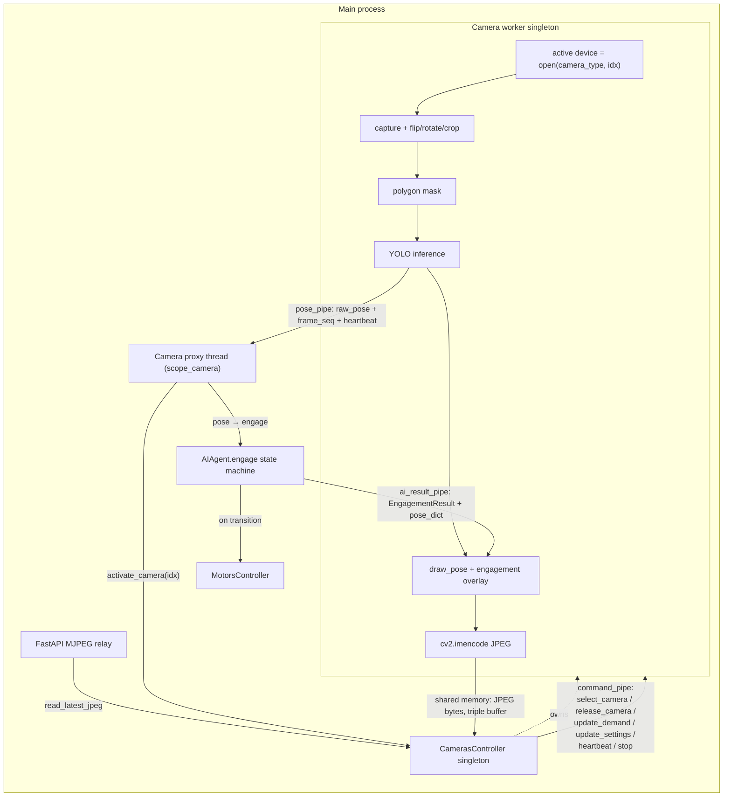
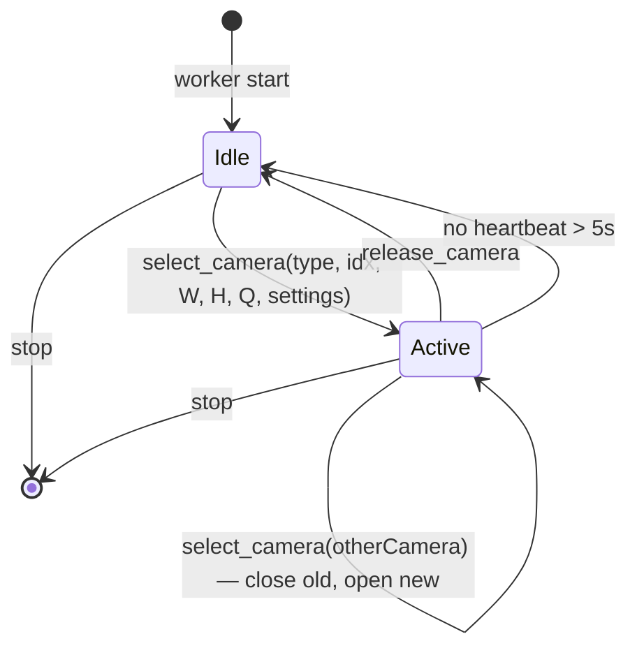
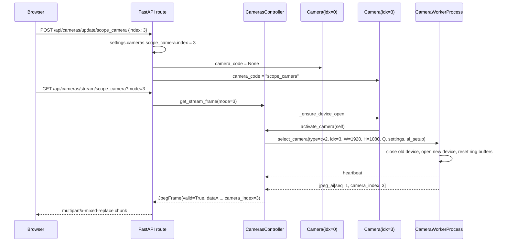

## Motivace a cíl

Po rozdělení na main worker + camera worker (plán `camera_process_isolation_c1c02a4c.plan.md`) provádí main dvě drahé operace per frame: `draw_pose` + `draw_engagement_result` overlay a `cv2.imencode('.jpg', ...)`. Obě tikají uvnitř `EPSILON_DELAY` smyčky a sdílí GIL s motor tickem + FastAPI event-loopem. To spotřebovává většinu "získaného" CPU času.

Uživatel navíc upřesnil, že **nechce worker na kameru, ale jeden jediný worker**. Systém v provozu stejně používá maximálně jednu kameru najednou. Dnes `CamerasController.reset()` vytváří 14 `Camera` instancí a každá má vlastní (lazy-started) worker — tohle je přepálené a zbytečné.

## Nové rozdělení

- **Jeden** `CameraWorkerProcess` (singleton) vlastněný `CamerasController` v main procesu.
- Main proces přes `command_pipe` řekne workeru: "otevři kameru X (camera_type, camera_index) v rozlišení W×H, quality Q, a streamuj módy {raw/masked/ai}". Worker otevře device, běží pipeline, streamuje JPEG bytes.
- Když uživatel přepne kameru, main pošle nový `select_camera` command. Worker zavře předchozí device, otevře nový.
- Když main přestane chtít snímky (žádný aktivní consumer + žádný headless AI provoz), pošle `release_camera`. Worker zavře device, jde do idle, ale zůstane naživu.
- Heartbeat každých ~1s, worker toleruje výpadek do **5 sekund** (místo současných 15) — po 5s bez heartbeatu worker zavře device a jde do idle (neukončuje se kvůli odolnosti při krátkém sprintu main procesu).
- Worker = capture + transform + mask + inference + **draw pose/overlay + JPEG encode**. Shared-memory výstup = JPEG bytes.
- Main = `AIAgent.engage()` state machine (autoritativní), motor commands, HTTP relay JPEG → browser.
- Pose + EngagementResult cirkulují mezi worker↔main přes pipes (non-blocking).

## Architektura dat



### Proč to je rychlejší

- Encoding (JPEG) je drahá CPU práce uvnitř jednoho framu. Pokud běží v samostatném procesu, nesoupeří s `MotorsController.run()` GIL tikem ani s FastAPI event-loopem.
- Main thread pro MJPEG stream místo `cv2.imencode(...)` jen čte hotové JPEG bytes a `yield`-uje je.
- Worker neblokuje čekáním na main (triple buffer).
- Overlay (draw_pose + statusbox) je blízko encoderu, nemusíme kopírovat celý BGR frame zpátky do main procesu.
- Jediný worker = jediný Python interpret, jediná YOLO model instance, jediný heartbeat watchdog. Méně procesů = méně memory + méně IPC overhead.

## Lifecycle singleton workeru



- **Idle**: worker běží, ale žádný device otevřený, ring buffery nepíše. Čte `command_pipe`, posílá heartbeat main procesu.
- **Active**: worker má otevřené `CameraDevice` + aktivní pipeline. Loop běží na plnou rychlost.
- **Switch**: worker zavře starý device, otevře nový. Reset sekvencí (seq_raw/masked/ai = 0), ring buffery se nastaví jako invalid, dokud nepřijde první frame.
- **Heartbeat timeout (5s)**: worker **nezemře** — jen zavře device a přejde do Idle. Main může kdykoli znovu poslat `select_camera`. Odolnost proti dočasnému zablokování main procesu (např. dlouhý settings save).

## Triple buffering pro JPEG bytes

Singleton transport drží **jednu sadu** ring bufferů (nezávisle na tom, ze které kamery data přicházejí):

- Sloty: `jpeg_raw[0..2]`, `jpeg_masked[0..2]`, `jpeg_ai[0..2]` — celkem 9 slotů.
- Header per slot: `sequence`, `timestamp`, `data_size`, `mode`, `valid`, `camera_index` (aby reader ignoroval staré framy z předchozí kamery po přepnutí).
- Max velikost: `max_width * max_height * 3 / 4` (horní hranice pro JPEG quality 100) — alokovat jednou pro maximum, JPEG typicky využije 5–20 %.
- Atomický latest pointer: `multiprocessing.Value('Q')` pro sekvenci + `multiprocessing.Value('B')` pro slot index. Reader zkopíruje z latest slotu pod slot-lockem.
- Při `select_camera` worker atomicky resetuje sequence counter na 0 a označí všechny sloty `valid=False` dokud nezapíše první nový frame.

## Pipe layout

- **`command_pipe`**: main → worker. Nové zprávy:
  - `{cmd: "select_camera", camera_type, camera_index, width, height, settings, ai_setup, quality: {raw, masked, ai}}` — přepne/aktivuje kameru.
  - `{cmd: "release_camera"}` — zavřít device, jít do idle.
  - `{cmd: "update_demand", raw, masked, ai}` — jen kdy zapisovat do kterého slotu.
  - `{cmd: "update_camera_settings", settings}` — flip/rotate/crop/mask/quality/resolution změny pro aktivní kameru.
  - `{cmd: "update_ai_setup", ai_setup}` — aiSetup změny (model name, device, organs).
  - `{cmd: "update_quality", raw, masked, ai}` — per-mode JPEG quality (35–100).
  - `{cmd: "heartbeat"}` — už existuje; tolerance snížit na 5s.
  - `{cmd: "stop"}` — už existuje.
- **`pose_pipe`**: worker → main. Nese `{type: "pose", camera_index, frame_seq, raw_pose}` + `{type: "heartbeat", time}`. Main použije `camera_index` pro validaci (ignoruje staré framy z předchozí kamery).
- **`ai_result_pipe`** (nová): main → worker. Nese `{cmd: "ai_result", frame_seq, engagement_result_dict, pose_dict, ai_setup, engagement_counter}`. Worker drží "poslední přijatý result" a kreslí ho na aktuální frame.

## Konkrétní změny souborů

### 1. [`server/cameraframetransport.py`](server/cameraframetransport.py) — singleton transport

Nahradit current per-camera `FrameTransport` za **jeden** sdílený transport:

- `JpegRingBuffer(name_prefix, num_slots=3, max_bytes, slot_lock)` — třída spravující N shared-memory slotů + `multiprocessing.Value('Q')` pro latest sequence + `Value('B')` pro latest slot index.
- `write_jpeg(data: bytes, timestamp: float, sequence: int, camera_index: int)` — round-robin slot, zapíše, update latest.
- `read_latest_jpeg() -> tuple[bytes, float, int, int] | None` — vrací (bytes, timestamp, sequence, camera_index).
- `reset()` — zneplatní všechny sloty (na `select_camera`).
- Naming: `fs_{mode_char}{slot_idx}_{uid}`, např. `fs_r0_a1b2f003` (≤ 16 znaků).
- `FrameTransport.__init__(max_width=1920, max_height=1080)` už nebere `camera_index` — vytvoří jeden set ring bufferů.
- Přidat `ai_result_parent/child` (`_mp_ctx.Pipe()`).
- Idempotentní `cleanup()` s `unlink()` jen v main procesu.

### 2. [`server/cameraworker.py`](server/cameraworker.py) — singleton worker

Klíčový refaktor — worker drží stav aktivní kamery:

```python
class CameraWorkerProcess(_mp_ctx.Process):
    def __init__(self, *, shm_names, shm_max_data_size, slot_locks,
                 latest_pointers, pose_pipe_conn, command_pipe_conn,
                 ai_result_pipe_conn):
        # NO camera_type, camera_index, index, camera_code, camera_name
        # — vše přijde runtime přes select_camera command.
        ...

    def run(self):
        active_device = None               # None v Idle
        active_camera_index = -1
        active_camera_type = None
        camera_settings = {}
        global_ai_setup = {}
        demand_raw, demand_masked, demand_ai = False, False, False
        quality_raw, quality_masked, quality_ai = 80, 80, 80
        last_engagement_result = None
        last_pose_dict = None
        last_heartbeat_recv = time.monotonic()
        
        while True:
            # 1. drain command_pipe
            # 2. check heartbeat (5s tolerance) — if missed → close device, go idle, continue
            # 3. if no active_device → sleep, continue (idle)
            # 4. drain ai_result_pipe → update last_engagement_result / last_pose_dict
            # 5. capture frame via active_device
            # 6. flip/rotate/crop (camera_settings)
            # 7. if demand_raw: encode + write to jpeg_raw ring
            # 8. if demand_masked or demand_ai: mask_image
            # 9. if demand_masked: encode masked + write
            # 10. if demand_ai:
            #     a. run YOLO inference → raw_pose
            #     b. send pose via pose_pipe (with camera_index, frame_seq)
            #     c. draw overlay (draw_ai_overlay from aidraw)
            #     d. encode AI + write to jpeg_ai ring
            # 11. sleep(EPSILON_DELAY)
```

- `select_camera` příkaz: pokud stejný `camera_index` + `camera_type`, jen update settings/quality. Jinak `active_device.close()`, vytvořit nové přes `create_camera_device`, `open()`, reset sekvencí, `transport.reset()`.
- `release_camera` příkaz: `active_device.close()`, přejít do idle.
- Heartbeat timeout → jako `release_camera` (ale bez logu chyby — jen info).
- Worker **NIKDY** neimportuje `settingscontroller`. `camera_settings` i `global_ai_setup` tečou přes pipes.
- Těžké importy (`cv2`, `YOLOModels`, `aidraw`) jsou uvnitř `run()`.

Reference: celá smyčka [`server/cameraworker.py`](server/cameraworker.py) řádky 65-234 se přepisuje.

### 3. [`server/cameradevice.py`](server/cameradevice.py)

Beze změn. HW abstrakce je stabilní. Worker ji instancuje dynamicky při `select_camera`.

### 4. [`server/camera.py`](server/camera.py) — tenký proxy, bez vlastního workeru

Role `Camera` se dramaticky zmenší:

- **Ztratí vlastní `CameraWorkerProcess` + `FrameTransport`** — už neřídí lifecycle procesu.
- **Přežívá jako proxy s metadaty + settings + API fasáda.**
- `__init__` stále probe-uje hardware přes `CameraDevice` (v main procesu, krátké otevření kamery pro zjištění `supported_resolutions` + `capabilities`) — stejně jako dnes.
- Camera thread `run()` pokračuje v main procesu, ale **jen pro scope_camera** (kde je potřeba pose→engage). Non-scope kamery už thread nepotřebují.
- Lifecycle:
  - `_ensure_device_open()` zavolá `master_controller.cameras_controller.activate_camera(self)` — controller řekne singletonu workeru `select_camera(...)`.
  - `stop()` → `cameras_controller.deactivate_camera(self)` pokud jsem aktivní.
- `run()` smyčka už neřídí worker restart (to dělá `CamerasController`). Jen:
  - Propaguje settings změny (camera settings + global ai_setup) přes controller.
  - Pokud je scope_camera: čte pose z `cameras_controller.pose_pipe` (filtrováno dle `camera_index`), volá `AIAgent.engage()`, posílá EngagementResult zpátky přes `cameras_controller.send_ai_result(...)`.
  - Aktualizuje demand flags + quality přes controller.
- Public API (`frame`, `frame_masked`, `frame_masked_ai`, `get_stream_frame(mode, stream_token)`) — vrací `JpegFrame` z controllera. Pokud `self` není aktivní kamera (nebo worker v Idle), vrací "Loading" JPEG placeholder.

Tohle smaže většinu kódu v [`server/camera.py`](server/camera.py) — odstraní se `_start_worker`, `_stop_worker`, `_try_restart_worker`, `_read_frames_from_transport`, `_staged_ai_image` atd. Zůstane cca 200–300 řádek místo dnešních 698.

### 5. [`server/camerascontroller.py`](server/camerascontroller.py) — singleton worker host

Největší změna v tomto souboru. Přidá:

- `self._worker: CameraWorkerProcess | None`
- `self._transport: FrameTransport | None`
- `self._active_camera: Camera | None`
- `self._worker_lock: threading.RLock`
- `self._heartbeat_thread: threading.Thread` — posílá heartbeat každou 1s přes `command_pipe`.
- `self._restart_attempts`, `self._last_restart_time` — exponential backoff (1s, 2s, 4s, max 30s) pokud worker spadne.

Nové API:
- `ensure_worker_running()` — lazy start singleton workeru při prvním požadavku.
- `activate_camera(camera: Camera) -> bool` — pošle workeru `select_camera` s kompletním kontextem (camera_type, camera_index, settings, ai_setup, quality). Zaznamená `self._active_camera`.
- `deactivate_camera(camera: Camera)` — pokud je to právě aktivní kamera, pošle `release_camera`.
- `update_demand(camera, raw, masked, ai)` — pokud camera je aktivní, propaguje do workeru.
- `update_quality(camera, raw, masked, ai)`.
- `send_ai_result(engagement_result_dict, pose_dict, ...)` — přes `ai_result_pipe`.
- `read_latest_jpeg(mode) -> JpegFrame` — pro MJPEG relay. Zkontroluje, že v headeru je správný `camera_index` (jinak vrátí placeholder).
- `poll_pose()` + `recv_pose()` — dispatch do aktivní `Camera` proxy.

Lifecycle:
- `reset()`: zastaví worker, vyčistí transport, vytvoří `Camera` instance (jako dnes), neotevře worker znovu (lazy start).
- `stop()`: zastaví worker přes pipe `{cmd: "stop"}`, fallback `terminate()` → `kill()`, cleanup transport.

Pozor: současný kód vytváří 14 `Camera` instancí (`max_index + 6`). Zachovat — stále potřebujeme probe-nout všechny indexy pro UI. Probing nepoužívá worker process, jen short-lived `CameraDevice.open()` v main procesu.

### 6. [`server/restapicameras.py`](server/restapicameras.py) — relay bytes, ne encoding

- `generate_camera_frames()`: místo `cv2.imencode` rovnou yield bytes z `camera.get_stream_frame(mode, stream_token).data`.
- `quality` parametr protéká do workeru přes `update_quality` command.
- Loading placeholder: `_make_loading_jpeg()` cachovaný jednou v `common.py`; `camera.get_stream_frame(...)` vrací `JpegFrame(valid=False, data=loading_jpeg_bytes)` dokud nepřijde první frame.

Reference: [`server/restapicameras.py`](server/restapicameras.py) řádky 401-434.

### 7. [`server/aidraw.py`](server/aidraw.py) + [`server/aiagent.py`](server/aiagent.py)

- Nový modul `server/aidraw.py` obsahuje `draw_ai_overlay(*, image, engagement_result_dict, pose_dict, ai_setup, engagement_counter)` — čistý helper bez stavu, volá `draw_pose` a vykresluje status rectangle + text (přenos kódu z [`server/aiagent.py`](server/aiagent.py) řádky 646-703).
- `AIAgent.draw_engagement_result` → buď slim wrapper (volá `draw_ai_overlay`), nebo úplně odstraněn, protože overlay se teď dělá ve workeru.
- `AIAgent` má být schopný po `engage()` poslat workeru prostřednictvím `CamerasController.send_ai_result(...)` EngagementResult + translated pose_dict + aiSetup snapshot + current engagement_counter. Aktuálně to dělá `camera.py::_process_pose` — přesune se tam.

### 8. [`server/common.py`](server/common.py)

- `JpegFrame(BaseModel)` s fields: `valid: bool`, `data: bytes`, `time: float`, `uid: int`, `mode: int`, `sequence: int`, `camera_index: int`.
- `_make_loading_jpeg()` — vytvoří jednorázově "Loading, please wait a minute..." jako JPEG bytes (cachovat modulově).

## Požadavky z shared_memory_improvement plánu (body 1–5)

Plán musí ctít multiplatformní a bezpečnostní záruky z [`shared_memory_improvement_after_workers_were_split.plan.md`](.cursor/plans/shared_memory_improvement_after_workers_were_split.plan.md), konkrétně body 1–5:

- **Bod 1 — `cameraframetransport.py`**: nová ring buffer třída dodržuje max 18 znaků shared-memory naming, stale segment detection, `_mp_ctx = multiprocessing.get_context("spawn")`, idempotentní `cleanup()` s `unlink()` jen v main procesu. Nově se transport stává **singleton** (nemá `camera_index` v názvech).
- **Bod 2 — `cameraworker.py`**: worker stále **NIKDY** neimportuje `settingscontroller`; `camera_settings`, `ai_setup`, `jpeg_quality`, `camera_type`, `camera_index` tečou výhradně přes `command_pipe` nebo `ai_result_pipe`; těžké moduly (`cv2`, `YOLOModels`, `aidraw`) importované až uvnitř `run()`. Worker drží stav aktivní kamery + idle mode.
- **Bod 3 — `cameradevice.py`**: beze změn, HW abstrakce zůstává čistá; dynamicky instancovaná ve workeru.
- **Bod 4 — `camera.py`**: zachovat proxy pattern (thread v main procesu), ale worker lifecycle se přesune do `CamerasController`. Veřejné API (`frame`, `frame_masked`, `frame_masked_ai`, `get_stream_frame`, `stop()`, `create_stream_token()`) zůstává; vrací `JpegFrame`.
- **Bod 5 — `camerascontroller.py`**: nově vlastní singleton `CameraWorkerProcess` + `FrameTransport`. Lifecycle (start/stop/reset) lazy-start při prvním `activate_camera`, idle po `release_camera` nebo heartbeat timeout. Crash recovery s exponential backoff přesunuta sem z `camera.py`.

Multiplatformní checklist:

- [ ] Worker NIKDY neimportuje `settingscontroller`; vše přes pipes.
- [ ] Všechny `multiprocessing` objekty přes `_mp_ctx = multiprocessing.get_context("spawn")`.
- [ ] Všechny argumenty `CameraWorkerProcess.__init__` pickle-ovatelné (`ai_result_pipe_conn` je pickle-ovatelný stejně jako ostatní pipes).
- [ ] Worker importuje těžké moduly (`cv2`, `ultralytics`, `aidraw`) až uvnitř `run()`.
- [ ] Shared memory názvy ≤ 18 znaků (jen 9 slotů, prefixy bez `camera_index` zkracují názvy).
- [ ] `shm.unlink()` volá pouze main proces, worker jen `shm.close()`.
- [ ] Shutdown přes pipe-based `{"cmd": "stop"}`, fallback `terminate()` → `kill()`.
- [ ] `CameraRPIDevice` import obalený v `try/except`.
- [ ] Žádné `fork`-specifické předpoklady.
- [ ] Testováno na Windows (cmd/PowerShell), Linuxu (včetně RPi) a macOS.
- [ ] Heartbeat tolerance 5s, při timeoutu se worker jen zavře device (Idle mode), neukončuje se.

## Přepínání kamer — sekvenční diagram



## Očekávaný dopad na výkon (RPi 5)

- JPEG encode @ 1280×720 quality 80: ~3–8 ms CPU — teď mimo main.
- Overlay (`draw_pose` + rectangle + text): ~1–3 ms — teď mimo main.
- Main MJPEG relay: `read_latest_jpeg()` (~0.1 ms memcpy) + `yield` → o řád levnější.
- Triple buffering: worker nečeká na čtenáře.
- Jediný worker místo 14 lazy-started: méně memory overhead (1× Python, 1× YOLO model instance).
- Očekáváno získat zpět >30 % ztracených snímků + plynulejší motor PWM.

## Pořadí implementace (bottom-up, testovatelné po krocích)

1. **Transport refaktor** [`server/cameraframetransport.py`](server/cameraframetransport.py) — singleton `FrameTransport` + `JpegRingBuffer` + `ai_result_pipe` + `reset()` na přepnutí kamery. Unit test.
2. **Aidraw modul** [`server/aidraw.py`](server/aidraw.py) — extrakce drawing logiky. Unit test s fake EngagementResult.
3. **JpegFrame + loading placeholder** [`server/common.py`](server/common.py).
4. **Worker singleton** [`server/cameraworker.py`](server/cameraworker.py) — select_camera / release_camera / idle mode / overlay / JPEG encode / 5s heartbeat tolerance.
5. **CamerasController host** [`server/camerascontroller.py`](server/camerascontroller.py) — vlastní worker + transport + activate/deactivate API + crash recovery.
6. **Camera proxy thin** [`server/camera.py`](server/camera.py) — odstranit worker lifecycle; pose forward + engage + send_ai_result.
7. **REST relay** [`server/restapicameras.py`](server/restapicameras.py) — relay bytes, quality přes pipe.
8. **Regresní test**:
   - mode=0/1/3 stream
   - AI engagement transitions (arming → engaging → disengaging → exit strategy)
   - motor responsivita s AI
   - worker restart (`kill -9` workera → controller detekuje, restartne, stream obnoví)
   - reset all
   - **přepnutí kamery** za běhu streamu (nová kritická cesta!)
   - idle/resume cyklus (heartbeat výpadek → device zavřený → heartbeat obnoven → device znovu otevřený)
   - soak test FPS 24+ h

## Rizika a mitigace

- **Latence overlay vs motor**: motor commands se řídí `AIAgent.engage()` v main procesu přímo podle příchozího pose. Overlay workeru využije EngagementResult pro předchozí frame (1–2 frame latence v overlay). Motor reakce nemá latenci navíc.
- **Max JPEG size allocation**: konzervativní horní mez (`W * H * 3 / 4`) = ~1.5 MB/slot @ 1920×1080 → 9 slotů = ~13.5 MB. Dříve 18 MB → úspora.
- **Placeholder "Loading..."**: cachovat jako JPEG bytes jednou v `common.py`. Controller vrací placeholder, dokud nepřijde první JPEG s matching `camera_index`. Řeší regresní bug z [`command.md`](command.md) řádky 3921-3924.
- **Přepnutí kamery za streamu**: stream tokens + `camera_index` v JPEG header zajistí, že consumer uvidí placeholder, dokud nová kamera nezapíše první frame.
- **Crash workeru**: `CamerasController` monitoruje `worker.is_alive()` v heartbeat threadu. Exponential backoff restart (1s, 2s, 4s, max 30s). Po 5 pokusech stream vrací placeholder "Worker unavailable" + HTTP 503 pro `/api/cameras/stream`.
- **Heartbeat tolerance 5s**: dost dlouho na GC pauzu / settings save (~stovky ms), dost krátká, aby worker brzy uvolnil zdroje (zavřel HW kameru) když je main zmražený.
- **Dva consumer na různé módy souběžně (mode=0 preview + mode=3 AI)**: worker píše do všech demand-enabled slotů; jeden stream consumer bere mode=0, druhý mode=3 — oba čtou z odpovídajícího ring bufferu. Funguje paralelně.
