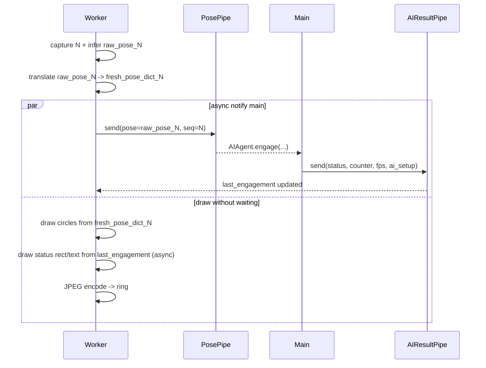

## Problém (shrnutí)

Dnes camera worker v [server/cameraworker.py](server/cameraworker.py) pro každý snímek detekuje novou pózu (`raw_pose` na řádku 405), ale pro kreslení koleček používá `last_engagement_pose`, která dorazila přes `ai_result_pipe` z mainu — typicky z nějakého staršího snímku. Proto kolečka zaostávají za pohybem o 1–5 snímků (~33–170 ms).

## Fix (minimální)

Worker si čerstvou pózu sám přeloží na `pose_dict` přímo ve své iteraci a předá ji do `draw_engagement_overlay`. Z `last_engagement` se nadále čerpá jen `status_value`, `engagement_counter`, `fps`, `ai_setup` a `draw_ai_stats` — tyto hodnoty se mění pomalu, takže mírné zpoždění není viditelné.

### Změny v souborech

#### A) [server/cameraworker.py](server/cameraworker.py)

Importovat `translate_raw_pose_to_pose_dict` (je čistá funkce v [server/cameraai.py](server/cameraai.py) a neimportuje `settingscontroller`):

```python
from .cameraai import translate_raw_pose_to_pose_dict
```

V AI pipeline (řádky ~402–440) po `_run_ai_inference`, před voláním `draw_engagement_overlay`, přeložit čerstvou pózu pomocí aktuálního `global_settings["aiSetup"]` (worker už tento snapshot má):

```python
ai_setup_for_draw = (global_settings.get("aiSetup") or {}) if isinstance(global_settings, dict) else {}
fresh_pose_dict = None
if raw_pose:
    try:
        fresh_pose_dict = translate_raw_pose_to_pose_dict(
            raw_pose=raw_pose, ai_setup=ai_setup_for_draw,
        )
    except Exception as exc:
        print(f"[Worker] pose translate error: {exc}")
        fresh_pose_dict = None
```

Nahradit volání kreslení tak, aby `pose=` bylo čerstvé a `ai_setup=` byl vždy worker-lokální (kvůli konzistenci velikostí koleček):

```python
if last_engagement is not None:
    draw_engagement_overlay(
        image=ai_frame,
        status_value=str(last_engagement.get("status_value", "not_engaging")),
        engagement_counter=int(last_engagement.get("engagement_counter", 0)),
        fps=float(last_engagement.get("fps", 0.0)),
        pose=fresh_pose_dict,
        ai_setup=ai_setup_for_draw,
        draw_ai_stats=bool(last_engagement.get("draw_ai_stats", True)),
    )
elif fresh_pose_dict is not None:
    # Main ještě nedodal engagement snapshot (např. první snímek po
    # spuštění AI), ale kolečka už můžeme vykreslit — uživatel uvidí
    # pózu okamžitě, bez "Loading" pauzy.
    try:
        from .aidraw import draw_pose_overlay
        draw_pose_overlay(image=ai_frame, pose=fresh_pose_dict, ai_setup=ai_setup_for_draw)
    except Exception as exc:
        print(f"[Worker] pose-only draw error: {exc}")
```

Proměnná `last_engagement_pose` tím ztratí smysl pro kreslení, ale zůstává stále uložená při příjmu `ai_result`. Nebudeme ji mazat — může se hodit pro budoucí diagnostiku a žádná jiná cesta ji nepoužívá.

#### B) [server/camera.py](server/camera.py) — bez změn kromě dokumentace

`_process_pose` v `Camera.run()` nadále překládá pózu pro svůj `AIAgent.engage(...)` round-trip — tento překlad je nutný pro `build_engagement_snapshot` i pro autoritu motorů. Nic se tam neruší.

Do docstringu `_process_pose` přidat poznámku, že worker má **svou vlastní** čerstvou verzi `pose_dict` pro kreslení koleček; `pose_dict` odesílaný zpět přes `ai_result_pipe` slouží jen `AIAgent.build_engagement_snapshot` v mainu.

## Dataflow po fixu



Kolečka tedy vždy odpovídají snímku, na kterém jsou nakreslena. Stavový text (`status_value`, counter, FPS) odráží výsledek z o 1–3 snímky staršího zpracování, což je vizuálně nepostřehnutelné.

## Edge cases

- **První AI snímek** — `last_engagement` je `None`. Nový větvený kód (`elif fresh_pose_dict is not None`) nakreslí aspoň kolečka z čerstvé pózy, takže uživatel vidí detekci ihned, bez čekání na main round-trip.
- **Žádná póza detekována** — `raw_pose` je prázdné / `None`, `fresh_pose_dict = None`, `draw_pose_overlay` se nic nekreslí (má early return na `pose is None`).
- **`ai_setup` se změní** — `global_settings` se aktualizuje přes `update_global_settings` command (worker má tedy prakticky okamžitě nejnovější verzi). `translate_raw_pose_to_pose_dict` používá jen `confidenceThreshold` per organ, což se mění zřídka; i kdyby byla hodnota o iteraci starší, vliv na vizuál je nulový.
- **Non-AI režim (`demand_ai == False`)** — pipeline se tohoto fixu netýká.

## Non-goals

- Nepřesouvat `AIAgent.engage` stavový stroj do workeru — main zůstává autoritou nad motory.
- Nedotýkat se motor-control logiky ani exit-strategy cesty.
- Nevytvářet nové pipes ani shared-memory sloty.

## Test plan

1. Rychlý test: nasadit webovou kameru, zobrazit scope_camera v AI módu (`mode=3`), zapnout AI, mávat rukou před kamerou. Kolečka musí sledovat ruku **bez viditelné latence** (subjektivně porovnatelné s raw režimem `mode=1`).
2. Potvrdit, že stavový rámeček/text i nadále mění barvu a `Engagement Counter` i `FPS` se aktualizují (tedy cesta přes `ai_result_pipe` funguje).
3. Přepnutí kamery (scope → spotter → scope): kolečka musí zmizet při přepnutí a objevit se hned po prvním detekovaném snímku, bez „Loading" mezi snímky v AI módu.
4. Soak test: ponechat AI běžet 2 minuty, potvrdit, že FPS hlášené v overlay se drží blízko FPS AI ringu (který je měřen v mainu přes `_process_pose`).
5. Kill workeru (terminate) — po restartu worker znovu kreslí kolečka ihned po prvním AI snímku (cíl: žádná vizuální regrese).
