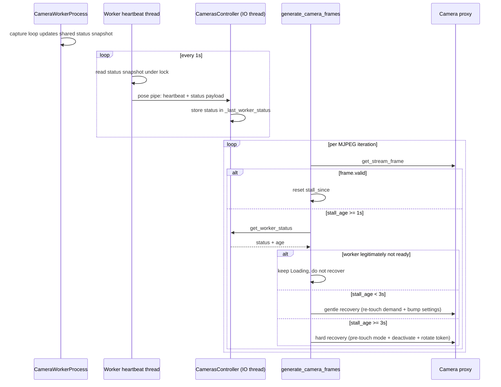

# Generic MJPEG Stream Stall Watchdog

## Goals

- Detect any MJPEG stall (mode switch desync, USB hiccup, YOLO warm-up, etc.) within ~1 s.
- Distinguish "worker is legitimately not ready" from "worker is producing but main's pipeline is desynced", using a status-enriched worker heartbeat (no new IPC).
- Recover desync cases server-side **without closing the HTTP connection** (browser MJPEG does not auto-reconnect on connection close).
- Change minimal, fully inside `server/` Python code; no frontend changes.

## Non-goals

- Do not implement variant 1 (`_ensure_active` pretouch) — explicitly skipped per user choice. Its effect is folded into the hard-recovery path of the watchdog.
- No new multiprocessing primitives, no request/response correlation, no new pipes.

## High-level flow



## Changes

### 1) [server/cameraworker.py](server/cameraworker.py) — shared status + enriched heartbeat

Currently the heartbeat thread (`_heartbeat_thread_main`, around line 211) sends a minimal `{"type": "heartbeat", "time": time.time()}`. All state we want to report lives as locals inside `run()`.

Introduce a small lock-protected status container visible to both the capture loop and the heartbeat thread. Minimal-intrusion approach: a plain `dict` + `threading.Lock` created in `run()` and captured by the heartbeat closure.

Fields (all wall-clock `time.time()` or `time.monotonic()` as noted):

- `active_camera_index: int` (-1 = idle)
- `active_camera_code: str | None`
- `select_applied_mono: float` (monotonic; set inside `_apply_select` right after successful `device.open()`)
- `device_state: "closed" | "opening" | "open" | "failed"`
- `last_capture_ok_mono: float` (monotonic; 0.0 = never)
- `last_capture_fail_mono: float` (monotonic; 0.0 = never)
- `ai_inference_started_mono: float`
- `ai_inference_completed_mono: float`
- `ai_model_state: "not_loaded" | "loading" | "ready" | "failed"`
- `demand_seen: {"raw": bool, "masked": bool, "ai": bool}`
- `seq: {"raw": int, "masked": int, "ai": int}`
- `heartbeat_mono: float` (monotonic; refreshed by heartbeat thread itself)

Call sites that update the container (all inside `run()`):

- `_apply_select`: set `device_state="opening"`, then on success set `device_state="open"`, `select_applied_mono=time.monotonic()`, `active_camera_index/code`; on failure set `device_state="failed"`, `active_camera_index=-1`.
- `release_camera` branch: `device_state="closed"`, `active_camera_index=-1`.
- Capture success (after `device.get_image()` returned `valid`): `last_capture_ok_mono=now_mono`.
- Capture failure branch (around line 391): `last_capture_fail_mono=now_mono`, and when we close/reopen inside that branch set `device_state="opening"` then back to `"open"` / `"failed"` based on `device.open()` result.
- `update_demand` command handler: update `demand_seen` to the new tuple.
- After each successful JPEG publish to a ring: `seq[ring_key] = seq_<ring_key>`.
- Right before `_run_ai_inference(...)` call: `ai_inference_started_mono = now_mono`; if `ai_model_state != "ready"` then set to `"loading"`.
- Right after the call returns normally: `ai_inference_completed_mono = now_mono`, `ai_model_state="ready"`.
- On `_run_ai_inference` exception: `ai_model_state="failed"`.

Heartbeat thread change:

```python
def _heartbeat_thread_main() -> None:
    while not heartbeat_stop.is_set():
        try:
            with status_lock:
                status_snapshot = dict(status)
                status_snapshot["demand_seen"] = dict(status["demand_seen"])
                status_snapshot["seq"] = dict(status["seq"])
            status_snapshot["heartbeat_mono"] = time.monotonic()
            with pose_send_lock:
                self._pose_conn.send({
                    "type": "heartbeat",
                    "time": time.time(),
                    "status": status_snapshot,
                })
        except (BrokenPipeError, OSError, EOFError):
            return
        except Exception as exc:
            print(f"[Worker] heartbeat send error: {exc}")
        if heartbeat_stop.wait(timeout=HEARTBEAT_SEND_INTERVAL):
            return
```

Key constraint: the heartbeat thread must never block on a lock held by the capture loop. Keep the `status_lock` critical section tiny (just snapshot the dict); the capture loop only holds the lock while doing scalar assignments.

Because the heartbeat thread is already separate from the capture loop, an in-progress `_run_ai_inference` (e.g. first-ever YOLO inference taking 20 s) does not block heartbeats — `ai_inference_started_mono > ai_inference_completed_mono` for those 20 s, which is exactly how main classifies "YOLO warming up".

### 2) [server/camerascontroller.py](server/camerascontroller.py) — cache worker status

In `_io_thread_loop` (heartbeat-consuming block around line 313), extend the `mtype == "heartbeat"` handler to also stash the status snapshot:

```python
if mtype == "heartbeat":
    self._last_worker_heartbeat = now_mono
    status = msg.get("status")
    if isinstance(status, dict):
        with self._worker_status_lock:
            self._last_worker_status = status
            self._last_worker_status_mono = now_mono
    continue
```

Add in `__init__`:

```python
self._worker_status_lock = threading.Lock()
self._last_worker_status: dict | None = None
self._last_worker_status_mono: float = 0.0
```

Add a public accessor used by the relay:

```python
def get_worker_status(self) -> tuple[dict | None, float]:
    """Return (latest worker status snapshot, age_in_seconds).
    age is math.inf if no status has ever arrived."""
    with self._worker_status_lock:
        status = self._last_worker_status
        stamp = self._last_worker_status_mono
    if status is None or stamp == 0.0:
        return None, float("inf")
    return status, max(0.0, time.monotonic() - stamp)
```

Also clear the cache on worker restart: in `_cleanup_worker_locked` (or wherever the worker is torn down), set `self._last_worker_status = None` / `self._last_worker_status_mono = 0.0` under the lock so the relay can tell "worker was replaced; previous status is meaningless".

### 3) [server/restapicameras.py](server/restapicameras.py) — stall detector + classifier + recovery

Inside `generate_camera_frames`, add per-connection watchdog state right after `last_seq_by_mode` is initialized:

```python
stall_since_mono: float | None = None
last_gentle_recovery_mono: float = 0.0
last_hard_recovery_mono: float = 0.0
WATCHDOG_STALL_GRACE = 1.0
WATCHDOG_GENTLE_PERIOD = 1.0
WATCHDOG_HARD_THRESHOLD = 3.0
WATCHDOG_HARD_COOLDOWN = 5.0
```

The loop currently distinguishes three cases for `frame`:

- `frame.valid and frame.data` — yield, this is "live".
- `frame.data` (not valid) — real Loading placeholder ring.
- no `frame.data` — no-change sentinel.

Amend to also update `stall_since_mono`:

- On `frame.valid and frame.data`: `stall_since_mono = None` (reset any in-flight recovery state).
- Otherwise (Loading placeholder or no-change sentinel): if `stall_since_mono is None`, set to `time.monotonic()`.

After those branches, add the watchdog block:

```python
if stall_since_mono is not None:
    stall_age = time.monotonic() - stall_since_mono
    if stall_age >= WATCHDOG_STALL_GRACE:
        status, status_age = (
            master_controller.cameras_controller.get_worker_status()
        )
        if not _watchdog_worker_legitimately_not_ready(
            status=status, status_age=status_age, mode=mode,
            camera_index=camera.index,
        ):
            if stall_age < WATCHDOG_HARD_THRESHOLD:
                if (time.monotonic() - last_gentle_recovery_mono
                        >= WATCHDOG_GENTLE_PERIOD):
                    _watchdog_gentle_recovery(camera=camera, mode=mode)
                    last_gentle_recovery_mono = time.monotonic()
            else:
                if (time.monotonic() - last_hard_recovery_mono
                        >= WATCHDOG_HARD_COOLDOWN):
                    stream_token = _watchdog_hard_recovery(
                        master_controller=master_controller,
                        camera=camera, mode=mode,
                        old_stream_token=stream_token,
                        last_seq_by_mode=last_seq_by_mode,
                    )
                    last_hard_recovery_mono = time.monotonic()
                    stall_since_mono = time.monotonic()
```

Helper functions (module-level in `restapicameras.py`):

```python
def _watchdog_worker_legitimately_not_ready(
    *, status: dict | None, status_age: float, mode: int, camera_index: int,
) -> bool:
    if status is None or status_age > 3.0:
        return True  # stale / missing status -> do not force recovery yet
    if int(status.get("active_camera_index", -1)) != int(camera_index):
        return True  # worker not on our camera yet (select in flight)
    device_state = status.get("device_state", "closed")
    if device_state in ("closed", "opening", "failed"):
        return True
    now_mono = time.monotonic()
    select_applied = float(status.get("select_applied_mono", 0.0) or 0.0)
    if select_applied and (now_mono - select_applied) < 1.5:
        return True
    last_fail = float(status.get("last_capture_fail_mono", 0.0) or 0.0)
    last_ok = float(status.get("last_capture_ok_mono", 0.0) or 0.0)
    if last_fail and last_fail > last_ok and (now_mono - last_fail) < 2.0:
        return True
    if mode == 3:
        started = float(status.get("ai_inference_started_mono", 0.0) or 0.0)
        completed = float(status.get("ai_inference_completed_mono", 0.0) or 0.0)
        if started > completed and (now_mono - started) > 0.5:
            return True
        if status.get("ai_model_state") in ("not_loaded", "loading"):
            return True
    return False

def _watchdog_gentle_recovery(*, camera, mode: int) -> None:
    try:
        camera._touch_access(mode=mode)
    except Exception as exc:
        print(f"[Watchdog] gentle recovery touch_access failed: {exc}")
    try:
        camera.settings = camera.settings  # bump _settings_version
    except Exception as exc:
        print(f"[Watchdog] gentle recovery settings bump failed: {exc}")

def _watchdog_hard_recovery(
    *, master_controller, camera, mode: int,
    old_stream_token: int, last_seq_by_mode: dict[str, int],
) -> int:
    print(f"[Watchdog] hard recovery on camera index={camera.index} mode={mode}")
    # Pre-touch the REQUESTED mode BEFORE we tear down the proxy thread.
    # This is the one line that prevents the recovery itself from
    # re-entering the update_demand(masked=False) race that variant 1
    # would have fixed in _ensure_active.  Without it, our own recovery
    # can restart the proxy thread with _last_access_time_masked=0,
    # the new thread's init _touch_access(mode=0) would send
    # update_demand(masked=False) right after select_camera, and we
    # would be back in the same stuck-Loading state.
    try:
        camera._touch_access(mode=mode)
    except Exception:
        pass
    try:
        master_controller.cameras_controller.deactivate_camera(camera)
    except Exception as exc:
        print(f"[Watchdog] deactivate_camera failed: {exc}")
    try:
        camera.stop()  # invalidates tokens + joins proxy thread with 4s cap
    except Exception as exc:
        print(f"[Watchdog] camera.stop failed: {exc}")
    for key in last_seq_by_mode:
        last_seq_by_mode[key] = 0
    new_token = camera.create_stream_token()
    return new_token
```

Notes on hard recovery:

- We reuse the existing connection. The generator loop keeps going with the new `stream_token`; the next `camera.get_stream_frame(...)` call will re-enter `_ensure_active`, which will call `activate_camera` (sends fresh `select_camera`), restart the proxy thread, and thanks to the pre-`_touch_access(mode=mode)` the `update_demand(masked/ai=True)` flag reaches the worker before the proxy thread's own init `_touch_access(mode=0)`.
- The browser sees no connection drop. While hard recovery is running (a few hundred ms), `get_stream_frame` will return Loading placeholders, which the relay rate-limits to 0.5 s — no flicker.
- `HARD_COOLDOWN = 5.0 s` prevents recovery thrashing if the root cause is external (camera physically unplugged, worker crashed).

## Intentionally NOT changed

- `Camera._ensure_active` — no variant 1 pre-touch there. Equivalent effect is applied in the watchdog hard-recovery path only.
- `Camera.run()` initial `_touch_access(mode=0)` — unchanged.
- `CamerasController.update_demand_from_camera` — unchanged.
- Frontend (`ManualControl.jsx`, `Polygon.jsx`) — unchanged.
- `stop_camera` REST endpoint — unchanged.

## Verification

Manual, on real hardware (physical camera with nonzero warmup):

1. **Mode switch** (original bug repro): Manual Control Save from Raw → Mask.
   - Expect: live frames within at most `WATCHDOG_STALL_GRACE + gentle_recovery_propagation` ≈ 1.0–1.2 s, without requiring Setup → Cancel.
   - Logs: `[Watchdog] hard recovery ...` should NOT appear on this path (gentle recovery should suffice).

2. **Mode switch Mask → Raw**: same expectation.

3. **Mode switch Raw → AI (mode=3)**: first time after server start, YOLO loads (10–30 s).
   - Expect: "Loading, please wait a minute..." stays throughout the YOLO load with NO `[Watchdog]` log entries (because status classifier sees `ai_model_state in ("not_loaded","loading")` and skips recovery).
   - Once YOLO finishes, live AI frames arrive; no recovery happened.

4. **USB disconnect mid-stream**: unplug the USB camera.
   - Expect: Loading placeholder, no `[Watchdog]` log entries (classifier sees `last_capture_fail_mono` recent).
   - Plug back in: stream resumes without recovery action.

5. **Artificial desync**: in the worker, hack the capture loop to drop `update_demand` messages once to simulate the state-sync bug.
   - Expect: gentle recovery restores the stream within ~1 s; `[Watchdog] hard recovery ...` log does not appear.

6. **Worker hang** (e.g. artificially `time.sleep(10)` in capture loop in a dev build):
   - Expect: existing worker-heartbeat-stale detector (`_WORKER_HEARTBEAT_STALE * 3` in [server/camerascontroller.py](server/camerascontroller.py)) kills the worker; relay sees status age > 3 s → classifier returns "not ready" → no false hard recovery; worker restart logs appear.

7. **Spam Save twice**: two Save clicks in rapid succession.
   - Expect: stream recovers within the budget; the `WATCHDOG_HARD_COOLDOWN = 5 s` prevents double hard recovery.

Automated:

```
pytest tests
```

must still pass. Add one focused unit test (or smoke test) for `_watchdog_worker_legitimately_not_ready` with representative status dicts (device opening, YOLO loading, capture failing, fully-ready-but-stuck).

## Rollback plan

The watchdog is entirely additive and gated by stall detection; reverting the three files ([server/cameraworker.py](server/cameraworker.py), [server/camerascontroller.py](server/camerascontroller.py), [server/restapicameras.py](server/restapicameras.py)) is sufficient to go back to today's behavior. The only cross-cutting concern is the heartbeat message shape — main tolerates missing `status` via `isinstance(status, dict)` guards, so a partially-rolled-back worker (without status) still works.
