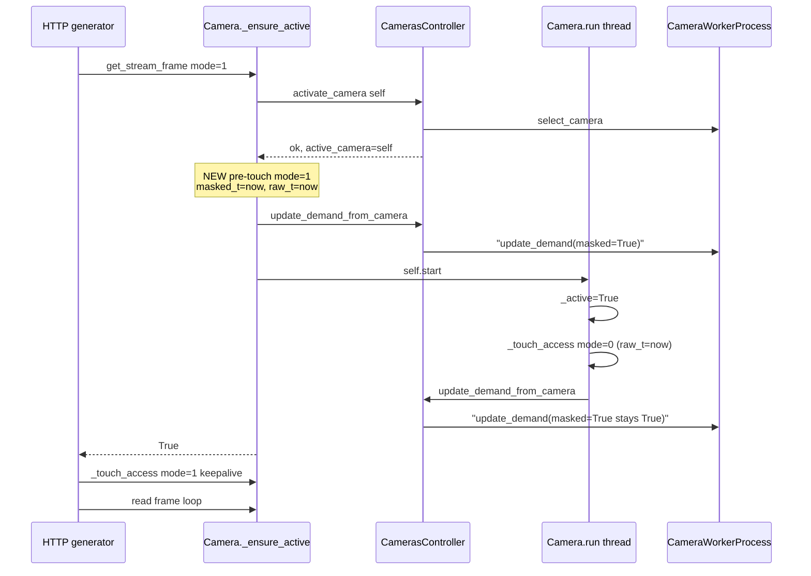

# Fix Stuck "Loading..." After Manual Control Save

## Problem Recap

After `POST /api/cameras/stop` (issued by `handleSaveMotors` in [server/wwwroot/src/ManualControl.jsx](server/wwwroot/src/ManualControl.jsx)) a new MJPEG request triggers a full proxy-thread restart in [Camera._ensure_active](server/camera.py). The order of worker-pipe messages can end up as:

1. `select_camera` (from `CamerasController.activate_camera`)
2. `update_demand(masked=False, raw=True, ai=False)` (from the new thread's `Camera.run()` init doing `self._touch_access(mode=0)`, while `_last_access_time_masked` is still 0)
3. `update_demand(masked=True, ...)` (later, from the HTTP generator's post-`_ensure_active` `_touch_access(mode=mode)`)

If the worker processes (2) before (3) for the capture iteration right after `_apply_select`, it skips masked/AI encoding and the masked/AI ring stays at `seq=0`, which makes `Camera.get_stream_frame` keep returning the "Loading" placeholder (see [server/restapicameras.py](server/restapicameras.py) line 463-476).

## Fix

Pre-touch the requested mode inside `_ensure_active`, immediately after `controller.activate_camera(self)` succeeds and **before** `self.start()`. Because `_touch_access` synchronously calls `CamerasController.update_demand_from_camera(self)` under `_worker_lock`, this guarantees the worker pipe order becomes:

1. `select_camera`
2. `update_demand(<mode>=True)`   <-- new, sent while main thread still holds the control path
3. `update_demand(raw_t=now, masked_t=now, ai_t=now or 0)`   <-- from thread's own `_touch_access(mode=0)` after `self.start()`; now consistent because `_last_access_time_masked` / `_last_access_time_ai` were set by step 2

No matter which of (2) or (3) wins a subsequent race, both carry the correct demand flags for the mode the generator is actually streaming.

## Sequence Diagram (after fix)



## Changes

### 1) [server/camera.py](server/camera.py) - add `mode` to `_ensure_active` and pre-touch before thread start

Current signature and body (lines 284-322):

```284:322:server/camera.py
    def _ensure_active(self, *, stream_token: int | None = None) -> bool:
        if not self._is_stream_token_current(stream_token=stream_token):
            return False

        mc = self._master_controller
        if mc is None:
            return False
        controller = getattr(mc, "cameras_controller", None)
        if controller is None:
            return False

        # Ask the controller to put the singleton worker on this camera.
        activated = controller.activate_camera(self)
        if not activated:
            return False

        if not self.is_alive():
            try:
                if not self._is_stream_token_current(stream_token=stream_token):
                    return False
                if not self.is_alive() and not self._active:
                    threading.Thread.__init__(self)
                    self.daemon = True
                self.start()
                # Shortened spin-wait: ...
                for _ in range(int(0.5 / EPSILON_DELAY)):
                    if not self._is_stream_token_current(stream_token=stream_token):
                        return False
                    if self._active:
                        break
                    time.sleep(EPSILON_DELAY)
            except RuntimeError as err:
                print(f"Error starting camera proxy thread for {self._camera_name}: {err}")
                return False
        return self._is_stream_token_current(stream_token=stream_token)
```

Required changes:

- Add required keyword arg `mode: int`.
- Add a `self._touch_access(mode=mode)` call **inside** the `if not self.is_alive():` branch, **before** `self.start()` (and after the stream-token re-check so we do not bother if the caller has been superseded).
- Keep the spin-wait and rest of the function unchanged.

New body (pseudo-diff, only the relevant hunk):

```python
def _ensure_active(self, *, mode: int, stream_token: int | None = None) -> bool:
    if not self._is_stream_token_current(stream_token=stream_token):
        return False

    mc = self._master_controller
    if mc is None:
        return False
    controller = getattr(mc, "cameras_controller", None)
    if controller is None:
        return False

    activated = controller.activate_camera(self)
    if not activated:
        return False

    if not self.is_alive():
        try:
            if not self._is_stream_token_current(stream_token=stream_token):
                return False
            if not self.is_alive() and not self._active:
                threading.Thread.__init__(self)
                self.daemon = True

            # Touch the requested mode BEFORE starting the proxy thread
            # so the worker receives update_demand(<mode>=True) as the
            # very first demand message after select_camera.  Without
            # this, the new thread's init _touch_access(mode=0) in
            # run() races against the generator's post-_ensure_active
            # _touch_access(mode=mode) and the worker can end up with
            # demand_masked / demand_ai == False after select_camera,
            # which leaves the masked/AI ring stuck at seq=0 and the
            # HTTP relay keeps emitting the "Loading..." placeholder.
            # activate_camera above already set _active_camera = self,
            # so update_demand_from_camera will actually hit the wire.
            self._touch_access(mode=mode)

            self.start()
            for _ in range(int(0.5 / EPSILON_DELAY)):
                if not self._is_stream_token_current(stream_token=stream_token):
                    return False
                if self._active:
                    break
                time.sleep(EPSILON_DELAY)
        except RuntimeError as err:
            print(f"Error starting camera proxy thread for {self._camera_name}: {err}")
            return False
    return self._is_stream_token_current(stream_token=stream_token)
```

Key points:

- The pre-touch is scoped to the restart branch (`if not self.is_alive()`). On the fast path (thread still alive) nothing changes, so the existing keepalive via `get_stream_frame`'s post-call `_touch_access(mode=mode)` keeps working.
- For `mode=0`, the pre-touch is functionally equivalent to what the thread's init `_touch_access(mode=0)` does, so it is a safe no-op semantically.
- For `mode=1` / `mode=3`, the pre-touch sets `_last_access_time_masked` (and `_last_access_time_ai` for mode=3) to `now`, so every subsequent `update_demand_from_camera` from the freshly started thread already sees the correct mask/AI timestamps.

### 2) [server/camera.py](server/camera.py) - pass `mode` from the single caller

Current call site at line 401 (inside `get_stream_frame`):

```398:404:server/camera.py
        if quality is not None:
            self.set_requested_quality(mode=mode, quality=int(quality))

        if not self._ensure_active(stream_token=stream_token):
            return self._loading_frame(mode=mode)

        self._touch_access(mode=mode)
```

Change to:

```python
        if quality is not None:
            self.set_requested_quality(mode=mode, quality=int(quality))

        if not self._ensure_active(mode=mode, stream_token=stream_token):
            return self._loading_frame(mode=mode)

        self._touch_access(mode=mode)
```

Keep the post-call `self._touch_access(mode=mode)` unchanged - it is needed as the continuous keepalive that prevents the proxy thread's `_should_stay_alive` from tripping after `Camera.TIMEOUT_SECONDS = 5` on the fast path.

## Intentionally NOT Changing

- `Camera.run()`'s initial `self._touch_access(mode=0)` at line 491 stays. It is a harmless keepalive that, after this fix, will already see fresh `_last_access_time_masked` / `_last_access_time_ai` values set by the pre-touch, so its `update_demand_from_camera` send cannot downgrade the demand flags.
- `CamerasController.update_demand_from_camera` at [server/camerascontroller.py](server/camerascontroller.py) line 446-471 stays.
- `generate_camera_frames` in [server/restapicameras.py](server/restapicameras.py) stays. The initial "Loading..." JPEG emission is still correct - after the fix it will simply be replaced by a real frame much sooner.
- [server/wwwroot/src/ManualControl.jsx](server/wwwroot/src/ManualControl.jsx) stays.

## Verification

Manual, on real hardware (since the bug reproduces only on physical cameras with nonzero warmup):

1. Start on Manual Control with `scope_camera` in Raw mode, confirm live stream.
2. Open Setup, switch Scope Camera Raw -> Mask, press Save. Expect the live mask stream to appear within 1-2 s (previously: stuck on "Loading..." until next Setup/Cancel).
3. Open Setup, switch Mask -> Raw, press Save. Same expectation in the opposite direction.
4. Open Setup, switch Scope Camera Raw -> AI (mode=3), press Save. Expect AI overlay within the usual YOLO warmup window, no residual "Loading..." after the first post-warmup frame.
5. Spam Save twice in a row with no intervening mode change. Expect the stream to recover without any stuck "Loading...".

Sanity check - existing pytest suite:

```
pytest tests
```

must still pass (no tests touch `_ensure_active` or `_touch_access` directly - confirmed by grep over `tests/`).