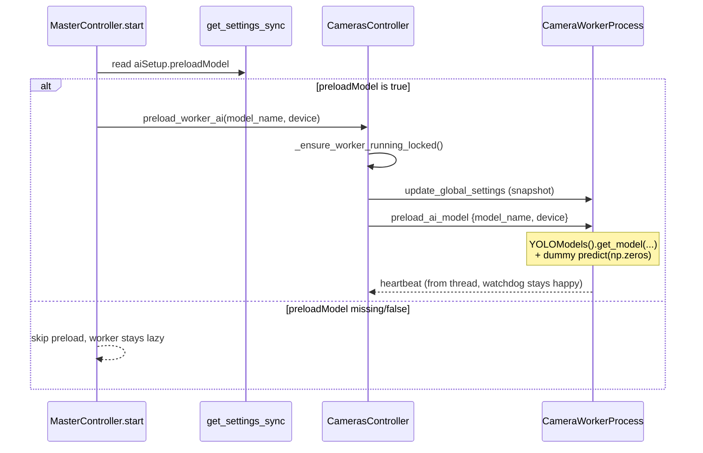

## Context

Today the worker is started lazily:
- [server/camerascontroller.py](server/camerascontroller.py) `activate_camera()` -> `_ensure_worker_running_locked()` only spawns `CameraWorkerProcess` on the first stream request.
- The YOLO model is loaded only inside `_run_ai_inference()` in [server/cameraworker.py](server/cameraworker.py) (via `YOLOModels().predict(...)`), so the first AI frame takes ~10-15 s (import + `model.to(device)` + first forward pass).

Goal: during app startup (`MasterController.start()`), bring the worker up "empty" (no `select_camera`), push a snapshot of the global settings and send a new `preload_ai_model` command. The worker then calls `YOLOModels().get_model(...)` plus one dummy inference against a black image so the model is fully warm.

This behavior is gated by a new boolean `settings.aiSetup.preloadModel`. If the flag is `True`, preload runs. If it is missing, `False`, or any other value, preload is skipped and the worker stays idle until the first Manual Control request (current behavior).

The flag already exists in [server/wwwroot/src/assets/settings.json](server/wwwroot/src/assets/settings.json) at line 741 (`"preloadModel": true`). `AISetupConfigModel` in [server/settingsschema.py](server/settingsschema.py) uses `model_config = ConfigDict(extra="allow", strict=True)`, so no schema change is required.

## Flow



## Changes

### 1) [server/cameraworker.py](server/cameraworker.py) - new `preload_ai_model` command

In the command-draining section (around lines 270-300) add:

```python
elif cmd == "preload_ai_model":
    last_heartbeat_recv = now_mono
    _preload_ai_model(
        model_name=msg.get("model_name"),
        device=msg.get("device"),
    )
```

And a module-level helper (analogous to `_run_ai_inference`):

```python
def _preload_ai_model(*, model_name: str | None, device: str | None) -> None:
    from .yolomodels import YOLOModels
    from .ai_setup_constants import DEFAULT_DEVICE
    import numpy as np
    try:
        models = YOLOModels()
        mn = model_name or models.default_model_name
        dev = device or DEFAULT_DEVICE
        models.get_model(model_name=mn, preferred_device=dev)
        dummy = np.zeros((64, 64, 3), dtype=np.uint8)
        models.predict(model_name=mn, preferred_device=dev, image=dummy, verbose=False)
        print(f"[Worker] YOLO preload done: model='{mn}' device='{dev}'")
    except Exception as exc:
        print(f"[Worker] YOLO preload failed: {exc}")
```

Notes:
- The heartbeat thread inside the worker (see lines 169-188) keeps liveness alive even during the slow first inference, so the main worker process is not killed.
- The call is idempotent - `YOLOModels` has a cache (`_model_cache`); repeated preloads are a no-op.

### 2) [server/camerascontroller.py](server/camerascontroller.py) - public API `preload_worker_ai`

Add a method that ensures the worker is running and sends it the global settings + the preload command:

```python
def preload_worker_ai(self, *, model_name: str, device: str) -> bool:
    with self._worker_lock:
        if not self._ensure_worker_running_locked():
            return False
        try:
            snapshot = dict(deepcopy(get_settings_sync()))
        except Exception:
            snapshot = {}
        self._transport.send_command({"cmd": "update_global_settings", "settings": snapshot})
        self._last_sent_global_settings = snapshot
        self._transport.send_command({
            "cmd": "preload_ai_model",
            "model_name": model_name,
            "device": device,
        })
        return True
```

### 3) [server/mastercontroller.py](server/mastercontroller.py) - call preload on startup (conditional)

In `MasterController.start()`, after `motors_controller` and `ai_agent` are started, read the settings and decide whether to preload. The HTTP server does not need to wait for the preload to finish; the worker process just receives the message and loads the model concurrently with the rest of server initialization.

```python
def start(self):
    if self._started:
        return
    self.motors_controller.start()
    self.ai_agent.start()
    self._maybe_preload_camera_worker()
    self._started = True

def _maybe_preload_camera_worker(self) -> None:
    try:
        from .settingscontroller import get_settings_sync
        from .ai_setup_constants import DEFAULT_DEVICE
        settings = get_settings_sync() or {}
        ai_setup = settings.get("aiSetup", {}) if isinstance(settings, dict) else {}
        if ai_setup.get("preloadModel") is not True:
            print("[MasterController] camera worker preload skipped (aiSetup.preloadModel not true)")
            return
        model_name = ai_setup.get("modelName") or ""
        device = ai_setup.get("device") or DEFAULT_DEVICE
        self.cameras_controller.preload_worker_ai(model_name=model_name, device=device)
    except Exception as exc:
        print(f"[MasterController] camera worker preload skipped: {exc}")
```

The check uses `is not True` so only an explicit boolean `True` enables preload; any missing value, `False`, `None`, `"true"` string, `1`, etc. leave the worker lazy and the old behavior intact.

### 4) Nit: restart backoff stays untouched

`_ensure_worker_running_locked()` already supports restart backoff (`_restart_count`, `_RESTART_BACKOFF_BASE`). Because preload runs during `start()` and the worker has not started yet, the `self._worker is not None` branch is False and backoff is bypassed (correct state). No further change needed.

### 5) Schema note

No change to [server/settingsschema.py](server/settingsschema.py) is needed: `AISetupConfigModel` accepts extra fields (`extra="allow"`), so `preloadModel` flows through normalization untouched. The default `settings_default.json` and shipped `settings.json` already contain `"preloadModel": true`, so existing deployments behave as today; users can turn preload off by editing it to `false`.

## Verification

- With `aiSetup.preloadModel: true` in [settings.json](server/wwwroot/src/assets/settings.json):
  - `python -m server.main` -> within ~1 s the log should show:
    - `[Controller] Camera worker started`
    - `[Worker] YOLO preload done: model='...' device='...'`
  - Opening Manual Control afterwards shows the AI overlay almost immediately (no 10-15 s "Loading..." screen).
- With `aiSetup.preloadModel: false` or the field removed:
  - Startup log shows `[MasterController] camera worker preload skipped (aiSetup.preloadModel not true)`.
  - No camera worker process is spawned until the first Manual Control request (unchanged legacy behavior).
- If `aiSetup.device` is unsupported (e.g. `cuda:0` without CUDA), `YOLOModels._resolve_device_config()` already falls back to CPU and just logs a warning - the worker does not crash.

## Out of scope (follow-ups)

- Re-preload when `aiSetup.modelName` / `device` changes from the UI (today the model is swapped lazily on the next AI frame after a change).
- Background preload of other models.
- Exposing `preloadModel` as a toggle in the AI Setup UI.
