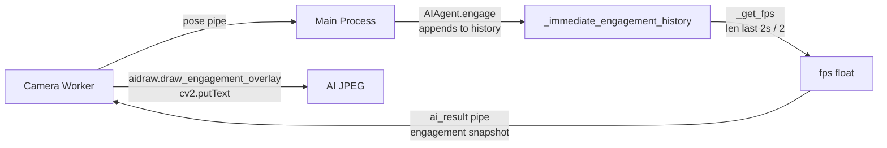
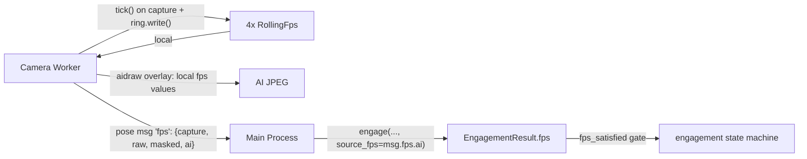

## Architektura

Dnešní tok FPS:



Nový tok:



Klíčový princip: FPS je **producer-side metrika** (worker ví, kolik sám stihne). Main ji jen přebírá pro engagement gate.

## Soubory a změny

### 1. Nová pomocná třída `RollingFps` — [server/cameraworker.py](server/cameraworker.py)

Přidat do souboru (blízko `POLL_BATCH_LIMIT` konstant) jednoduchou strukturu se sliding window 2 s:

```python
class RollingFps:
    __slots__ = ("_window", "_ts")
    def __init__(self, window: float = 2.0):
        self._window = window
        self._ts: collections.deque[float] = collections.deque()
    def tick(self, now: float) -> None:
        self._ts.append(now)
        cutoff = now - self._window
        while self._ts and self._ts[0] < cutoff:
            self._ts.popleft()
    def value(self, now: float) -> float:
        cutoff = now - self._window
        while self._ts and self._ts[0] < cutoff:
            self._ts.popleft()
        return len(self._ts) / self._window
```

2 s zachovává sémantiku současného [`_get_fps` v aiagent.py](server/aiagent.py).

### 2. Měření ve worker smyčce — [server/cameraworker.py](server/cameraworker.py)

V `_main_loop` (uvnitř `run()`) vytvořit instance:

```python
fps_capture = RollingFps()
fps_raw = RollingFps()
fps_masked = RollingFps()
fps_ai = RollingFps()
```

Vložit `tick(now_ts)` na tato místa:

- **Capture** — hned po úspěšném `device.get_image()` (řádky ~340–345), tzn. po větvi `if not valid or image is None: continue`.
- **Raw ring** — za `rings["raw"].write(...)` (řádky 394–401).
- **Masked ring** — za `rings["masked"].write(...)` (řádky 421–427).
- **AI ring** — za `rings["ai"].write(...)` (řádek 512).

Pomocný snapshot (volaný před odesláním pose):

```python
def _fps_snapshot(now: float) -> dict:
    return {
        "capture": fps_capture.value(now),
        "raw": fps_raw.value(now),
        "masked": fps_masked.value(now),
        "ai": fps_ai.value(now),
    }
```

### 3. Piggyback na pose message — [server/cameraworker.py](server/cameraworker.py) řádky 441–454

Do payloadu `self._pose_conn.send({...})` přidat jeden klíč:

```python
"fps": _fps_snapshot(now_ts),
```

Rozměry zpráv zůstávají malé (4 floats), bez nového pipe, bez změny `collect_pose_messages`.

### 4. Overlay kreslí z lokálních hodnot — [server/cameraworker.py](server/cameraworker.py) + [server/aidraw.py](server/aidraw.py)

V místě volání `draw_engagement_overlay` (cameraworker.py ~478–490) přestat brát FPS ze `last_engagement["fps"]` a místo toho předávat `fps_ai.value(now_ts)` (worker to má lokálně, bez round-tripu):

```python
draw_engagement_overlay(
    image=ai_frame,
    status_value=...,
    engagement_counter=...,
    fps=fps_ai.value(now_ts),
    pose=fresh_pose_dict,
    ai_setup=ai_setup_for_draw,
    draw_ai_stats=...,
)
```

Signatura `draw_engagement_overlay` zůstává. `aidraw.py` beze změn.

Vedlejší benefit: odpadá drift mezi zobrazovaným FPS a aktuálním stavem (dnes má zpoždění ~1 engage iteraci).

### 5. `AIAgent.engage` přijímá FPS zvenčí — [server/aiagent.py](server/aiagent.py)

- Přidat parametr `source_fps: float = 0.0` do `engage()`.
- Nahradit blok `result.fps = self._get_fps(now=now)` za `result.fps = float(source_fps)`.
- `_get_fps` smazat (už nepoužit). `_immediate_engagement_history` **zůstává** — `_get_organ_visible_duration` na řádcích 375–391 ho stále čte.
- `fps_satisfied` logika beze změny — jen vstupní hodnota je teď worker-reported.

### 6. `_process_pose` propaguje FPS — [server/camera.py](server/camera.py) řádky 541–620

V `_process_pose`, po extrakci `latest = msgs[-1]` (řádek 573):

```python
fps_info = latest.get("fps") if isinstance(latest, dict) else None
source_fps_ai = float((fps_info or {}).get("ai", 0.0))
```

a předat do engage:

```python
engagement_result = ai_agent.engage(
    frame=frame, settings=settings, source_fps=source_fps_ai,
)
```

### 7. Engagement snapshot → worker už FPS nenese

V [server/aiagent.py](server/aiagent.py) kolem řádku 665 (`build_engagement_snapshot`) a v [server/cameraworker.py](server/cameraworker.py) kolem řádku 484 se dnes přenáší `"fps"` tam i zpátky. Krok 4 odstraňuje jediného konzumenta v workeru, takže `fps` ze snapshot payloadu lze **smazat**. Pokud ho čte REST API (`restapicameras.py`), hodnota zůstane validní — jen je teď vyplněna z worker-reported FPS prostřednictvím `EngagementResult.fps` v main.

Krátce ověřit `restapicameras.py` a případné spotřebitele snapshot.fps — hodnota je stále k dispozici přes `EngagementResult.fps` (nyní naplněná z workeru), takže veřejné API se nemění.

## Edge cases

- **Žádné pose zprávy (např. AI zakázáno, raw-only stream)** — main nedostává žádný FPS update. Engagement gate (`fps_satisfied`) není relevantní, protože bez AI se `engage()` ani nevolá. OK.
- **Startup window** — worker v prvních 2 s vrací nižší FPS (deque se plní). Stejné chování jako dnes (`_get_fps` rovněž má 2s window). `minFpsToAllowEngagement` tak stále působí jako warm-up brzda.
- **Přepnutí kamery** — worker by měl instance `RollingFps` vyresetovat na hraně `select_camera` / `release_camera`, aby hodnoty nezaháněly staré timestampy z předchozí kamery. Přidat `fps_*.reset()` (nebo novou instanci) v `_apply_select` / `_close_device`.
- **`_immediate_engagement_history` roste** — dnešní `deque(maxlen=1000)` stačí; nechávám.

## Co NEZMĚNÍM

- `JpegRingBuffer`, počet slotů, shared-memory layout.
- Signatury `read_jpeg_for`, `wait_for_new_jpeg_for`.
- Frontend a HTTP relay.
- `Frame` dataclass.

## Jak ověřit po implementaci

1. Na AI streamu v Manual Control overlay FPS ≈ hodnota z `fps_ai`, reaguje rychleji na změny (nemá 1-iteraci lag).
2. V main procesu `EngagementResult.fps` = hodnota z posledního pose messagu.
3. Dočasný debug log ve workeru `print(_fps_snapshot(now_ts))` ukáže 4 čísla, kde `capture ≥ raw, masked, ai`.
4. Když uměle zpomalím main proces (`time.sleep(0.1)` v `_process_pose`), overlay FPS zůstává vysoké (měří worker, ne main) — dnes by kleslo.