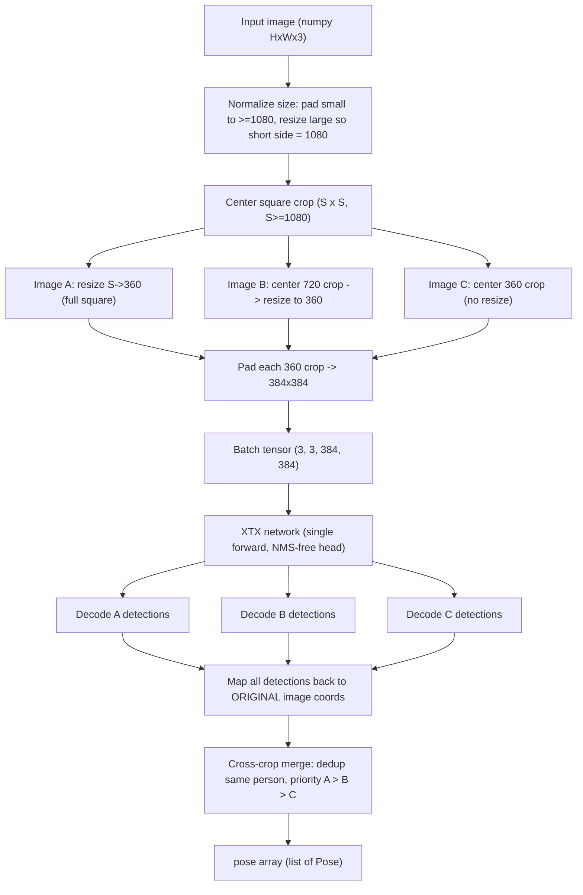

# XTX Pose — Engineering Specification

> Build-ready specification for an AI coding agent (Cursor). Implement exactly as written.
> Audience: senior Python engineer specialised in PyTorch. Target IDE: Cursor.
> Language of all code, comments, identifiers, and documentation: **English**.

---

## 0. Executive summary

Build a **new, standalone Python project** that trains and runs a family of **extremely fast human-pose estimation** networks called **XTX**, in three variants: **`XTX-n`**, **`XTX-m`**, **`XTX-l`**.

The design is *inspired by* (not copied from, and **without any dependency on**) Ultralytics **YOLO26-pose** (`yolo26n-pose`, `yolo26m-pose`, `yolo26l-pose`). The full XTX network, losses, data pipeline, training loop, and inference are implemented **from scratch in pure PyTorch**.

XTX must match or beat YOLO26-pose on accuracy at comparable or lower computational cost, with the headline differentiator being a **3-scale center-focused crop cascade (A/B/C)** that recovers small, distant people in the centre of the frame.

Key deployment facts:

- `XTX-n` must run in real time on a **Raspberry Pi** (ARM CPU), shipped via **NCNN**.
- `XTX-m` and `XTX-l` run on a normal computer (CUDA GPU or CPU) via PyTorch.
- The public library API takes an **image as a NumPy array** and returns a **pose array** (list of detected people, each with 17 COCO keypoints and per-keypoint confidence), inspired by the YOLO26-pose output format.

### Why "inspired by YOLO26-pose"

YOLO26 (Ultralytics, announced Sept 2025) introduced, for the `-pose` task:

- **End-to-end, NMS-free** inference via a dual head (one-to-one head for deployment + auxiliary one-to-many head for richer training signal; YOLOv10-style consistent dual assignment).
- **DFL removed** (box regression is a direct, hardware-friendly formulation) → cleaner ONNX/edge export.
- **RLE (Residual Log-Likelihood Estimation)** keypoint head for high-precision keypoint localisation.
- 17 COCO person keypoints; end-to-end pose output shape `(N, 300, 57)` = 6 box values `[x1,y1,x2,y2,conf,cls]` + `17×3` keypoints `[x,y,visibility]`, max 300 detections.
- Reference scale points (COCO val2017, 640px): `n` ≈ 2.9M params / 7.5 GFLOPs, `m` ≈ 21.5M / 73.1 GFLOPs, `l` ≈ 25.9M / 91.3 GFLOPs.

XTX **adopts** the NMS-free dual head, DFL-free box regression, and RLE keypoint head, and **adds** the A/B/C crop cascade plus a centre-prior label assignment. XTX runs at a **360×360 crop resolution** (internally padded to 384×384), which is far smaller than YOLO26's 640, so per-crop cost is low even though we run 3 crops.

---

## 1. Goals and non-goals

### Goals

1. Three from-scratch PyTorch pose models `XTX-n/m/l` with shared architecture and depth/width scaling.
2. A console **training pipeline** that reads a COCO-style dataset (`train/` + `test/`), trains a chosen variant, prints progress, and writes time-based checkpoints.
3. A **merge calibration** stage that tunes the A/B/C cross-crop deduplication thresholds on the test set and stores them with the model.
4. A standalone **inference example** + a reusable **library API**: `numpy image → pose array`.
5. **NCNN export** of `XTX-n` for Raspberry Pi, with a raw-NCNN inference path.
6. Accuracy ≥ YOLO26-pose of equivalent size at equal-or-lower compute, measured by OKS mAP.

### Non-goals

- No multi-class detection: a single class, `person`.
- No tracking across frames (single-image inference only).
- No dependency on `ultralytics`, `mmpose`, `detectron2`, or any pose framework. Allowed third-party: `torch`, `torchvision`, `numpy`, `opencv-python`, `onnx`, `onnxsim`, `tqdm`, plus NCNN tooling for export.
- People removed by the centre square crop (far left/right edges) are intentionally out of scope — XTX detects only within the central square (see §4).

---

## 2. Output contract (public API)

### 2.1 Function signature

```python
def detect_poses(
    image: np.ndarray,                 # HxWx3, uint8, BGR (OpenCV convention)
    *,
    conf_threshold: float = 0.25,
    max_detections: int = 300,
    return_normalized: bool = True,
) -> list[Pose]:
    ...
```

`image` is a standard OpenCV BGR `uint8` array. The library converts to the model's expected channel order/normalisation internally. Grayscale (`HxW`) input is promoted to 3 channels.

### 2.2 `Pose` data structure

Each detected person is one `Pose`. Use a `@dataclass` and also provide a plain-dict / NumPy serialisation.

```python
@dataclass(slots=True)
class Pose:
    bbox_xyxy: np.ndarray      # shape (4,), float32, person bbox in ORIGINAL image pixels
    score: float               # person/detection confidence in [0, 1]
    keypoints: np.ndarray      # shape (17, 3): [x_pixel, y_pixel, confidence]
    keypoints_norm: np.ndarray # shape (17, 3): [x_norm, y_norm, confidence], norm in [0,1] of ORIGINAL image
    visibility: np.ndarray     # shape (17,), int in {0,1,2} predicted visibility class
    source_crop: str           # "A" | "B" | "C", which crop produced the surviving detection (debug/telemetry)
```

- **Coordinate origin**: pixel coordinates are in the **original input image** coordinate system (the array passed in), not the cropped square. The library is responsible for mapping every detection from its 360-crop space all the way back to original-image pixels (see §4.4).
- Keypoint order is the **17 COCO keypoints**, fixed indices (§7.2).
- Per-keypoint `confidence` ∈ [0,1]; `visibility` is the argmax of the 3-way visibility head mapped to `{0,1,2}` (§7.2).
- A convenience `to_array()` returns a single `np.ndarray` of shape `(N, 56)` = `[x1,y1,x2,y2,score, kpt0_x,kpt0_y,kpt0_conf, ... , kpt16_x,kpt16_y,kpt16_conf]` in original-image pixels, mirroring YOLO26's flattened layout (minus the class column, since there is a single class).

### 2.3 Batch API

Provide `detect_poses_batch(images: list[np.ndarray], ...) -> list[list[Pose]]` that batches efficiently across images and across the 3 crops.

---

## 3. High-level data flow



The three crops are stacked into a single batch of shape `(3, 3, 384, 384)` and run through **one** forward pass ("processed in parallel"), then decoded per-crop, mapped back, and merged.

---

## 4. Preprocessing pipeline (exact spec)

All preprocessing lives in `xtx/data/preprocess.py` and must be **bit-for-bit identical between training and inference** (the same function builds A/B/C in both paths).

### 4.1 Size normalisation

Let the input be `W×H`.

1. **Too small** — if `min(W, H) < 1080`: create a black canvas of size `max(1080, W) × max(1080, H)` (square at least `1080×1080`; if either dimension already exceeds 1080 use that dimension so nothing is cropped away yet), and paste the original image **centred**. Record the paste offset.
2. **Too large / non-square** — otherwise, if `min(W, H) > 1080`: resize **preserving aspect ratio** so the **shorter side becomes 1080**. (e.g. `2000×4000` → `1080×2160`). Record the scale factor.
3. After step 1 or 2 the working image `WW×HH` has `min(WW, HH) >= 1080`.

> Implementation note: steps 1 and 2 are mutually exclusive branches based on `min(W,H)` vs 1080. An image that is, say, `900×3000` first goes through the small-pad branch only if `min < 1080` (here 900 < 1080) → pad to a canvas, then proceed. Document the chosen rule with examples in code docstrings.

### 4.2 Centre square crop

Take the **centred square** of side `S = min(WW, HH)` (`S >= 1080`). Example: `1920×1080 → 1080×1080`; left/right margins are discarded as the user specified. Record crop offset `(ox, oy)`.

### 4.3 Build A / B / C (each 360×360)

From the square `S×S`:

- **Image A** = resize the whole `S×S` square down to `360×360`. Scale `sA = 360 / S`. Covers the entire square (large + medium people).
- **Image B** = take the centred `720_S × 720_S` region of the square where `720_S = round(S * 720/1080)` (i.e. the central 2/3 by side at the 1080 reference; scale relative to `S`), then resize that region to `360×360`. *(At the reference `S=1080` this is exactly the central `720×720` resized to 360.)* Covers medium + small central people.
- **Image C** = take the centred `360_S × 360_S` region where `360_S = round(S * 360/1080)`, then resize to `360×360`. *(At `S=1080`, the central `360×360` with no resize.)* Covers the smallest, most distant central people.

> Rationale for scaling `720`/`360` by `S/1080`: the user's numbers (720, 360) are defined at the canonical `S=1080`. To keep behaviour consistent when `S > 1080` (large images resized to short side 1080 can still yield `S` slightly above 1080 after the long side handling, or when small-pad produced a larger canvas), scale the region sizes by `S/1080`. If you prefer strict literal behaviour, after §4.1/§4.2 force `S` to exactly 1080 by an extra resize of the square to `1080×1080`; **choose this simpler "normalise square to 1080" approach** unless profiling shows quality loss, and document it. With the square fixed at 1080, B = central 720→360, C = central 360 (no resize). The rest of this spec assumes `S = 1080`.

### 4.4 Network resolution and coordinate transforms

- Each 360×360 crop is **padded** to **384×384** by adding a 12 px border on every side (constant value 114, the common gray pad value; document the choice). 384 is divisible by 32, so the stride-8/16/32 backbone produces clean `48/24/12` feature maps. **360 is not divisible by 32 (360/32 = 11.25), which is why padding to 384 is required.**
- Maintain, per crop `k ∈ {A,B,C}`, the **affine transform** `T_k` mapping **network pixel (384 space) → original image pixel**. It is the composition of: remove 12px pad → crop-local 360 scale → region offset within square → square offset within working image → undo size-normalisation (un-resize / un-pad). Provide a single helper that returns each `T_k` as a 2×3 matrix so keypoints/boxes map back with one matrix multiply.
- `keypoints_norm` are produced by dividing original-image pixel coordinates by original `W, H`.

---

## 5. Multi-crop merge (cross-crop deduplication)

After decoding detections from A, B, C and mapping them all to original-image coordinates:

### 5.1 Matching

Two detections from different crops are considered the **same person** if their similarity exceeds calibrated thresholds. Compute both:

- **bbox IoU** of the mapped boxes.
- **OKS** (Object Keypoint Similarity) using COCO per-keypoint sigmas (§7.3) and the average of the two boxes' area as the OKS scale.

A pair matches if `OKS >= oks_match_thr` **or** `IoU >= iou_match_thr` (configurable; default `oks_match_thr=0.5`, `iou_match_thr=0.5`).

### 5.2 Priority and selection

Priority is **A > B > C**. The goal is to *keep A's detection* for any person seen in multiple crops, and only *add* B/C detections for people A missed (and add C-only for the farthest central people B also missed).

Algorithm:

1. Start the result set with all A detections (above `conf_threshold`).
2. For each B detection, if it matches any already-accepted detection → discard; else accept it (tag `source_crop="B"`).
3. For each C detection, if it matches any already-accepted detection → discard; else accept it (tag `source_crop="C"`).
4. Apply final `max_detections` cap by descending score.

Because XTX is **NMS-free within a single crop**, no intra-crop NMS is needed; the merge only resolves **cross-crop** duplicates. Implement matching greedily by descending confidence; use a spatial short-circuit (only compare boxes whose centres are within a radius) for speed.

### 5.3 Merge calibration ("learned" merge)

The merge thresholds are tuned, not hand-fixed:

- After training, run **full A/B/C inference** on the **test split** and grid/Bayesian-search over `(oks_match_thr, iou_match_thr, conf_threshold)` to **maximise merged OKS mAP**.
- Optionally fit a tiny **logistic regression** on pairwise features `[IoU, OKS, center_distance, scale_ratio, source_pair]` to predict "same person", and store its weights; the runtime then uses `P(same) >= 0.5`. Provide both modes behind a config flag `merge.mode: "threshold" | "logistic"`.
- Persist the resulting `merge_params` inside the checkpoint **and** mirror them into `config.json` so inference is self-contained.

---

## 6. XTX network architecture (from scratch)

Single class (`person`). Anchor-free. NMS-free. DFL-free. RLE keypoints. Implemented in `xtx/models/`.

### 6.1 Building blocks (`xtx/models/blocks.py`)

- `ConvBNAct`: Conv2d (no bias) + BatchNorm2d + SiLU.
- `RepConv`: re-parameterisable block (3×3 + 1×1 + identity branches at train time; fused to a single 3×3 at deploy/export time). Provide `.fuse()` and `.reparameterize()`.
- `CSPBlock` (C2f-style): split → `n` bottleneck `RepConv` units → concat → 1×1 fuse. `n` scales with depth multiplier.
- `SPPF`: spatial pyramid pooling-fast for receptive field at the deepest stage.
- `DWConv` / depthwise-separable variants used in `XTX-n` to cut FLOPs for Raspberry Pi.

### 6.2 Backbone

5 stages, strides `2,4,8,16,32` from the 384 input → feature maps at strides `8 (48×48)`, `16 (24×24)`, `32 (12×12)` are exported to the neck (call them P3, P4, P5). `XTX-n` uses depthwise-separable convs and SPPF; `m`/`l` use full `CSPBlock`s.

> Small-person emphasis: optionally expose a **P2 (stride 4, 96×96)** feature for `m`/`l` to help the smallest central people in crop C. Make P2 a config flag (`model.use_p2`); default **off for `n`** (too costly on Pi), **on for `l`**, optional for `m`.

### 6.3 Neck

**PAN/FPN**: top-down then bottom-up fusion over `{P3,P4,P5}` (+P2 when enabled), `CSPBlock` fusion at each merge. Output one feature map per pyramid level to the head.

### 6.4 Head (decoupled, dual, NMS-free)

Per pyramid level, a **decoupled head** with three branches:

1. **Box branch** → 4 values, **direct distance-to-box regression (no DFL)**: predict `(l, t, r, b)` distances from each grid cell to box edges, decoded with the level stride. Use a learnable per-level scale.
2. **Classification/score branch** → 1 logit (person confidence).
3. **Keypoint branch (RLE)** → for each of the 17 keypoints: a 2D offset `(dx, dy)` relative to the cell (decoded to box-normalised or stride-normalised coords), a **scale/σ** parameter for the RLE flow, and a **visibility** output (3-way logits → `{0,1,2}`, plus a derived `[0,1]` confidence via softmax max or sigmoid of "visible").

**Dual head (YOLOv10/YOLO26 style):**

- **One-to-many head**: dense predictions with a one-to-many label assigner (TaskAligned / SimOTA-style). Used **only during training** for a rich gradient signal.
- **One-to-one head**: produces ≤300 final detections with one-to-one assignment (consistent matching with the one-to-many head). This is the **only head active at inference/export**, giving native **NMS-free** output.
- Provide `model.fuse()` that folds Conv+BN, reparameterises `RepConv`, and **drops the one-to-many head** for deployment.

### 6.5 Output tensor layout

Training forward returns both heads' raw outputs. Deployment forward (one-to-one head, after decode) returns, per crop:

```
detections: (max_det, 56)
  [0:4]   = bbox xyxy in 384-network pixels (then mapped back via T_k)
  [4]     = person score (sigmoid)
  [5:56]  = 17 * (x, y, conf)   # keypoint x,y in 384-network pixels; conf in [0,1]
```

(56 instead of YOLO26's 57 because there is a single class, so the class column is omitted; visibility class is kept separately for the `Pose.visibility` field.) Max 300 detections per crop.

### 6.6 Scaling table (`XTX-n/m/l`)

Implement in `xtx/models/scaling.py` as a dict keyed by variant. Targets (tune during implementation to hit the compute budget; values below are the **design targets**, all measured at the **384** network resolution, **per single crop**):

| Variant | depth_mult | width_mult | max_channels | P2 | Backbone convs | Target params | Target GFLOPs/crop | Deploy target |
|---------|-----------:|-----------:|-------------:|:--:|----------------|--------------:|-------------------:|---------------|
| `XTX-n` | 0.34 | 0.25 | 512 | off | depthwise-separable | ~2.5–3.0 M | ~2.0–2.8 | Raspberry Pi (NCNN, real-time) |
| `XTX-m` | 0.67 | 0.75 | 768 | optional | full CSP | ~18–22 M | ~22–28 | PC CPU/GPU |
| `XTX-l` | 1.00 | 1.00 | 1024 | on | full CSP | ~24–28 M | ~30–38 | PC GPU |

Note: 3 crops × per-crop FLOPs gives the end-to-end cost; because resolution is 384 (not 640) the **3-crop total** is designed to be **≤ a single YOLO26 640-pass** of the same tier while being more accurate on small central people. Provide a `scripts/profile_flops.py` to verify params/FLOPs.

---

## 7. Keypoints, losses, and assignment

### 7.1 The 17 COCO keypoints (fixed order)

```
0 nose, 1 left_eye, 2 right_eye, 3 left_ear, 4 right_ear,
5 left_shoulder, 6 right_shoulder, 7 left_elbow, 8 right_elbow,
9 left_wrist, 10 right_wrist, 11 left_hip, 12 right_hip,
13 left_knee, 14 right_knee, 15 left_ankle, 16 right_ankle
```

### 7.2 Visibility

Per the dataset: `0 = not visible/absent`, `1 = occluded (labeled but hidden)`, `2 = clearly visible`. The keypoint branch predicts a 3-way visibility class; `Pose.visibility` is its argmax, and `keypoints[...,2]` confidence is `sigmoid(visible_logit)` (probability the point is present, i.e. class 1 or 2). Keypoints with predicted "absent" still report coordinates but with low confidence.

### 7.3 OKS sigmas (COCO standard)

```
[0.026,0.025,0.025,0.035,0.035,0.079,0.079,0.072,0.072,
 0.062,0.062,0.107,0.107,0.087,0.087,0.089,0.089]
```

Store in `xtx/utils/keypoints.py`; used by both OKS loss and merge matching.

### 7.4 Losses (`xtx/losses/`)

- **Box**: CIoU loss (`losses/detection_loss.py`). No DFL.
- **Classification/score**: BCE with optional **varifocal** weighting.
- **Keypoint localisation**: **RLE** loss (`losses/rle.py`) — implement the Residual Log-Likelihood Estimation objective (a learnable normalising flow / Laplace-residual formulation; reference arXiv:2107.11291). Provide a fallback **OKS loss + L1** path behind a config flag in case RLE training is unstable.
- **Keypoint visibility**: cross-entropy over `{0,1,2}` (mask absent points from the localisation loss using GT visibility > 0).
- **Assignment** (`losses/assignment.py`):
  - One-to-many: TaskAligned assigner (alignment metric = `score^α · IoU^β`), top-k candidates per GT.
  - One-to-one: consistent matching (Hungarian / top-1 by the same alignment metric) so the one-to-one head agrees with the one-to-many head — this is what removes the need for NMS.
  - **Centre-prior (XTX-specific)**: add a centre-distance prior to the assignment cost so detections near the image centre are favoured, aligning the network with the A/B/C centre-recovery objective. Weight is configurable (`loss.center_prior_weight`, default small, e.g. 0.1).
- **Total**: weighted sum; expose all weights in `config.json` (`loss.box`, `loss.cls`, `loss.kpt`, `loss.vis`, `loss.center_prior_weight`).

---

## 8. Dataset and annotations

### 8.1 Layout

```
dataset/
  train/
    img0001.jpg
    img0001.json          # or a single annotations file per folder — support both, see 8.3
    ...
  test/
    ...
```

The program **recursively scans all `*.json`** under the chosen split folder and builds an index. Images are matched to annotations by `file_name` (resolved relative to the JSON's directory).

### 8.2 Annotation schema (COCO-style, as provided)

```json
{
  "images": [
    { "id": 1, "file_name": "img0001.jpg", "width": 1920, "height": 1080 }
  ],
  "annotations": [
    {
      "id": 1,
      "image_id": 1,
      "category_id": 1,
      "name": "person",
      "supercategory": "human",
      "bbox": [0.234375, 0.166667, 0.3125, 0.791667],
      "iscrowd": 0,
      "num_keypoints": 17,
      "keypoint_names": ["nose", "left_eye", ... , "right_ankle"],
      "keypoints": [0.281250, 0.208333, 2,  ... , 0.320312, 0.875000, 0]
    }
  ]
}
```

- **`bbox`** is `[x, y, w, h]`, **normalised** to image `width/height` (values in [0,1]).
- **`keypoints`** is a flat list of `17×3 = 51` values: `x_norm, y_norm, visibility` per keypoint; `x,y` normalised to image `width/height`; `visibility ∈ {0,1,2}`.
- A single JSON may contain many images/annotations, or one per image — the loader (`xtx/data/annotations.py`) must handle both by aggregating across all JSON files and grouping annotations by `image_id`.
- Validate: keypoint count, normalised ranges, dangling `image_id`s, missing image files (warn and skip).

### 8.3 Target transform (normalised-original → crop-relative)

For each annotation and each crop `k ∈ {A,B,C}`:

1. Denormalise bbox/keypoints to **original pixel** coords using JSON `width/height`.
2. Apply the **same** size-normalisation + square crop + region selection + 360-resize + 384-pad as §4 to get **network-space (384) targets** via the inverse of `T_k`.
3. **Visibility/inclusion rules**:
   - A person is a **valid target in crop `k`** if a sufficient fraction of its visible keypoints (vis > 0) and its bbox centre fall inside crop `k`'s region (configurable `min_visible_keypoints`, default 1, and bbox-centre-inside rule).
   - Keypoints that fall outside the 384 frame are marked `visibility = 0` (absent) for that crop and **masked from localisation loss**.
   - People entirely outside crop `k` produce **no** target for that crop (this is how the model learns scale specialisation: tiny central people appear as well-sized targets in C but tiny/absent in A).

### 8.4 Training sample generation (explicit A/B/C)

Per the approved decision, **training explicitly materialises A/B/C crops**:

- Each source image yields **three training samples** (A, B, C), each a `384×384` tensor with its own transformed targets.
- A `BalancedSampler` controls the A:B:C ratio (default `1:1:1`) so the model is trained equally across scales; expose as `data.abc_ratio`.
- The Dataset (`xtx/data/dataset.py`) returns `(image_tensor, targets, crop_tag, transform_meta)`; a custom `collate_fn` batches variable numbers of targets.

### 8.5 Augmentation (`xtx/data/augment.py`)

Applied **before/within** A/B/C generation so geometry stays consistent:

- Horizontal flip with **left/right keypoint index swap** (provide the swap pairs in `utils/keypoints.py`: `(1,2),(3,4),(5,6),(7,8),(9,10),(11,12),(13,14),(15,16)`).
- Random scale jitter and translation of the square crop centre (this naturally augments which people land in B/C — key for the centre-recovery objective).
- Photometric: HSV jitter, brightness/contrast.
- Optional mosaic (4-image) at the square stage, disabled in the last `N` epochs (`data.close_mosaic_epochs`, default 10).
- All augmentation probabilities/magnitudes in `config.json`.

---

## 9. Training pipeline (console app)

Entry point: **`train.py`** at project root. Implementation in `xtx/engine/trainer.py`.

### 9.1 Interactive prompts (in order)

1. **Model variant**: prompt `Which model do you want to train? [n/m/l]` — validate input; re-ask on invalid.
2. **Dataset path**: prompt `Dataset path [./dataset]:` — pressing **Enter** selects the default relative path `./dataset`. Validate that `<path>/train` and `<path>/test` exist.

Also support non-interactive overrides via CLI flags (`--variant`, `--dataset`, `--config`, `--resume`) for CI; prompts are used only when a value is missing.

### 9.2 Behaviour

- Load `config.json` from project root (§11). CLI flags override config; config overrides defaults.
- Scan all JSONs under `train/` and `test/`, build datasets, print dataset stats (#images, #people, per-keypoint visibility histogram).
- Build the chosen `XTX` variant; print params/GFLOPs.
- Train with the **dual head**, optimiser, LR schedule (warmup + cosine), AMP on CUDA.
- **Progress output** each step/epoch: epoch, step, losses (box/cls/kpt/vis/total), LR, imgs/s, ETA; per-epoch run validation (OKS mAP, AP50/AP75) on `test/`.
- **Time-based checkpointing**: every `checkpoint_interval_minutes` (default **5**) of wall-clock training, save a checkpoint; also save `last.pt` each epoch and `best.pt` on improved val OKS mAP. Default **100 epochs**.
- **Resume**: `--resume path/to/checkpoint` restores model/optimiser/scaler/epoch/step.
- After the final epoch (or `--calibrate`), run the **merge calibration** (§5.3) on `test/` and embed `merge_params`.

### 9.3 Checkpoint contents (`xtx/engine/checkpoint.py`)

```
{
  "variant": "n|m|l",
  "model_state": ...,
  "ema_state": ...,            # exponential moving average weights
  "optimizer_state": ...,
  "scaler_state": ...,
  "epoch": int, "global_step": int,
  "config": {...},             # frozen config snapshot
  "merge_params": {...},       # filled after calibration
  "metrics": {"oks_map": ...},
  "keypoint_meta": {...}
}
```

Use **EMA weights** for validation and export.

---

## 10. Inference example and NCNN export

### 10.1 Inference example: `infer.py`

CLI: `python infer.py --weights best.pt --image path.jpg [--variant n] [--device cpu|cuda|ncnn] [--save out.jpg] [--json out.json]`.

Flow: read image with OpenCV → `detect_poses(...)` (library) → print/serialise the pose array → optionally draw the 17-keypoint skeleton (skeleton edges in `utils/keypoints.py`) and save. Also include a minimal **library usage snippet** in `README.md`:

```python
import cv2
from xtx import load_model, detect_poses

model = load_model("best.pt", variant="n", device="cpu")
img = cv2.imread("scene.jpg")
poses = detect_poses(img, model=model)
for p in poses:
    print(p.score, p.keypoints)   # (17,3) [x_pixel, y_pixel, conf]
```

### 10.2 NCNN export for `XTX-n` (`xtx/export/ncnn_export.py`)

Pipeline (no `ultralytics`):

1. `model.fuse()` (Conv+BN fold, RepConv reparameterise, drop one-to-many head).
2. Export to **ONNX** at fixed input `(1, 3, 384, 384)`, opset ≥ 17, with the one-to-one decoded output (or raw head + a documented decode — prefer exporting raw head tensors and decoding in Python/C++ to keep ONNX/NCNN graph simple and edge-friendly; document exactly which).
3. **Simplify** with `onnxsim`.
4. Convert ONNX → NCNN via **`pnnx`** (preferred) or `onnx2ncnn`, producing `xtx_n.ncnn.param` + `xtx_n.ncnn.bin`. Document install of the chosen converter.
5. Provide a **raw-NCNN inference** path (`ncnn.Net`, input blob `in0`, output `out0`) plus the Python decode + A/B/C merge, mirroring the structure of the existing `benchmark_ncnn_pose.py` style (load param/bin, CHW float32 `/255.0`, run 3 crops).
6. Provide `scripts/benchmark.py` to measure FPS for the full 3-crop pipeline on the target device (Raspberry Pi); assert `XTX-n` hits the real-time goal and report ms/frame.

> Edge note: keep the deployed graph DFL-free and NMS-free (already true by design) so NCNN export is clean. The one-to-one head emits ≤300 detections directly; the merge is done in host code.

---

## 11. `config.json` (project root) — schema and defaults

```json
{
  "training": {
    "epochs": 100,
    "checkpoint_interval_minutes": 5,
    "batch_size": 32,
    "optimizer": "musgd_or_sgd",
    "lr0": 0.01,
    "lr_final_factor": 0.01,
    "warmup_epochs": 3,
    "weight_decay": 0.0005,
    "momentum": 0.937,
    "amp": true,
    "ema_decay": 0.9999,
    "num_workers": 8,
    "seed": 0
  },
  "data": {
    "dataset_path": "./dataset",
    "square_size": 1080,
    "crop_size": 360,
    "network_size": 384,
    "pad_value": 114,
    "abc_ratio": [1, 1, 1],
    "min_visible_keypoints": 1,
    "close_mosaic_epochs": 10,
    "augment": {
      "fliplr": 0.5, "hsv_h": 0.015, "hsv_s": 0.7, "hsv_v": 0.4,
      "scale_jitter": 0.5, "translate": 0.1, "mosaic": 0.5
    }
  },
  "model": {
    "num_keypoints": 17,
    "use_p2": { "n": false, "m": false, "l": true }
  },
  "loss": {
    "box": 7.5, "cls": 0.5, "kpt": 12.0, "vis": 1.0,
    "center_prior_weight": 0.1,
    "keypoint_loss": "rle"
  },
  "merge": {
    "mode": "threshold",
    "oks_match_thr": 0.5,
    "iou_match_thr": 0.5,
    "conf_threshold": 0.25,
    "max_detections": 300
  },
  "export": {
    "ncnn_input_size": 384,
    "onnx_opset": 17
  }
}
```

All defaults above must be honoured. Missing keys fall back to these defaults; `train.py` writes a resolved config snapshot into each checkpoint.

---

## 12. Project structure

```
xtx-pose/
  README.md
  requirements.txt
  config.json
  train.py                     # interactive console training entry point
  infer.py                     # inference example / CLI
  xtx/
    __init__.py                # exports: load_model, detect_poses, detect_poses_batch, Pose
    api.py                     # public library API (Pose dataclass, detect_poses)
    models/
      __init__.py
      blocks.py                # ConvBNAct, RepConv, CSPBlock, SPPF, DWConv
      backbone.py
      neck.py                  # PAN/FPN
      head.py                  # decoupled dual head (one2one + one2many), RLE kpt branch
      xtx.py                   # XTX module + build_model(variant)
      scaling.py               # n/m/l depth/width/channel configs
    data/
      __init__.py
      annotations.py           # COCO-style JSON scan + parse + validate
      preprocess.py            # size-norm, square crop, A/B/C, 384 pad, T_k transforms
      dataset.py               # PyTorch Dataset (A/B/C samples) + collate_fn
      augment.py
    losses/
      __init__.py
      rle.py                   # Residual Log-Likelihood Estimation
      assignment.py            # task-aligned one2many + consistent one2one + center prior
      detection_loss.py        # CIoU + cls
      pose_loss.py             # kpt RLE/OKS + visibility CE; total loss
    engine/
      __init__.py
      trainer.py
      checkpoint.py
      metrics.py               # OKS, mAP (AP50/AP75/AP, AR)
      merge.py                 # cross-crop dedup + calibration
    export/
      __init__.py
      ncnn_export.py
    utils/
      __init__.py
      keypoints.py             # names, flip pairs, skeleton edges, OKS sigmas
      geometry.py              # affine transforms, box/keypoint mapping
      logging.py
  scripts/
    profile_flops.py
    benchmark.py
  tests/
    test_preprocess.py         # A/B/C geometry + round-trip transform correctness
    test_annotations.py        # JSON parsing/validation
    test_merge.py              # priority A>B>C dedup logic
    test_model_forward.py      # shapes for n/m/l, fuse(), export-readiness
```

## 13. `requirements.txt`

Pin compatible versions at implementation time (latest stable). Required:

```
torch
torchvision
numpy
opencv-python
onnx
onnxsim
tqdm
```

NCNN export tooling (`pnnx` and/or `ncnn` python package, `onnx2ncnn`) documented in `README.md` as a separate, platform-specific install step (not all dev machines need it).

---

## 14. Acceptance criteria

1. `python train.py` runs the interactive prompts (variant, dataset default `./dataset` on Enter), trains, prints per-step/epoch progress, and writes a checkpoint at least every 5 minutes plus `last.pt`/`best.pt`; default 100 epochs and 5-minute checkpoint interval are read from `config.json`.
2. Preprocessing reproduces the A/B/C crops exactly as in §4, with unit tests proving keypoint round-trip mapping (network-384 → original pixels) within ≤1 px tolerance for synthetic cases.
3. The model is **NMS-free** at inference (one-to-one head only after `fuse()`); no NMS code path is used in `detect_poses`.
4. `detect_poses(numpy_image)` returns a pose array of `Pose` objects with 17 keypoints + per-keypoint confidence in original-image coordinates, deduplicated across A/B/C with priority **A > B > C**.
5. Merge thresholds are produced by the calibration stage and stored in the checkpoint/config; runtime uses them with no hard-coded magic numbers beyond defaults.
6. `XTX-n` exports to NCNN (`*.ncnn.param` + `*.ncnn.bin`) and runs the full 3-crop pipeline via raw NCNN on Raspberry Pi in real time (`scripts/benchmark.py` reports ms/frame and FPS).
7. Validation reports OKS mAP (AP, AP50, AP75, AR) on `test/`; `XTX-{n,m,l}` meet-or-exceed the corresponding `YOLO26{n,m,l}-pose` accuracy targets at equal-or-lower compute (verified with `scripts/profile_flops.py`).
8. No `ultralytics`/external pose-framework dependency anywhere in the codebase.
9. `tests/` pass; markdown/code are lint-clean.

## 15. Edge cases (must handle)

- Very small image (e.g. `320×240`) → black-pad to ≥1080 centred, then A/B/C; detections map back into the small valid region only.
- Tall/wide image (e.g. `2000×4000`) → resize short side to 1080, centre-crop square, then A/B/C; left/right (or top/bottom) content outside the square is intentionally dropped.
- Grayscale or 4-channel input → coerce to 3-channel BGR.
- Image with no people → return empty list (not an error).
- People split across the C/B boundary → handled by the inclusion rule (§8.3) and resolved at merge.
- Crowded scenes exceeding 300 people per crop → cap at `max_detections`, keep highest scores.
- Corrupt/missing image referenced by JSON → warn and skip during dataset scan.
```
