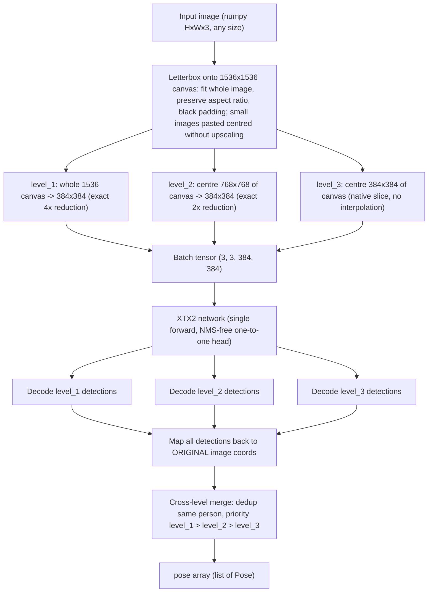

# XTX2 Pose — Engineering Specification

> Build-ready specification for an AI coding agent (Cursor). Implement exactly as written.
> Audience: senior Python engineer specialised in PyTorch. Target IDE: Cursor.
> Language of all code, comments, identifiers, and documentation: **English**.

---

## 0. Executive summary

Build a **new, standalone Python project** that trains and runs a family of **extremely fast human-pose estimation** networks called **XTX2**, in three variants: **`XTX2-n`**, **`XTX2-m`**, **`XTX2-l`**.

Put everything — source code, additional files, the complete directory structure — into the **`./xtx2`** folder.

The design is *inspired by* (not copied from, and **without any dependency on**) Ultralytics **YOLO26-pose** (`yolo26n-pose`, `yolo26m-pose`, `yolo26l-pose`). Study the YOLO26 architecture rigorously from all available sources (Ultralytics docs, the YOLO26 arXiv paper, community write-ups) before implementing. The full XTX2 network, losses, data pipeline, training loop, and inference are implemented **from scratch in pure PyTorch**.

XTX2 must match or beat YOLO26-pose accuracy at comparable or lower computational cost. The headline differentiator is a **3-level centre-focused image pyramid (level_1 / level_2 / level_3)**, each level a `384×384` input, that recovers small, distant people in the centre of the frame while still covering the **entire** original image at level_1.

### Relationship to the existing XTX project

A previous generation, **XTX**, exists in the repository under `./xtx` (spec in `persondetection.md`). You **may study it** for reference — its module layout, its shared train/inference preprocessing, and its NCNN export path are reasonable — but **do not follow it closely**. XTX2 must be **more accurate** and **faster at inference**. Key deliberate differences from XTX:

1. **Full-frame coverage.** XTX centre-cropped a square and *discarded* the left/right (or top/bottom) edges of the image. XTX2 **letterboxes the whole image** into the level_1 canvas, so no part of the input is ever thrown away at level_1.
2. **Canonical 1536 pyramid.** XTX used a 1080 square with awkward region scaling. XTX2 uses a clean power-of-two pyramid on a **1536×1536** canvas (`1536 = 4 × 384`): level_1 is an exact 4× reduction, level_2 an exact 2× reduction, level_3 a native slice with **zero interpolation**.
3. **Modern training recipe.** XTX2 adopts the three YOLO26 training innovations — **ProgLoss**, **STAL**, and a **MuSGD-style optimizer** — which XTX lacked. STAL in particular directly serves the far-person/level_3 objective.
4. **Faster deploy graph.** Aggressive fusion and reparameterisation, cheaper stem for the `n` variant, and one batched forward for all 3 levels.
5. **`.bat` launchers.** XTX had none; XTX2 ships `train.bat` and `infer.bat` (see §10, §11).

Key deployment facts:

- `XTX2-n` must run in real time on a **Raspberry Pi** (ARM CPU), shipped via **NCNN**.
- `XTX2-m` and `XTX2-l` run on a normal computer (CUDA GPU or CPU) via PyTorch.
- The public library API takes an **image as a NumPy array** and returns a **pose array** (list of detected people, each with 17 COCO keypoints and per-keypoint confidence), mirroring the YOLO26-pose output format.

### YOLO26 reference facts (verified, use as design baseline)

YOLO26 (Ultralytics, announced Sept 2025; arXiv 2606.03748) introduced, for the `-pose` task:

- **End-to-end, NMS-free** inference via a dual head: a one-to-one head used at deployment plus an auxiliary one-to-many head used during training for a richer gradient signal (YOLOv10-style consistent dual assignment).
- **DFL removed** — box regression is a direct, hardware-friendly `(l,t,r,b)` formulation → cleaner ONNX/edge export.
- **ProgLoss (Progressive Loss Balancing)** — training gradually shifts loss emphasis from the one-to-many head toward the inference-time one-to-one head.
- **STAL (Small-Target-Aware Label Assignment)** — guarantees positive anchor coverage for tiny objects (a minimum number of assigned candidates for objects smaller than ~8 px), fixing the failure mode where tiny targets receive no supervision under plain TAL.
- **MuSGD optimizer** — a hybrid of SGD and Muon-style (orthogonalised momentum) updates for more stable convergence.
- **RLE (Residual Log-Likelihood Estimation)** keypoint head for high-precision keypoint localisation.
- 17 COCO person keypoints; end-to-end pose output shape `(N, 300, 57)` = 6 box values `[x1,y1,x2,y2,conf,cls]` + `17×3` keypoints `[x,y,visibility]`, max 300 detections.
- Reference scale points (COCO val2017, 640 px input):

| Model | Params | FLOPs | Pose mAP50-95 |
|-------|-------:|------:|--------------:|
| YOLO26n-pose | 2.9 M | 7.5 G | 57.2 |
| YOLO26m-pose | 21.5 M | 73.1 G | 68.8 |
| YOLO26l-pose | 25.9 M | 91.3 G | 70.4 |

XTX2 **adopts** the NMS-free dual head, DFL-free box regression, RLE keypoint head, ProgLoss, STAL, and a MuSGD-style optimizer, and **adds** the level_1/2/3 pyramid plus a centre-prior label assignment. XTX2 runs at **384×384 per level**, far smaller than YOLO26's 640, so the 3-level total cost per frame is designed to stay at or below one YOLO26 640 pass of the same tier while being more accurate on small central people.

---

## 1. Goals and non-goals

### Goals

1. Three from-scratch PyTorch pose models `XTX2-n/m/l` with shared architecture and depth/width scaling.
2. A console **training pipeline** (launched by `train.bat`) that interactively asks for the variant, the dataset path, and whether to resume from a checkpoint; reads a COCO-style dataset (`train/` + `test/`); trains; prints progress; and writes time-based checkpoints.
3. A **merge calibration** stage that tunes the cross-level deduplication thresholds on the test set and stores them with the model.
4. A standalone **inference example** (launched by `infer.bat`) + a reusable **library API**: `numpy image → pose array`.
5. **NCNN export** of `XTX2-n` for Raspberry Pi, with a raw-NCNN inference path and a benchmark script.
6. Accuracy ≥ YOLO26-pose of the equivalent size at equal-or-lower compute, measured by OKS mAP, and **inference measurably faster than XTX** of the equivalent variant on the same hardware.

### Non-goals

- No multi-class detection: a single class, `person`.
- No tracking across frames (single-image inference only).
- No dependency on `ultralytics`, `mmpose`, `detectron2`, or any pose framework. Allowed third-party packages: `torch`, `torchvision`, `numpy`, `opencv-python`, `onnx`, `onnxsim`, `tqdm`, plus NCNN tooling for export.

---

## 2. Output contract (public API)

### 2.1 Function signature

```python
def detect_poses(
    image: np.ndarray,                 # HxWx3, uint8, BGR (OpenCV convention)
    *,
    conf_threshold: float = 0.25,
    max_detections: int = 300,
    return_normalized: bool = True,
) -> list[Pose]:
    ...
```

`image` is a standard OpenCV BGR `uint8` array. The library converts to the model's expected channel order/normalisation internally. Grayscale (`HxW`) input is promoted to 3 channels; 4-channel input has alpha dropped.

### 2.2 `Pose` data structure

Each detected person is one `Pose`. Use a `@dataclass(slots=True)` and also provide plain-dict / NumPy serialisation.

```python
@dataclass(slots=True)
class Pose:
    bbox_xyxy: np.ndarray      # shape (4,), float32, person bbox in ORIGINAL image pixels
    score: float               # person/detection confidence in [0, 1]
    keypoints: np.ndarray      # shape (17, 3): [x_pixel, y_pixel, confidence]
    keypoints_norm: np.ndarray # shape (17, 3): [x_norm, y_norm, confidence], norm in [0,1] of ORIGINAL image
    visibility: np.ndarray     # shape (17,), int in {0,1,2} predicted visibility class
    source_level: int          # 1 | 2 | 3, which pyramid level produced the surviving detection
```

- **Coordinate origin**: pixel coordinates are in the **original input image** coordinate system (the array passed in), not the pyramid canvas. The library maps every detection from its 384-level space all the way back to original-image pixels (§4.4).
- Keypoint order is the **17 COCO keypoints**, fixed indices (§7.1).
- Per-keypoint `confidence` ∈ [0,1]; `visibility` is the argmax of the 3-way visibility head mapped to `{0,1,2}` (§7.2).
- A convenience `to_array()` returns a single `np.ndarray` of shape `(N, 56)` = `[x1,y1,x2,y2,score, kpt0_x,kpt0_y,kpt0_conf, …, kpt16_x,kpt16_y,kpt16_conf]` in original-image pixels, mirroring YOLO26's flattened layout minus the class column (single class).

### 2.3 Batch API

Provide `detect_poses_batch(images: list[np.ndarray], ...) -> list[list[Pose]]` that batches efficiently across images and across the 3 levels (a batch of `3 × len(images)` crops in one forward).

---

## 3. High-level data flow



The three levels are stacked into a single batch of shape `(3, 3, 384, 384)` and run through **one** forward pass ("processed in parallel"), then decoded per level, mapped back, and merged.

---

## 4. Preprocessing pipeline (exact spec)

All preprocessing lives in `xtx2/data/preprocess.py` and must be **bit-for-bit identical between training and inference** (the same function builds level_1/2/3 in both paths).

### 4.1 Canonical canvas geometry

The pyramid is defined on a virtual **1536×1536 canvas** (`CANVAS = 1536 = 4 × 384`). Given an input image `W×H`:

1. **Large image** (`max(W, H) > 1536`): compute scale `s = 1536 / max(W, H)`, resize to `(round(W·s), round(H·s))` preserving aspect ratio, paste **centred** on a black `1536×1536` canvas. Example: `1920×1080 → 1536×864`, pasted centred with black bars of 336 px top and bottom.
2. **Small image** (`max(W, H) ≤ 1536`): **no upscaling.** Paste the original image, unchanged, **centred** on a black `1536×1536` canvas. Example: `320×240` sits in the middle of an almost entirely black canvas.
3. Record the paste offset `(px, py)` and scale `s` (`s = 1` in the small branch) — they define the affine `canvas → original` mapping.

### 4.2 The three levels (each 384×384)

From the (virtual) canvas, build three `384×384` images:

- **level_1** = the whole `1536×1536` canvas downscaled to `384×384`. Exact **4× reduction** (`cv2.resize`, `INTER_AREA`). Field of view: the entire original image. Detects large and medium people anywhere in the frame.
- **level_2** = the centred `768×768` region of the canvas (canvas coords `[384:1152, 384:1152]`) downscaled to `384×384`. Exact **2× reduction** (`INTER_AREA`). Field of view: the central quarter (by area) of the canvas. Detects medium and small people near the centre.
- **level_3** = the centred `384×384` region of the canvas (canvas coords `[576:960, 576:960]`), used **as-is** — a pure slice, **no interpolation**. Field of view: the central 1/16 (by area) of the canvas, at native canvas resolution. Detects the smallest, most distant people in the centre of the frame — people typically missed by level_1 and level_2.

### 4.3 One-shot implementation (performance requirement)

Materialising the full 1536 canvas and then resizing it three times is **forbidden** as the production path — it wastes memory bandwidth. Each level must be produced with **at most one interpolation, directly from the original image**, using precomputed per-level affine geometry:

- Compose, per level `k ∈ {1,2,3}`, the affine `original image → level-k 384 space` from (a) the §4.1 scale+offset and (b) the §4.2 level scale+offset. Then produce each level with **one** operation:
  - either one `cv2.warpAffine(src, M_k, (384, 384))` per level (borders filled black), or
  - equivalently one `cv2.resize` of the appropriate source ROI plus a black-canvas paste, when the composed transform is a pure scale+translate (it always is — there is no rotation), choosing whichever profiles faster.
- The black padding must appear **only** in regions the original image does not cover; never resample the same pixels twice (no chained resizes: level_2 is **not** computed from level_1's 384 image, and level_3 is **not** computed from level_2's 384 image — both are defined by canvas geometry and cut/scaled straight from the original image).
- The same one-shot routine is used by **training** (target generation uses the same transforms) and **inference**.
- Use `INTER_AREA` for downscales. Level_3 must remain interpolation-free in the small-image branch (`s = 1`): it is a pure pixel copy. In the large-image branch (`s < 1`), level_3's pixels come from a single `INTER_AREA` resize of the corresponding source ROI — still exactly one interpolation.

### 4.4 Coordinate transforms

Maintain, per level `k`, the **affine transform** `T_k` mapping **network pixel (384 space) → original image pixel** as a `2×3` float64 matrix (pure scale + translation). It is the exact inverse of the composed forward transform from §4.3. Provide a single helper (`xtx2/utils/geometry.py`) so keypoints/boxes map back with one matrix multiply. `keypoints_norm` are produced by dividing original-image pixel coordinates by original `W, H`.

Worked example (`1920×1080` input):

- §4.1: `s = 1536/1920 = 0.8` → resized to `1536×864`, pasted at `(px, py) = (0, 336)`.
- level_1: canvas→384 scale `1/4`. `T_1`: `x_orig = (4·x_net − 0) / 0.8`, `y_orig = (4·y_net − 336) / 0.8`.
- level_2: region origin `(384, 384)`, scale `1/2`. `T_2`: `x_orig = (2·x_net + 384) / 0.8`, `y_orig = (2·y_net + 384 − 336) / 0.8`.
- level_3: region origin `(576, 576)`, scale `1`. `T_3`: `x_orig = (x_net + 576) / 0.8`, `y_orig = (y_net + 576 − 336) / 0.8`.

Unit tests must verify round-trip mapping (original → level-k → original) to ≤ 0.5 px for all three levels and both canvas branches (§15).

---

## 5. Multi-level merge (cross-level deduplication)

After decoding detections from levels 1, 2, 3 and mapping them all to original-image coordinates, poses of the **same person must not repeat** in the result. Priority: **level_1 > level_2 > level_3**.

### 5.1 Matching

Two detections from different levels are the **same person** if their similarity exceeds calibrated thresholds. Compute both:

- **bbox IoU** of the mapped boxes.
- **OKS** (Object Keypoint Similarity) using COCO per-keypoint sigmas (§7.3) and the mean of the two boxes' areas as the OKS scale.

A pair matches if `OKS ≥ oks_match_thr` **or** `IoU ≥ iou_match_thr` (defaults `0.5` / `0.5`, calibrated per §5.3).

### 5.2 Priority and selection

1. Start the result set with all level_1 detections above `conf_threshold`.
2. For each level_2 detection (descending score): if it matches any accepted detection → discard; else accept (`source_level = 2`).
3. For each level_3 detection (descending score): if it matches any accepted detection → discard; else accept (`source_level = 3`).
4. Cap at `max_detections` by descending score.

Because XTX2 is **NMS-free within a single level**, no intra-level NMS exists; the merge resolves only **cross-level** duplicates. Use a centre-distance spatial short-circuit so the pairwise pass stays O(n) in practice.

### 5.3 Merge calibration

- After training, run full 3-level inference on the **test split** and grid-search `(oks_match_thr, iou_match_thr, conf_threshold)` to **maximise merged OKS mAP**.
- Optionally fit a tiny logistic regression on pairwise features `[IoU, OKS, center_distance, scale_ratio, level_pair]` predicting "same person"; runtime then uses `P(same) ≥ 0.5`. Expose both behind `merge.mode: "threshold" | "logistic"`.
- Persist the resulting `merge_params` inside the checkpoint **and** mirror them into `config.json` so inference is self-contained.

---

## 6. XTX2 network architecture (from scratch)

Single class (`person`). Anchor-free. NMS-free. DFL-free. RLE keypoints. Implemented in `xtx2/models/`. You may innovate beyond this baseline if you can demonstrably beat it (profile before/after), but the following is the required reference design.

### 6.1 Building blocks (`xtx2/models/blocks.py`)

- `ConvBNAct`: Conv2d (no bias) + BatchNorm2d + SiLU.
- `RepConv`: re-parameterisable block (3×3 + 1×1 + identity branches at train time; fused to a single 3×3 at deploy time). Provide `.fuse()` / `.reparameterize()`.
- `CSPBlock` (C2f-style): split → `n` bottleneck `RepConv` units → concat → 1×1 fuse; `n` scales with the depth multiplier.
- `SPPF`: spatial pyramid pooling-fast at the deepest stage.
- `DWConv` / depthwise-separable variants for `XTX2-n` (Raspberry Pi FLOPs budget).
- `PConv` (partial convolution, FasterNet-style): convolve only a fraction of channels, pass the rest through. Use in the `n` stem and early stages — this is one of the concrete "faster than XTX" levers.

### 6.2 Backbone

5 stages, strides `2,4,8,16,32` from the 384 input → feature maps at strides `8 (48×48)`, `16 (24×24)`, `32 (12×12)` feed the neck (P3, P4, P5). `XTX2-n` uses a `PConv`/depthwise stem and depthwise-separable stage convs; `m`/`l` use full `CSPBlock`s. SPPF closes the last stage.

> Small-person emphasis: expose an optional **P2 (stride 4, 96×96)** pyramid level via config flag `model.use_p2` — default **off for `n`** (too costly on Pi), **on for `l`**, optional for `m`. Note that STAL (§7.4) already substantially improves tiny-target supervision even without P2.

### 6.3 Neck

**PAN/FPN**: top-down then bottom-up fusion over `{P3,P4,P5}` (+P2 when enabled), `CSPBlock` fusion at each merge. One output feature map per pyramid level to the head.

### 6.4 Head (decoupled, dual, NMS-free)

Per pyramid level, a **decoupled head** with three branches:

1. **Box branch** → 4 values, **direct distance-to-box regression (no DFL)**: `(l, t, r, b)` distances from each grid cell to the box edges, decoded with the level stride and a learnable per-level scale.
2. **Score branch** → 1 logit (person confidence).
3. **Keypoint branch (RLE)** → per keypoint: 2D offset `(dx, dy)` relative to the cell, a scale/σ parameter for the RLE flow, and a 3-way **visibility** logit (`{0,1,2}`); derived `[0,1]` per-keypoint confidence via `sigmoid(visible_logit)`.

**Dual head (YOLO26 style):**

- **One-to-many head**: dense predictions with a one-to-many assigner (TaskAligned) — **training only**, rich gradient signal.
- **One-to-one head**: ≤300 final detections with consistent one-to-one assignment — the **only** head at inference/export → native NMS-free output.
- `model.fuse()` folds Conv+BN, reparameterises `RepConv`, and **drops the one-to-many head** for deployment.

### 6.5 Output tensor layout

Deployment forward (one-to-one head, after decode) returns, per level:

```
detections: (max_det, 56)
  [0:4]   = bbox xyxy in 384-network pixels (then mapped back via T_k)
  [4]     = person score (sigmoid)
  [5:56]  = 17 * (x, y, conf)   # keypoint x,y in 384-network pixels; conf in [0,1]
```

(56 instead of YOLO26's 57 because the single-class column is omitted; the visibility class is carried separately for `Pose.visibility`.) Max 300 detections per level.

### 6.6 Scaling table (`XTX2-n/m/l`)

Implement in `xtx2/models/scaling.py` as a dict keyed by variant. Design targets, all measured at **384** input, **per single level**:

| Variant | depth_mult | width_mult | max_channels | P2 | Backbone convs | Target params | Target GFLOPs/level | Deploy target |
|---------|-----------:|-----------:|-------------:|:--:|----------------|--------------:|--------------------:|---------------|
| `XTX2-n` | 0.34 | 0.25 | 512 | off | PConv + depthwise-separable | ~2.5–3.0 M | ~1.8–2.5 | Raspberry Pi (NCNN, real time) |
| `XTX2-m` | 0.67 | 0.75 | 768 | optional | full CSP | ~18–22 M | ~20–24 | PC CPU/GPU |
| `XTX2-l` | 1.00 | 1.00 | 1024 | on | full CSP | ~24–28 M | ~26–30 | PC GPU |

3 levels × per-level FLOPs is the end-to-end cost; it must stay **≤ one YOLO26-pose 640 pass** of the same tier (7.5 / 73.1 / 91.3 GFLOPs) — and each `XTX2` variant must also come in **under the corresponding XTX variant's per-crop FLOPs** (the "faster than XTX" requirement). Provide `scripts/profile_flops.py` to verify params/FLOPs against this table and against the old `xtx` models.

---

## 7. Keypoints, losses, and assignment

### 7.1 The 17 COCO keypoints (fixed order)

```
0 nose, 1 left_eye, 2 right_eye, 3 left_ear, 4 right_ear,
5 left_shoulder, 6 right_shoulder, 7 left_elbow, 8 right_elbow,
9 left_wrist, 10 right_wrist, 11 left_hip, 12 right_hip,
13 left_knee, 14 right_knee, 15 left_ankle, 16 right_ankle
```

### 7.2 Visibility

Per the dataset: `0 = not visible/absent`, `1 = occluded (labeled but hidden)`, `2 = clearly visible`. The keypoint branch predicts a 3-way visibility class; `Pose.visibility` is its argmax, and `keypoints[..., 2]` confidence is the probability the point is present (class 1 or 2). Keypoints predicted "absent" still report coordinates, with low confidence.

### 7.3 OKS sigmas (COCO standard)

```
[0.026,0.025,0.025,0.035,0.035,0.079,0.079,0.072,0.072,
 0.062,0.062,0.107,0.107,0.087,0.087,0.089,0.089]
```

Store in `xtx2/utils/keypoints.py`; used by the OKS metric, the merge matching, and the optional OKS loss.

### 7.4 Losses and assignment (`xtx2/losses/`)

- **Box**: CIoU loss. No DFL.
- **Score**: BCE with varifocal weighting.
- **Keypoint localisation**: **RLE** loss (`losses/rle.py`, reference arXiv:2107.11291) — learnable-flow / Laplace-residual formulation. Provide a fallback **OKS + L1** path behind `loss.keypoint_loss: "rle" | "oks_l1"` in case RLE training is unstable.
- **Keypoint visibility**: cross-entropy over `{0,1,2}`; mask points with GT visibility `0` out of the localisation loss.
- **Assignment** (`losses/assignment.py`):
  - One-to-many: TaskAligned assigner (alignment metric `score^α · IoU^β`), top-k candidates per GT.
  - One-to-one: consistent matching (top-1 by the same alignment metric) so the one-to-one head agrees with the one-to-many head — this is what removes NMS.
  - **STAL (Small-Target-Aware Label Assignment)** — new in XTX2, adopted from YOLO26: for ground-truth boxes smaller than a size threshold (default: box side < **8 px** in network 384 space, i.e. smaller than one cell at the finest stride), decouple the geometry used for candidate *selection* from the geometry used for *regression*: inflate the assignment surrogate box so the GT is guaranteed a minimum of **4 positive candidates**, while regression still targets the true box. This is critical for level_3's distant people and for tiny people in level_1. Expose `loss.stal_min_anchors` (default 4) and `loss.stal_size_px` (default 8).
  - **Centre-prior (XTX2-specific)**: add a centre-distance prior to the assignment cost so detections near the image centre are favoured, aligning the network with the pyramid's centre-recovery objective. `loss.center_prior_weight`, default 0.1.
- **ProgLoss (Progressive Loss Balancing)** — new in XTX2, adopted from YOLO26: the total loss is `w_o2m(t) · L_one2many + w_o2o(t) · L_one2one`, where the weights shift **linearly over training progress** `t ∈ [0,1]` from emphasis on the one-to-many head (early: rich, dense signal) toward the one-to-one inference head (late: align training with the deployed path). Defaults: `w_o2m: 1.0 → 0.25`, `w_o2o: 0.5 → 1.0`; expose start/end values in `config.json` (`loss.progloss`).
- **Total**: weighted sum; all weights in `config.json` (`loss.box`, `loss.cls`, `loss.kpt`, `loss.vis`, `loss.center_prior_weight`, `loss.progloss`, `loss.stal_*`).

### 7.5 Optimizer: MuSGD-style (`xtx2/engine/optim.py`)

Adopt YOLO26's hybrid approach: **Muon-style orthogonalised momentum updates for 2D weight matrices (conv/linear kernels)** combined with **plain SGD+momentum for biases, gains, and BatchNorm parameters**. Implement the Newton–Schulz orthogonalisation iteration (5 steps is standard) for the Muon branch. Expose `training.optimizer: "musgd" | "sgd"` with `"musgd"` the default and `"sgd"` a safe fallback; both use the same LR schedule (warmup + cosine).

---

## 8. Dataset and annotations

### 8.1 Layout

```
dataset/
  train/
    img0001.jpg
    img0001.json          # or one JSON covering many images — support both
    ...
  test/
    ...
```

The program **recursively scans all `*.json`** under the chosen split folder and builds an index. Images are matched to annotations by `file_name`, resolved relative to the JSON's directory.

### 8.2 Annotation schema (COCO-style, exactly as provided)

```json
{
  "images": [
    { "id": 1, "file_name": "img0001.jpg", "width": 1920, "height": 1080 }
  ],
  "annotations": [
    {
      "id": 1,
      "image_id": 1,
      "category_id": 1,
      "name": "person",
      "supercategory": "human",
      "bbox": [0.234375, 0.166667, 0.3125, 0.791667],
      "iscrowd": 0,
      "num_keypoints": 17,
      "keypoint_names": [
        "nose", "left_eye", "right_eye", "left_ear", "right_ear",
        "left_shoulder", "right_shoulder", "left_elbow", "right_elbow",
        "left_wrist", "right_wrist", "left_hip", "right_hip",
        "left_knee", "right_knee", "left_ankle", "right_ankle"
      ],
      "keypoints": [
        0.281250, 0.208333, 2,
        0.273438, 0.197917, 2,
        0.289062, 0.197917, 2,
        0.265625, 0.218750, 1,
        0.296875, 0.218750, 2,
        0.250000, 0.270833, 2,
        0.312500, 0.270833, 2,
        0.234375, 0.375000, 2,
        0.328125, 0.375000, 2,
        0.218750, 0.458333, 2,
        0.343750, 0.458333, 2,
        0.257812, 0.541667, 2,
        0.304688, 0.541667, 2,
        0.250000, 0.708333, 2,
        0.312500, 0.708333, 2,
        0.242188, 0.875000, 0,
        0.320312, 0.875000, 0
      ]
    }
  ]
}
```

- **`bbox`** is `[x, y, w, h]`, **normalised** to image `width/height` (values in [0,1]).
- **`keypoints`** is a flat list of `17×3 = 51` values: `x_norm, y_norm, visibility` per keypoint; `x, y` **normalised** to image `width/height`; `visibility ∈ {0,1,2}` (`0` = not visible, `1` = occluded, `2` = clearly visible).
- One JSON may contain many images/annotations, or one per image — the loader (`xtx2/data/annotations.py`) handles both by aggregating across all JSON files and grouping annotations by `image_id` (namespaced per JSON file to avoid id collisions across files).
- Validate: keypoint count, normalised ranges, dangling `image_id`s, missing image files (warn and skip, never crash).

### 8.3 Target transform (normalised-original → level-relative)

For each annotation and each level `k ∈ {1,2,3}`:

1. Denormalise bbox/keypoints to **original pixels** using JSON `width/height`.
2. Apply the inverse of `T_k` (§4.4) — the exact same geometry as inference — to get **network-space (384) targets**.
3. **Inclusion rules**:
   - A person is a valid target in level `k` if its bbox centre lies inside level `k`'s field of view and at least `min_visible_keypoints` (default 1) of its visible keypoints (vis > 0) land inside the 384 frame.
   - Keypoints falling outside the 384 frame are set to `visibility = 0` for that level and masked from the localisation loss.
   - People entirely outside level `k`'s field of view produce **no** target for that level — this is how the model learns scale specialisation (a tiny central person is a well-sized target in level_3 but near-invisible in level_1).

### 8.4 Training sample generation

- Each source image yields **three training samples** (level_1, level_2, level_3), each a `384×384` tensor with its own transformed targets.
- A `BalancedSampler` controls the level ratio (default `1:1:1`), exposed as `data.level_ratio`. Levels 2/3 of images whose centre contains no people still participate (empty/negative samples are valid and useful).
- `xtx2/data/dataset.py` returns `(image_tensor, targets, level_tag, transform_meta)`; a custom `collate_fn` batches variable numbers of targets.

### 8.5 Augmentation (`xtx2/data/augment.py`)

Applied at the canvas stage so geometry stays consistent across levels:

- Horizontal flip with **left/right keypoint index swap** (pairs `(1,2),(3,4),(5,6),(7,8),(9,10),(11,12),(13,14),(15,16)` in `utils/keypoints.py`).
- Random scale jitter and translation of the canvas placement (this naturally varies which people land in levels 2/3 — key for the centre-recovery objective).
- Photometric: HSV jitter, brightness/contrast.
- Optional mosaic (4-image) at the canvas stage, disabled for the last `data.close_mosaic_epochs` epochs (default 10).
- All probabilities/magnitudes in `config.json`.

---

## 9. Training pipeline (console app)

Entry point: **`train.py`** at the `xtx2` project root, launched by **`train.bat`** (§11). Implementation in `xtx2/engine/trainer.py`.

### 9.1 Interactive prompts (in order)

1. **Resume?** — if any checkpoints exist under the default runs directory, ask first: `Resume training from a checkpoint? [y/N]`; on `y`, list discovered checkpoints (`runs/**/last.pt`, `runs/**/best.pt`) and let the user pick one or type a path. On resume, the variant and config are restored from the checkpoint and prompts 2–4 are skipped (except confirmation of the dataset path).
2. **Model variant**: `Which model do you want to train? [n/m/l]` — validate; re-ask on invalid input.
3. **Dataset path**: `Dataset path [./dataset]:` — pressing **Enter** selects the default relative path `./dataset`. Validate that `<path>/train` and `<path>/test` exist.
4. **Checkpoint output directory**: `Checkpoint directory [./runs/xtx2-<variant>]:` — Enter accepts the default.

Also support non-interactive CLI flags (`--variant`, `--dataset`, `--output`, `--config`, `--resume`, `--device`) for CI; prompts appear only for values not given on the command line.

### 9.2 Behaviour

- Load `config.json` from the `xtx2` app root (§12). CLI flags override config; config overrides built-in defaults.
- Scan all JSONs under `train/` and `test/`, build datasets, print dataset stats (#images, #people, per-keypoint visibility histogram, per-level target counts).
- Build the chosen `XTX2` variant; print params/GFLOPs (per level and 3-level total).
- Train with the dual head, ProgLoss weighting, STAL assignment, MuSGD optimizer, warmup + cosine LR, AMP on CUDA, EMA weights.
- **Progress output** each step/epoch: epoch, step, losses (box/cls/kpt/vis/total), current ProgLoss weights, LR, imgs/s, ETA; per-epoch validation (OKS mAP, AP50/AP75, AR) on `test/` using the full 3-level merged pipeline.
- **Time-based checkpointing**: every `checkpoint_interval_minutes` (default **5**) of wall-clock training save a checkpoint; also save `last.pt` each epoch and `best.pt` on improved val OKS mAP. Default **50 epochs** (`training.epochs`).
- **Resume** restores model/EMA/optimizer/scaler/epoch/step/ProgLoss schedule position.
- After the final epoch (or on `--calibrate`), run the **merge calibration** (§5.3) on `test/` and embed `merge_params` into `best.pt`.

### 9.3 Checkpoint contents (`xtx2/engine/checkpoint.py`)

```
{
  "variant": "n|m|l",
  "model_state": ..., "ema_state": ...,
  "optimizer_state": ..., "scaler_state": ...,
  "epoch": int, "global_step": int,
  "config": {...},             # frozen config snapshot
  "merge_params": {...},       # filled after calibration
  "metrics": {"oks_map": ...},
  "keypoint_meta": {...}
}
```

Use **EMA weights** for validation and export.

---

## 10. Inference example and NCNN export

### 10.1 Inference example: `infer.py` + `infer.bat`

CLI: `python infer.py --weights best.pt --image path.jpg [--variant n] [--device cpu|cuda] [--conf 0.25] [--save out.jpg] [--json out.json]`. When launched with no arguments (the `infer.bat` case), interactively prompt for the weights path (default: newest `best.pt` under `./runs`) and the image path.

Flow: read image with OpenCV → `detect_poses(...)` → print/serialise the pose array → optionally draw the 17-keypoint skeleton (edges in `utils/keypoints.py`) and save. Include a minimal library snippet in `README.md`:

```python
import cv2
from xtx2 import load_model, detect_poses

model = load_model("best.pt", device="cpu")
img = cv2.imread("scene.jpg")
poses = detect_poses(img, model=model)
for p in poses:
    print(p.score, p.keypoints)   # (17,3) [x_pixel, y_pixel, conf]
```

### 10.2 NCNN export for `XTX2-n` (`xtx2/export/ncnn_export.py`)

Pipeline (no `ultralytics`):

1. `model.fuse()` (Conv+BN fold, RepConv reparameterise, drop the one-to-many head).
2. Export to **ONNX** at fixed input `(1, 3, 384, 384)`, opset ≥ 17, exporting **raw head tensors** (box/cls/kpt per pyramid level) and decoding in host code — keeps the ONNX/NCNN graph simple and edge-friendly; document the decode contract.
3. Simplify with `onnxsim`.
4. Convert ONNX → NCNN via **`pnnx`** (preferred) or `onnx2ncnn`, producing `xtx2_n.ncnn.param` + `xtx2_n.ncnn.bin`. Document converter installation in `README.md`.
5. Provide a **raw-NCNN inference** path (`ncnn.Net`; CHW float32 `/255.0`; run the 3 levels) plus the Python decode + cross-level merge.
6. Provide `scripts/benchmark.py` measuring ms/frame and FPS for the full 3-level pipeline (PyTorch and NCNN backends); on Raspberry Pi, `XTX2-n` must hit real time and must beat the old `xtx` XTX-n on the same device.

---

## 11. `.bat` launchers (project root of `./xtx2`)

- **`train.bat`** — activates/creates the local virtual environment if needed (`python -m venv .venv`, `pip install -r requirements.txt` on first run), then runs `python train.py` with no arguments so the interactive prompts (§9.1) drive the session. Ends with `pause` so the window stays open on error.
- **`infer.bat`** — same environment bootstrap, then `python infer.py` with no arguments (interactive prompts, §10.1). Ends with `pause`.

Both scripts must work when double-clicked from Windows Explorer (set `cd /d %~dp0` first).

---

## 12. `config.json` (in `./xtx2` root) — schema and defaults

```json
{
  "training": {
    "epochs": 50,
    "checkpoint_interval_minutes": 5,
    "batch_size": 32,
    "optimizer": "musgd",
    "lr0": 0.01,
    "lr_final_factor": 0.01,
    "warmup_epochs": 3,
    "weight_decay": 0.0005,
    "momentum": 0.937,
    "amp": true,
    "ema_decay": 0.9999,
    "num_workers": 8,
    "seed": 0
  },
  "data": {
    "dataset_path": "./dataset",
    "canvas_size": 1536,
    "network_size": 384,
    "level_regions": { "level_1": 1536, "level_2": 768, "level_3": 384 },
    "level_ratio": [1, 1, 1],
    "min_visible_keypoints": 1,
    "close_mosaic_epochs": 10,
    "augment": {
      "fliplr": 0.5, "hsv_h": 0.015, "hsv_s": 0.7, "hsv_v": 0.4,
      "scale_jitter": 0.5, "translate": 0.1, "mosaic": 0.5
    }
  },
  "model": {
    "num_keypoints": 17,
    "use_p2": { "n": false, "m": false, "l": true }
  },
  "loss": {
    "box": 7.5, "cls": 0.5, "kpt": 12.0, "vis": 1.0,
    "center_prior_weight": 0.1,
    "keypoint_loss": "rle",
    "stal_min_anchors": 4,
    "stal_size_px": 8,
    "progloss": { "o2m_start": 1.0, "o2m_end": 0.25, "o2o_start": 0.5, "o2o_end": 1.0 }
  },
  "merge": {
    "mode": "threshold",
    "oks_match_thr": 0.5,
    "iou_match_thr": 0.5,
    "conf_threshold": 0.25,
    "max_detections": 300
  },
  "export": {
    "ncnn_input_size": 384,
    "onnx_opset": 17
  }
}
```

All defaults above must be honoured (note **`epochs: 50`** and **`checkpoint_interval_minutes: 5`** — the dictated defaults). Missing keys fall back to these defaults; `train.py` writes a resolved config snapshot into each checkpoint.

---

## 13. Project structure

```
xtx2/
  README.md
  requirements.txt
  config.json
  train.py                     # interactive console training entry point
  infer.py                     # inference example / CLI
  train.bat                    # double-clickable Windows launcher (env bootstrap + train.py)
  infer.bat                    # double-clickable Windows launcher (env bootstrap + infer.py)
  xtx2/
    __init__.py                # exports: load_model, detect_poses, detect_poses_batch, Pose
    api.py                     # public library API (Pose dataclass, detect_poses)
    models/
      __init__.py
      blocks.py                # ConvBNAct, RepConv, CSPBlock, SPPF, DWConv, PConv
      backbone.py
      neck.py                  # PAN/FPN
      head.py                  # decoupled dual head (one2one + one2many), RLE kpt branch
      xtx2.py                  # XTX2 module + build_model(variant)
      scaling.py               # n/m/l depth/width/channel configs
    data/
      __init__.py
      annotations.py           # COCO-style JSON scan + parse + validate
      preprocess.py            # 1536 canvas geometry, one-shot level_1/2/3, T_k transforms
      dataset.py               # PyTorch Dataset (level samples) + collate_fn
      augment.py
    losses/
      __init__.py
      rle.py                   # Residual Log-Likelihood Estimation
      assignment.py            # TaskAligned one2many + consistent one2one + STAL + center prior
      detection_loss.py        # CIoU + varifocal cls
      pose_loss.py             # kpt RLE/OKS + visibility CE; ProgLoss total
    engine/
      __init__.py
      trainer.py
      optim.py                 # MuSGD (Muon+SGD hybrid) + SGD fallback
      checkpoint.py
      metrics.py               # OKS, mAP (AP50/AP75/AP, AR)
      merge.py                 # cross-level dedup + calibration
    export/
      __init__.py
      ncnn_export.py
    utils/
      __init__.py
      keypoints.py             # names, flip pairs, skeleton edges, OKS sigmas
      geometry.py              # affine transforms, box/keypoint mapping
      logging.py
  scripts/
    profile_flops.py           # verify §6.6 budgets, compare against old ./xtx models
    benchmark.py               # ms/frame + FPS, PyTorch and NCNN, compare against old ./xtx
  tests/
    test_preprocess.py         # level geometry + round-trip transform correctness (<=0.5 px)
    test_annotations.py        # JSON parsing/validation
    test_merge.py              # priority level_1 > level_2 > level_3 dedup logic
    test_model_forward.py      # shapes for n/m/l, fuse(), export-readiness
```

## 14. `requirements.txt`

Pin compatible versions at implementation time (latest stable):

```
torch
torchvision
numpy
opencv-python
onnx
onnxsim
tqdm
```

NCNN export tooling (`pnnx` and/or the `ncnn` Python package) is documented in `README.md` as a separate, platform-specific install step.

---

## 15. Acceptance criteria

1. Double-clicking `train.bat` (or running `python train.py`) runs the interactive prompts — resume question first, then variant `[n/m/l]`, then dataset path with `./dataset` default on Enter — trains, prints per-step/epoch progress, and writes a checkpoint at least every 5 minutes plus `last.pt`/`best.pt`; the 50-epoch and 5-minute defaults are read from `config.json`.
2. Preprocessing reproduces level_1/2/3 exactly as in §4 — 1536 canvas, letterboxed full frame, 4×/2×/1× pyramid, level_3 interpolation-free when `s = 1` — with unit tests proving keypoint round-trip mapping (384 space → original pixels) within ≤ 0.5 px, for both a `1920×1080` and a `320×240` synthetic case.
3. Each level is produced with at most **one** interpolation directly from the original image (no chained resizes, no mandatory full-canvas materialisation); verified by code review and a preprocessing microbenchmark in `scripts/benchmark.py`.
4. The model is **NMS-free** at inference (one-to-one head only after `fuse()`); no NMS code path exists in `detect_poses`.
5. `detect_poses(numpy_image)` returns a pose array of `Pose` objects with 17 keypoints + per-keypoint confidence in original-image coordinates, deduplicated across levels with priority **level_1 > level_2 > level_3** — no person appears twice.
6. Merge thresholds come from the calibration stage and are stored in the checkpoint/config; runtime uses them with no hard-coded magic numbers beyond documented defaults.
7. Training uses ProgLoss (verifiable in the per-epoch log via the printed head weights), STAL (unit-testable: a 6-px synthetic GT box receives ≥ 4 positive candidates), and the MuSGD optimizer by default with a working `"sgd"` fallback.
8. `XTX2-n` exports to NCNN (`*.ncnn.param` + `*.ncnn.bin`) and runs the full 3-level pipeline via raw NCNN on Raspberry Pi in real time; `scripts/benchmark.py` reports ms/frame and FPS and shows `XTX2-n` faster than the old XTX-n on the same device.
9. Validation reports OKS mAP (AP, AP50, AP75, AR) on `test/`; `XTX2-{n,m,l}` meet or exceed the corresponding `YOLO26{n,m,l}-pose` accuracy targets at equal-or-lower compute (verified with `scripts/profile_flops.py`).
10. No `ultralytics`/external pose-framework dependency anywhere in the codebase; everything lives under `./xtx2`.
11. `tests/` pass.

## 16. Edge cases (must handle)

- Very small image (e.g. `320×240`) → pasted centred, unscaled, on the black 1536 canvas; level_2/level_3 see progressively magnified central portions of it; detections map back into the small valid region only.
- Very large / extreme aspect ratio image (e.g. `4000×2000`) → downscaled to fit 1536 on the long side, letterboxed; **nothing is cropped away** at level_1.
- Grayscale or 4-channel input → coerce to 3-channel BGR.
- Image with no people → return an empty list (not an error).
- People straddling the level_2/level_3 field-of-view boundary → handled by the inclusion rule (§8.3) and resolved at merge time.
- Crowded scenes exceeding 300 people per level → cap at `max_detections`, keep highest scores.
- Corrupt/missing image referenced by JSON → warn and skip during dataset scan.
- Resume prompt when no checkpoint exists → skip the question silently and proceed to the variant prompt.
