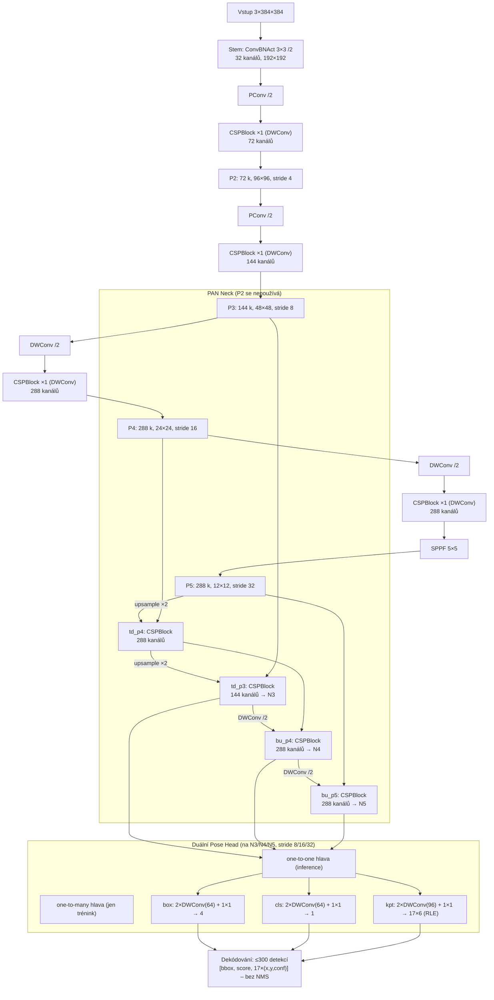
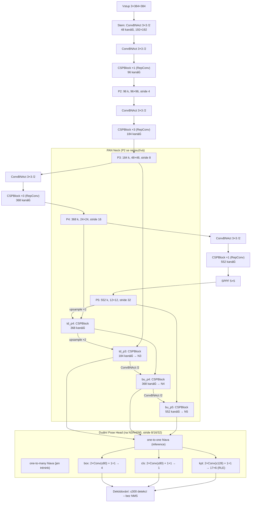
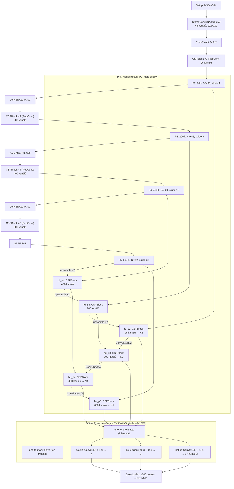
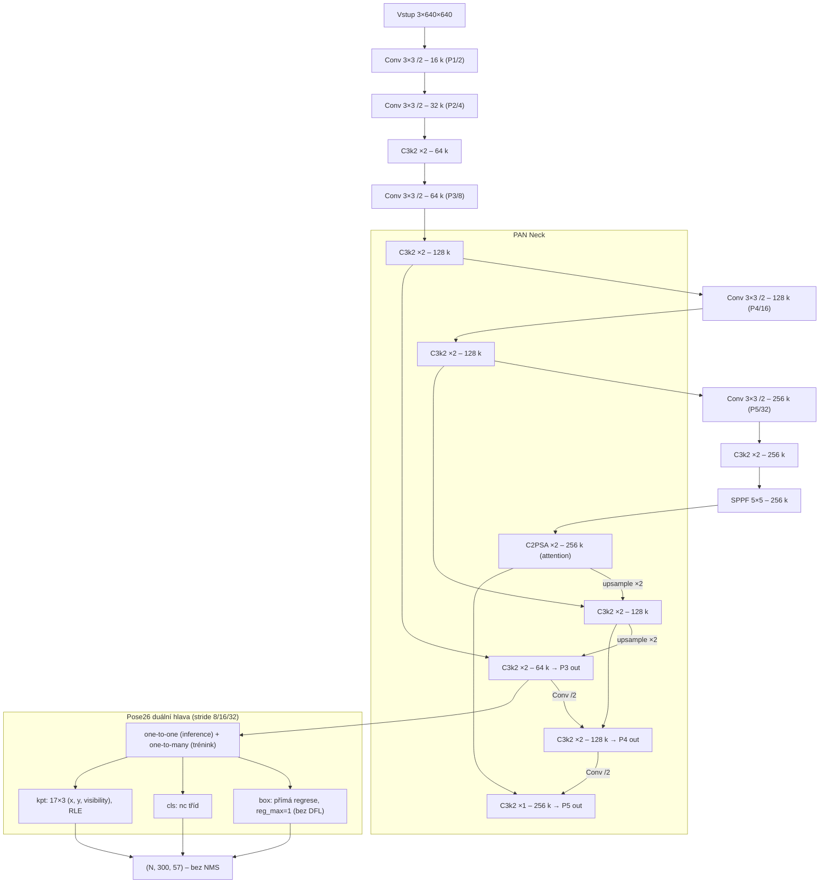
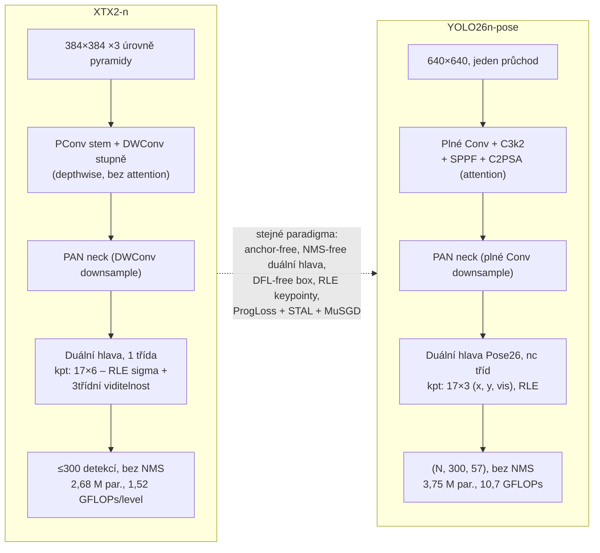

# Architektura neuronové sítě XTX2

Tento dokument popisuje strukturu neuronové sítě modelu **XTX2** (varianty `n`, `m`, `l`),
tak jak je implementována v `xtx2/models/`, a porovnává ji se state-of-the-art modelem
**YOLO26n-pose** od společnosti Ultralytics.

---

## 1. Celkový přehled

XTX2 je jednostupňový (single-stage), anchor-free a **NMS-free** detektor osob s odhadem
17 COCO keypointů. Síť má klasickou třídílnou topologii:

```
vstup (3×384×384) → Backbone (CSP) → Neck (PAN/FPN) → duální Pose Head → detekce + keypointy
```

- **Vstup:** pevně 384×384 px (`NETWORK_SIZE = 384`). Celý systém navíc používá
  3úrovňovou obrazovou pyramidu (viz README) – síť samotná ale vždy zpracovává dávku
  384×384 výřezů.
- **Backbone** (`backbone.py`): 5 stupňů se stride 2/4/8/16/32, produkuje pyramidu
  příznaků P2 (stride 4), P3 (8), P4 (16), P5 (32). Na konci SPPF pro velké receptivní pole.
- **Neck** (`neck.py`): PAN (Path Aggregation Network) – nejprve top-down (FPN) a poté
  bottom-up fúze; na každém spojovacím bodě CSPBlock.
- **Head** (`head.py`): oddělená (decoupled) hlava se třemi větvemi (box / cls / keypoint)
  na každé úrovni pyramidy. Během tréninku běží **dvě strukturně identické hlavy**
  (one-to-many + one-to-one, styl YOLO26); při inferenci/exportu zůstává jen
  one-to-one hlava → výstup je nativně bez NMS.
- **Výstup:** max. 300 detekcí na obrázek ve formátu `[x1, y1, x2, y2, score, 17×(x, y, conf)]`
  (56 hodnot) + třída viditelnosti každého keypointu {absent, occluded, visible}.

### Parametry a výpočetní náročnost (změřeno `scripts/profile_flops.py`)

| Varianta | Parametry | GFLOPs / 384×384 průchod | Cíl nasazení |
|----------|-----------|--------------------------|--------------|
| XTX2-n   | 2,68 M    | 1,52 (3 úrovně: 4,57)    | Raspberry Pi (NCNN) |
| XTX2-m   | 19,72 M   | 8,87 (3 úrovně: 26,6)    | PC CPU/GPU |
| XTX2-l   | 25,26 M   | 15,11 (3 úrovně: 45,3)   | PC GPU |

---

## 2. Stavební bloky (`blocks.py`)

| Blok | Popis |
|------|-------|
| **ConvBNAct** | Conv2d (bez biasu) + BatchNorm2d + SiLU. Při `fuse()` se BN složí do konvoluce. |
| **DWConv** | Depthwise-separable konvoluce: depthwise K×K + pointwise 1×1. Používá jen varianta `n`. |
| **PConv** | Parciální konvoluce (styl FasterNet): 3×3 konvoluce jen na ¼ kanálů, zbytek projde beze změny (při stride 2 přes max-pool), poté 1×1 mix. Používá se ve stemu / raných stupních varianty `n` – hlavní páka pro rychlost na Raspberry Pi. |
| **RepConv** | Reparametrizovatelný blok (RepVGG): při tréninku větve 3×3 + 1×1 + identity, při nasazení se složí do jediné 3×3 konvoluce. Používají varianty `m`/`l` v bottlenecích. |
| **Bottleneck** | 1×1 ConvBNAct → RepConv 3×3 (u `n` místo něj DWConv) + volitelná reziduální zkratka. |
| **CSPBlock** | Cross-stage blok ve stylu C2f: 1×1 split na 2 poloviny → n× Bottleneck (každý mezivýstup se uchová) → concat všech → 1×1 fúze. |
| **SPPF** | Spatial Pyramid Pooling – Fast: 1×1 → 3× sekvenční 5×5 max-pool → concat → 1×1. |

Všechny bloky podporují `fuse()` (složení Conv+BN, reparametrizace RepConv) pro čistý
export do ONNX/NCNN.

---

## 3. Backbone (`backbone.py`)

5 stupňů, každý stupeň = downsample + CSPBlock:

| Stupeň | Stride | Výstup | Downsample (`n`) | Downsample (`m`/`l`) |
|--------|--------|--------|------------------|----------------------|
| stem   | 2      | –      | ConvBNAct 3×3/2  | ConvBNAct 3×3/2 |
| stage1 | 4      | **P2** | PConv /2         | ConvBNAct 3×3/2 |
| stage2 | 8      | **P3** | PConv /2         | ConvBNAct 3×3/2 |
| stage3 | 16     | **P4** | DWConv /2        | ConvBNAct 3×3/2 |
| stage4 | 32     | **P5** | DWConv /2 + SPPF | ConvBNAct 3×3/2 + SPPF |

Pro vstup 384×384 mají P2/P3/P4/P5 prostorové rozlišení 96/48/24/12.

## 4. Neck – PAN (`neck.py`)

- **Top-down:** P5 se upsampluje a spojí s P4 (`td_p4`), výsledek se upsampluje a spojí
  s P3 (`td_p3`). Varianta `l` navíc pokračuje až na P2 (`td_p2`).
- **Bottom-up:** zpětné downsamply (3×3/2) a fúze CSPBlocky (`bu_p3`/`bu_p4`/`bu_p5`).
- CSPBlocky v necku běží **bez reziduální zkratky** (`shortcut=False`).
- Výstup: `n`/`m` → 3 úrovně (stride 8/16/32); `l` → 4 úrovně (stride 4/8/16/32,
  P2 pro malé osoby).

## 5. Hlava (`head.py`)

Na každé úrovni pyramidy má hlava tři nezávislé větve
(2× 3×3 konvoluce se skrytou šířkou + 1×1 projekce):

| Větev | Výstup na anchor | Poznámka |
|-------|------------------|----------|
| **box** | 4 – vzdálenosti `(l, t, r, b)` k okrajům boxu | **bez DFL** – přímá regrese; `softplus` × stride × učitelný per-level scale |
| **cls** | 1 – logit „osoba" | jediná třída; bias inicializován na prior 0,01 |
| **kpt** | 17 × 6 = 102 – na keypoint `(dx, dy, log_sigma, vis0, vis1, vis2)` | **RLE** (Residual Log-Likelihood Estimation): `log_sigma` parametrizuje nejistotu; 3 logity dávají třídu viditelnosti {absent, occluded, visible}; confidence = P(occluded) + P(visible) |

Skryté šířky větví jsou zastropované (varianta `n`: box/cls ≤ 64, kpt ≤ 96;
`m`/`l`: ≤ 80 / ≤ 128), aby hlava neovládla FLOPs rozpočet.

**Duální hlava (styl YOLO26):** při tréninku běží dvě identické hlavy –
*one-to-many* (hustý trénovací signál, one-to-many assigner) a *one-to-one*
(finální ≤ 300 detekcí). ProgLoss postupně přesouvá váhu na one-to-one hlavu.
Při `fuse()`/exportu se one-to-many hlava odstraní → inference je nativně **bez NMS**.

---

## 6. Škálování variant (`scaling.py`)

Základní šířky kanálů (stem, s1–s4) = (64, 128, 256, 512, 768),
základní hloubky CSP stupňů = (2, 4, 4, 2). Varianty je násobí:

| Varianta | depth × | width × | max kanálů | Kanály (stem, P2, P3, P4, P5) | Hloubky | P2 v necku | Depthwise/PConv |
|----------|---------|---------|------------|-------------------------------|---------|------------|-----------------|
| **n** | 0,34 | 0,56 | 512  | 32, 72, 144, 288, **288** | 1, 1, 1, 1 | ne  | **ano** |
| **m** | 0,67 | 0,72 | 768  | 48, 96, 184, 368, 552     | 1, 3, 3, 1 | ne  | ne |
| **l** | 1,00 | 0,78 | 1024 | 48, 96, 200, 400, 600     | 2, 4, 4, 2 | **ano** | ne |

---

## 7. Diagramy jednotlivých variant

### 7.1 XTX2-n (2,68 M parametrů, depthwise + PConv, 3 úrovně hlavy)



### 7.2 XTX2-m (19,72 M parametrů, plné konvoluce + RepConv)



### 7.3 XTX2-l (25,26 M parametrů, nejhlubší, navíc úroveň P2)



---

## 8. Srovnání XTX2-n vs. YOLO26n-pose (Ultralytics)

YOLO26 je state-of-the-art rodina modelů od Ultralytics postavená na YOLO11.
XTX2 je jí přímo inspirován (viz README), takže obě sítě sdílejí řadu klíčových
konstrukčních rozhodnutí – XTX2 je ale navržen jako menší specializovaná síť
pro detekci pózy osob na okrajovém hardwaru (Raspberry Pi).

### 8.1 V čem jsou sítě stejné

| Vlastnost | XTX2-n | YOLO26n-pose |
|-----------|--------|--------------|
| Topologie | backbone → PAN neck → decoupled head | stejná |
| Paradigma | single-stage, anchor-free | stejné |
| **NMS-free inference** | duální hlava one-to-one + one-to-many; při exportu zůstane jen one-to-one | identický princip (`end2end=True`) |
| **Bez DFL** | přímá regrese vzdáleností (l,t,r,b) | `reg_max=1` – DFL odstraněn |
| CSP bloky | CSPBlock (styl C2f: split → bottlenecky → concat → 1×1) | C3k2 (rovněž CSP rodina) |
| SPPF | ano, na konci backbone | ano, na konci backbone |
| Pyramida hlavy | P3/P4/P5, stride 8/16/32 | P3/P4/P5, stride 8/16/32 |
| Keypointy | 17 COCO keypointů, RLE (učení nejistoty) | 17 COCO keypointů, RLE |
| Max. detekcí | 300, filtrace jen prahem confidence | 300, filtrace jen prahem confidence |
| Aktivace | SiLU | SiLU |
| Fuse pro nasazení | Conv+BN fold + odstranění one-to-many hlavy | `model.fuse()` dělá totéž |
| Trénink | ProgLoss, STAL, MuSGD, EMA | ProgLoss, STAL, MuSGD, EMA |

### 8.2 V čem se liší

| Vlastnost | XTX2-n | YOLO26n-pose |
|-----------|--------|--------------|
| **Vstupní rozlišení** | 384×384, systém používá 3úrovňovou centrální pyramidu (3 průchody v jedné dávce) | 640×640, jediný průchod |
| **Velikost** | 2,68 M parametrů, 1,52 GFLOPs/průchod (4,57 za 3 úrovně) | 3,75 M parametrů, 10,7 GFLOPs (netfúzovaný, včetně obou hlav) |
| **Konvoluce v n-variantě** | depthwise-separable (DWConv) + **PConv** (parciální konvoluce, FasterNet) v raných stupních – cíleno na Raspberry Pi | plné (husté) konvoluce ve všech měřítkách |
| **Reparametrizace** | RepConv (RepVGG-style) v bottlenecích m/l variant | nepoužívá |
| **Attention** | žádný attention blok | **C2PSA** (CSP s Partial Self-Attention) za SPPF |
| CSP blok | C2f-style CSPBlock, u `n` s DWConv bottlenecky | C3k2 (s volbou C3k modulů) |
| **Počet tříd** | pevně 1 (osoba), cls větev = 1 logit | konfigurovatelné `nc` (výchozí 80) |
| **Keypoint reprezentace** | 6 kanálů/keypoint: `(dx, dy, log_sigma, vis0, vis1, vis2)` – explicitní RLE sigma + **3třídní viditelnost** {absent, occluded, visible} | 3 hodnoty/keypoint: `(x, y, visibility)` – jediné skóre viditelnosti |
| Dekódování boxu | `softplus(ltrb) × stride × učitelný per-level scale` | přímá regrese bez per-level scale |
| Kapacita hlavy | skryté šířky větví tvrdě zastropovány (64/96) | šířky odvozené z šířky necku |
| Škála variant | n / m / l (l přidává úroveň P2) | n / s / m / l / x (P2/P6 jen jako zvláštní YAML) |
| Závislosti | čistý PyTorch, bez ultralytics | framework ultralytics |

Shrnutí: **hlavové paradigma je téměř identické** (duální NMS-free hlava, DFL-free
boxy, RLE keypointy) – tam se XTX2 vědomě drží YOLO26. Liší se především
**tělo sítě**: XTX2-n vyměňuje husté konvoluce za PConv/depthwise (levnější na
CPU/ARM), vynechává attention blok C2PSA, pracuje na menším rozlišení s obrazovou
pyramidou místo jednoho velkého průchodu, je čistě jednotřídní a nese bohatší
keypoint výstup (nejistota + 3třídní viditelnost).

### 8.3 Diagram YOLO26n-pose (dle oficiálního `yolo26-pose.yaml`)



### 8.4 Klíčové strukturní rozdíly vedle sebe



---

## 9. Reference do kódu

| Soubor | Obsah |
|--------|-------|
| `xtx2/models/blocks.py` | ConvBNAct, DWConv, PConv, RepConv, Bottleneck, CSPBlock, SPPF, fuse logika |
| `xtx2/models/backbone.py` | 5stupňový CSP backbone (P2–P5) |
| `xtx2/models/neck.py` | PAN neck (top-down + bottom-up, volitelné P2) |
| `xtx2/models/head.py` | duální decoupled pose head, RLE keypointy, dekódování bez NMS |
| `xtx2/models/scaling.py` | škálovací tabulka variant n/m/l |
| `xtx2/models/xtx2.py` | sestavení modelu, `build_model`, `fuse()` |
| `scripts/profile_flops.py` | měření parametrů a GFLOPs proti rozpočtům |
