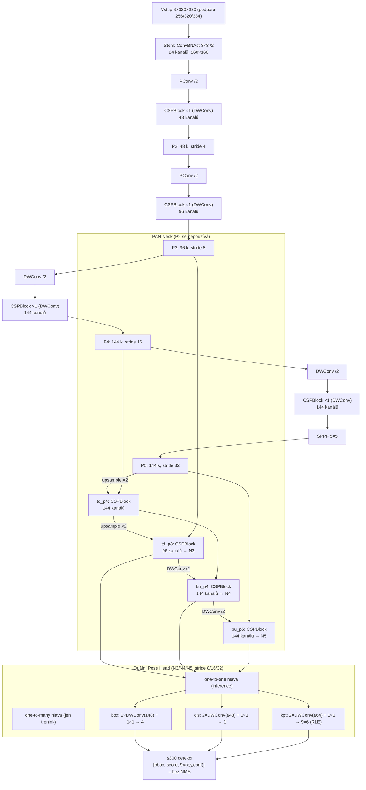

# Architektura neuronové sítě XTX3

Tento dokument popisuje strukturu neuronové sítě modelu **XTX3** (varianty `u`, `n`, `m`, `l`),
tak jak je implementována v `xtx3/models/`, a shrnuje rozdíly oproti předchůdci **XTX2**.

---

## 1. Celkový přehled

XTX3 je jednostupňový (single-stage), anchor-free a **NMS-free** detektor osob s odhadem
**9 landmarků hlavy a torza**: nos, oči, uši, ramena, boky (COCO indexy 0–6, 11, 12).
Ruce a nohy se nedetekují – to je hlavní specializace oproti XTX2 (17 COCO keypointů).

```
vstup (3×S×S) → Backbone (CSP) → Neck (PAN/FPN) → duální Pose Head → detekce + 9 keypointů
```

- **Vstup:** síť je plně konvoluční – funguje na libovolné velikosti dělitelné 32.
  Varianta `u` je trénovaná i exportovaná pro **256/320/384** (výchozí 320, jediný
  celoobrazový průchod – whole-frame letterbox). Varianty `n`/`m`/`l` používají výchozí
  384 a volitelně 3úrovňovou centrální pyramidu (režim `pyramid`, geometrie identická
  s XTX2 při S=384).
- **Backbone** (`backbone.py`): 5 stupňů se stride 2/4/8/16/32, produkuje P2 (stride 4),
  P3 (8), P4 (16), P5 (32). Na konci SPPF pro velké receptivní pole.
- **Neck** (`neck.py`): PAN (Path Aggregation Network) – top-down (FPN) a poté bottom-up
  fúze; na každém spojovacím bodě CSPBlock.
- **Head** (`head.py`): oddělená (decoupled) hlava se třemi větvemi (box / cls / keypoint)
  na každé úrovni pyramidy. Během tréninku běží **dvě strukturně identické hlavy**
  (one-to-many + one-to-one, styl YOLO26); při inferenci/exportu zůstává jen
  one-to-one hlava → výstup je nativně bez NMS.
- **Výstup:** max. 300 detekcí na obrázek ve formátu
  `[x1, y1, x2, y2, score, 9×(x, y, conf)]` (**32 hodnot**)
  + třída viditelnosti každého keypointu {absent, occluded, visible}.

### Parametry a výpočetní náročnost (změřeno `scripts/profile_flops.py`)

| Varianta | Parametry | GFLOPs / průchod | Vstup | Cíl nasazení |
|----------|-----------|------------------|-------|--------------|
| XTX3-u   | 0,82 M    | 0,25 @256 / **0,39 @320** / 0,56 @384 | 256–384, whole-frame | **Raspberry Pi 5 v reálném čase (≥25 FPS, NCNN)** |
| XTX3-n   | 2,65 M    | 1,51 @384 (3 úrovně: 4,53)            | 384 | Raspberry Pi (NCNN) |
| XTX3-m   | 19,68 M   | 8,85 @384 (3 úrovně: 26,6)            | 384 | PC CPU/GPU |
| XTX3-l   | 25,22 M   | 15,05 @384 (3 úrovně: 45,2)           | 384 | PC GPU |

Srovnání s XTX2 při stejném backbonu (n/m/l): XTX3 je díky 9bodové hlavě
(54 místo 102 keypoint kanálů) vždy o něco menší a rychlejší:
n 2,68→2,65 M / 1,525→1,511 GFLOPs; m 19,72→19,68 M; l 25,26→25,22 M.

---

## 2. Devět landmarků (`utils/keypoints.py`)

Jediný zdroj pravdy pro celý projekt:

| Index | Landmark | COCO index | Flip partner | OKS sigma |
|-------|----------|-----------|--------------|-----------|
| 0 | nose           | 0  | –  | 0,026 |
| 1 | left_eye       | 1  | 2  | 0,025 |
| 2 | right_eye      | 2  | 1  | 0,025 |
| 3 | left_ear       | 3  | 4  | 0,035 |
| 4 | right_ear      | 4  | 3  | 0,035 |
| 5 | left_shoulder  | 5  | 6  | 0,079 |
| 6 | right_shoulder | 6  | 5  | 0,079 |
| 7 | left_hip       | 11 | 8  | 0,107 |
| 8 | right_hip      | 12 | 7  | 0,107 |

- Sigmy jsou přesná podmnožina oficiálních COCO per-landmark sigem → 9bodové OKS je
  přímo srovnatelné s COCO OKS na zachovaných bodech.
- Skeleton pro vizualizaci: nos–oči, oči–uši, linka ramen, ramena–boky, linka boků.
- 17→9 výběr (`select_nine`) je deterministický a zachovává levo/pravou sémantiku;
  horizontální flip při augmentaci prohazuje páry (1,2), (3,4), (5,6), (7,8).

---

## 3. Stavební bloky (`blocks.py`)

| Blok | Popis |
|------|-------|
| **ConvBNAct** | Conv2d (bez biasu) + BatchNorm2d + SiLU. Při `fuse()` se BN složí do konvoluce. |
| **DWConv** | Depthwise-separable konvoluce: depthwise K×K + pointwise 1×1. Používají varianty `u` a `n`. |
| **PConv** | Parciální konvoluce (styl FasterNet): 3×3 konvoluce jen na ¼ kanálů, zbytek beze změny, poté 1×1 mix. Rané stupně `u`/`n` – hlavní páka pro rychlost na Raspberry Pi. |
| **RepConv** | Reparametrizovatelný blok (RepVGG): trénink 3×3 + 1×1 + identity, nasazení jediná 3×3 konvoluce. Varianty `m`/`l`. |
| **Bottleneck** | 1×1 ConvBNAct → RepConv 3×3 (u `u`/`n` DWConv) + volitelná reziduální zkratka. |
| **CSPBlock** | Cross-stage blok ve stylu C2f: 1×1 split → n× Bottleneck → concat → 1×1 fúze. |
| **SPPF** | Spatial Pyramid Pooling – Fast: 1×1 → 3× sekvenční 5×5 max-pool → concat → 1×1. |

Všechny bloky podporují `fuse()` pro čistý export do ONNX/NCNN.

---

## 4. Škálování variant (`scaling.py`)

Základní šířky kanálů (stem, s1–s4) = (64, 128, 256, 512, 768),
základní hloubky CSP stupňů = (2, 4, 4, 2).

| Varianta | depth × | width × | max kanálů | Kanály (stem, P2, P3, P4, P5) | Hloubky | P2 v necku | Depthwise/PConv | Head cap (box / kpt) |
|----------|---------|---------|------------|-------------------------------|---------|------------|-----------------|----------------------|
| **u** | 0,34 | 0,375 | 384  | 24, 48, 96, **144, 144** | 1, 1, 1, 1 | ne  | **ano** | 48 / 64 |
| **n** | 0,34 | 0,56  | 512  | 32, 72, 144, 288, 288    | 1, 1, 1, 1 | ne  | **ano** | 64 / 96 |
| **m** | 0,67 | 0,72  | 768  | 48, 96, 184, 368, 552    | 1, 3, 3, 1 | ne  | ne | 80 / 128 |
| **l** | 1,00 | 0,78  | 1024 | 48, 96, 200, 400, 600    | 2, 4, 4, 2 | **ano** | ne | 80 / 128 |

Varianta `u` navíc stropuje kanály na 384 **před** násobením šířkou, takže P4 i P5
končí na 144 kanálech – hluboké stupně jsou u ultra-light modelu nejdražší.

---

## 5. Hlava (`head.py`)

Na každé úrovni pyramidy tři nezávislé větve (2× 3×3 konvoluce + 1×1 projekce):

| Větev | Výstup na anchor | Poznámka |
|-------|------------------|----------|
| **box** | 4 – vzdálenosti `(l, t, r, b)` | **bez DFL** – přímá regrese; `softplus` × stride × učitelný per-level scale |
| **cls** | 1 – logit „osoba" | jediná třída; bias inicializován na prior 0,01 |
| **kpt** | 9 × 6 = **54** – na keypoint `(dx, dy, log_sigma, vis0, vis1, vis2)` | **RLE**: `log_sigma` parametrizuje nejistotu; 3 logity = viditelnost {absent, occluded, visible}; confidence = P(occluded) + P(visible) |

Redukce keypoint výstupu 102 → 54 kanálů (17×6 → 9×6) je hlavní strukturní úspora
XTX3 oproti XTX2. Skryté šířky větví jsou zastropované dle tabulky výše.

**Duální hlava (styl YOLO26):** při tréninku *one-to-many* (hustý signál) +
*one-to-one* (finální ≤300 detekcí); ProgLoss postupně přesouvá váhu na one-to-one.
Při `fuse()`/exportu se one-to-many hlava odstraní → inference nativně **bez NMS**.

Anchory se přepočítávají z reálných velikostí feature map při každém průchodu,
proto jedna síť `u` funguje na 256, 320 i 384 bez přeexportu vah.

---

## 6. Vstupní strategie (`data/preprocess.py`)

Dva režimy, jediná implementace geometrie pro trénink i inferenci:

- **`whole`** (výchozí pro `u`): letterbox celého snímku do jednoho S×S pohledu
  (bez zvětšování malých obrázků, vycentrováno, černý padding). 1 průchod sítí na snímek.
- **`pyramid`** (výchozí pro `n`/`m`/`l`, srovnávací režim): 3 pohledy S×S z virtuálního
  4S×4S plátna – pohled 1 = celé plátno (4× redukce), pohled 2 = centrální 2S (2×),
  pohled 3 = centrální S (nativní výřez). Při S=384 jde přesně o geometrii XTX2.

Plátno se nikdy nematerializuje – každý pohled vzniká max. jednou interpolací přímo
ze zdrojového obrázku (offsety zarovnané na násobek 4, takže složený affine má
celočíselnou translaci a rendering přesně realizuje zaznamenanou transformaci).
Každý pohled nese affine `T_k` (network px → původní px) pro zpětné mapování detekcí.
V režimu `pyramid` se duplicitní detekce řeší deterministickou prioritou
pohled 1 > 2 > 3 (`engine/merge.py`); v režimu `whole` merge degeneruje na filtr.

---

## 7. Diagramy jednotlivých variant

### 7.1 XTX3-u (0,82 M parametrů – ultralehká pro Raspberry Pi 5, whole-frame)



### 7.2 XTX3-n (2,65 M parametrů, depthwise + PConv, 3 úrovně hlavy)

Stejná topologie jako XTX3-u, ale se šířkami 32/72/144/288/288 a head capy 64/96.
Backbone i neck jsou identické s XTX2-n; jediný rozdíl je 9bodová keypoint větev
(54 místo 102 výstupních kanálů) – proto je XTX3-n při stejné přesnosti backbonu
striktně levnější na průchod než XTX2-n.

### 7.3 XTX3-m (19,68 M parametrů, plné konvoluce + RepConv)

Šířky 48/96/184/368/552, hloubky 1/3/3/1, RepConv bottlenecky, head capy 80/128,
3 úrovně (stride 8/16/32). Viz diagram XTX2-m v `xtx2/xtx2_architecture.md` –
liší se jen keypoint projekcí 9×6.

### 7.4 XTX3-l (25,22 M parametrů, nejhlubší, navíc úroveň P2)

Šířky 48/96/200/400/600, hloubky 2/4/4/2, RepConv, navíc úroveň **P2 (stride 4)**
v necku i hlavě pro malé osoby → 4 úrovně (stride 4/8/16/32).

---

## 8. Trénink

- **Loss:** CIoU (box) + VarifocalLoss (cls) + RLE s RealNVP flow (keypointy,
  fallback OKS+L1) + cross-entropy (3třídní viditelnost), váhy 7,5 / 0,5 / 12 / 1.
- **Přiřazování:** TaskAligned assigner s centrálním priorem; **STAL** garantuje malým
  GT boxům (<8 px) ≥4 pozitivní anchory; one-to-one hlava má konzistentní top-1 assigner.
- **ProgLoss:** lineární přesun váhy one-to-many → one-to-one během tréninku
  (1,0→0,25 / 0,5→1,0).
- **Optimalizace:** MuSGD (Muon pro matice + SGD pro 1-D parametry), EMA, mixed precision.
- **Multi-scale trénink varianty `u`:** dávky náhodně v 256/320/384, takže jedna síť
  drží přesnost na všech třech exportních rozlišeních.
- **Metriky:** 9bodové OKS AP/AP50/AP75/AR + detailní report – precision/recall detekce,
  per-landmark OKS, přesnost viditelnosti, výsledky dle měřítka obličeje/torza.

## 9. Export a nasazení

Po tréninku (automaticky, `export.auto_export` v `config.json`) se `best.pt` exportuje:

1. `fuse()` – složení Conv+BN, reparametrizace RepConv, odstranění one-to-many hlavy,
2. **ONNX** (opset 17) + zjednodušení `onnxsim` + numerická verifikace vůči PyTorch,
3. **NCNN** (`pnnx`, fallback `onnx2ncnn`) – pro Raspberry Pi 5.

Varianta `u` se exportuje ve **třech velikostech (256/320/384)**; ostatní varianty
v 384. Dekódování výstupních tenzorů (softplus box, sigmoid score, softmax
viditelnosti) běží na hostiteli – exportovaný graf obsahuje jen čistou síť.

## 10. Reference do kódu

| Soubor | Obsah |
|--------|-------|
| `xtx3/utils/keypoints.py` | 9 landmarků: jména, COCO výběr, flip páry, sigmy, skeleton |
| `xtx3/models/blocks.py` | ConvBNAct, DWConv, PConv, RepConv, Bottleneck, CSPBlock, SPPF |
| `xtx3/models/backbone.py` | 5stupňový CSP backbone (P2–P5) |
| `xtx3/models/neck.py` | PAN neck (top-down + bottom-up, volitelné P2) |
| `xtx3/models/head.py` | duální decoupled pose head 9×6, dekódování bez NMS |
| `xtx3/models/scaling.py` | škálovací tabulka u/n/m/l |
| `xtx3/models/xtx3.py` | sestavení modelu, `build_model`, `fuse()` |
| `xtx3/data/preprocess.py` | whole-frame + pyramidová geometrie (jediná implementace) |
| `xtx3/engine/merge.py` | cross-view dedup s prioritou pohledů, kalibrace prahů |
| `xtx3/export/ncnn_export.py` | ONNX/NCNN export s verifikací parity |
| `scripts/profile_flops.py` | měření parametrů a GFLOPs proti rozpočtům |
